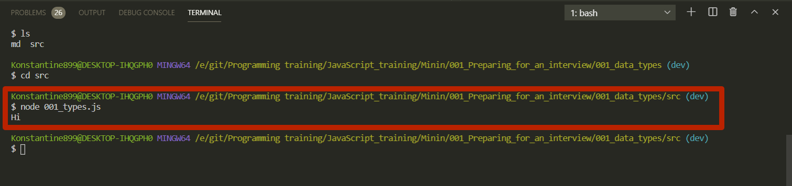
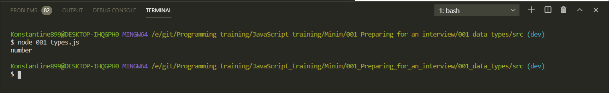
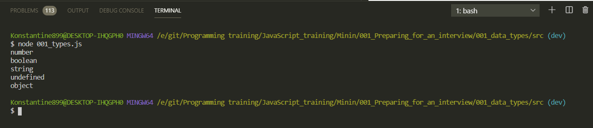
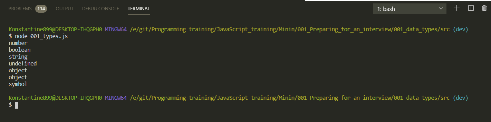
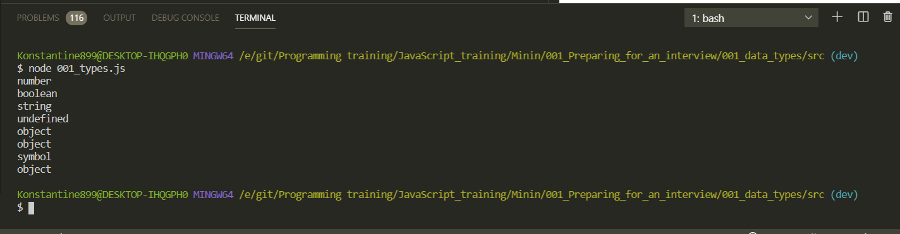
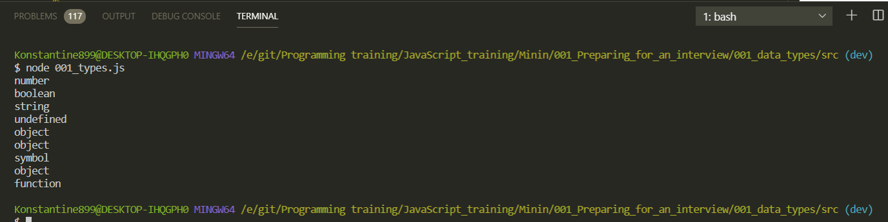
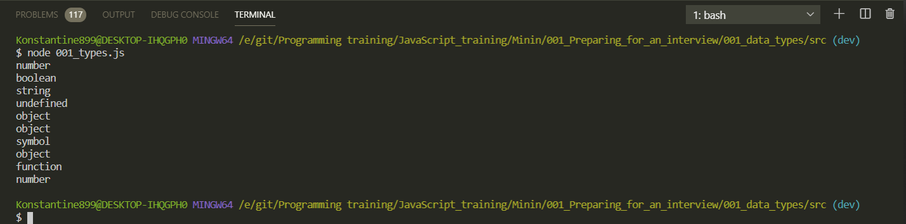
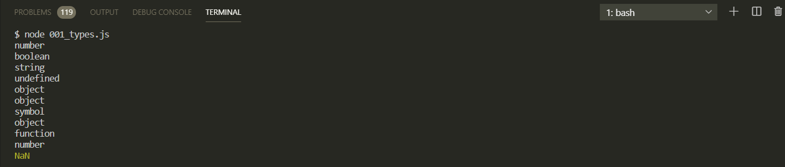

# Типы данных в JS

Все заучивать не нужно. Конспектирую лекцию. После чего для тренировки придумываю свое и тренируюсь.

Создаю файл по названию проходящей темы.

```js
// 001_types.js

console.log('Hi');
```

Далее, если я роботаю в **Node.js**, в консоле перехожу к файлу и командой запускаю файл.

```shell
node 01_types.js
```



Либо другой вариант с помощью которого мы можем тестировать файлы это создать **index.html** файл, подключить этот скрипт и так же в **console.log** запускать все в браузере.

Но в рамках данного курса мы будем пользоваться только **Node.JS**.

Приступаем к типам. Это база с которой стоит начать изучение **JS** и понимать что вообще здесь происходит.

В **JS** присутствуют 7-мь типов данных.

```js
// 001_types.js

// null, undefined, boolean, number, string, object,  symbol
```

Все эти типы данных являются примитивными кроме **object**

В **JS** присутствует специальный оператор который называется **typeof**. Который может позволить узнать какого типа является переменная или какое либо значение.

Я могу применять его так

```js
// 001_types.js

// null, undefined, boolean, number, string, object,  symbol

console.log(typeof 0);
```



```js
// 001_types.js

// null, undefined, boolean, number, string, object,  symbol

console.log(typeof 0);
console.log(typeof true);
console.log(typeof 'JavaScript'); // "", '', `` последняя называется литералами или шаблонная строка
console.log(typeof undefined);
console.log(typeof {});

//или же в место {} могу передавать какие-то существующие классы Data, Math

console.log(typeof Math);
```



**Symbol** у нас определяется через класс **Symbol** и в его условный конструктор мы должны передавать какой-то **symbol**, например **'JS'**

```js
// 001_types.js

// null, undefined, boolean, number, string, object,  symbol

console.log(typeof 0);
console.log(typeof true);
console.log(typeof 'JavaScript'); // "", '', `` последняя называется литералами или шаблонная строка
console.log(typeof undefined);
console.log(typeof {});

//или же в место {} могу передавать какие-то существующие классы Data, Math

console.log(typeof Math);
console.log(typeof Symbol('JS'));
```



Единственный тип данных коротый я еще не написал это **Null**.

```js
// 001_types.js

// null, undefined, boolean, number, string, object,  symbol

console.log(typeof 0);
console.log(typeof true);
console.log(typeof 'JavaScript'); // "", '', `` последняя называется литералами или шаблонная строка
console.log(typeof undefined);
console.log(typeof {});

//или же в место {} могу передавать какие-то существующие классы Data, Math

console.log(typeof Math);
console.log(typeof Symbol('JS'));
console.log(typeof null);
```



и я вижу **object**. И это первай не точность которая есть у оператора **typeof** который на **null** возвращает **object**. На самом деле **null** является типом данных **null**. И это стоит помнить.

Если уже говорить про не точности которые есть в операторе **typeof**, то мы можем написать следующим образом.

```js
// 001_types.js

// null, undefined, boolean, number, string, object,  symbol

console.log(typeof 0);
console.log(typeof true);
console.log(typeof 'JavaScript'); // "", '', `` последняя называется литералами или шаблонная строка
console.log(typeof undefined);
console.log(typeof {});

//или же в место {} могу передавать какие-то существующие классы Data, Math

console.log(typeof Math);
console.log(typeof Symbol('JS'));
console.log(typeof null);

console.log(typeof function () {});
```



Хотя в действительности такого типа данных как **function** нет. Функции по сути являются объектами.

Для того что бы было удобнее разрабатывать приложения и понимать где функция, а где объекты, оператор **typeof** на функцию выдает нам **function**. Ну и соотвтетственно мы можем с этим оперировать.

И еще один интересный момент с **typeof**. Это с **NaN**

```js
// 001_types.js

// null, undefined, boolean, number, string, object,  symbol

console.log(typeof 0);
console.log(typeof true);
console.log(typeof 'JavaScript'); // "", '', `` последняя называется литералами или шаблонная строка
console.log(typeof undefined);
console.log(typeof {});

//или же в место {} могу передавать какие-то существующие классы Data, Math

console.log(typeof Math);
console.log(typeof Symbol('JS'));
console.log(typeof null);

console.log(typeof function () {});
console.log(typeof NaN);
```

Забавный факт что если мы запустим скрипт то мы получим **number**.



Вот такая вот не точность. NaN мы можем получить если будем делить на ноль!!!

У меня были сонения и проверил получаю тип данных **Infinity**

```js
// 001_types.js

// null, undefined, boolean, number, string, object,  symbol

console.log(typeof 0);
console.log(typeof true);
console.log(typeof 'JavaScript'); // "", '', `` последняя называется литералами или шаблонная строка
console.log(typeof undefined);
console.log(typeof {});

//или же в место {} могу передавать какие-то существующие классы Data, Math

console.log(typeof Math);
console.log(typeof Symbol('JS'));
console.log(typeof null);

console.log(typeof function () {});
console.log(typeof NaN);
console.log(typeof 1 / 0);
```

Хотя нет получаю **NaN** но помни что **Infinity** тоже есть.



Рассмотрим отличие **undefined** от **null**. Подобный вопрос часто задают на собеседованиях. Зачем нам таких два типа данных?
Тип **undefined** используется тогода когда переменная не объявлена, иои она была определена с помощью ключевого слова **var**, но при этом в ней нет ни какого значения. Плюс функции которые ничего не возвращают они по умолчанию возвращают **undefined**.

**Null** же говорит о том что у нас отсутствует именно значение. Переменная объявлена, но в нем нет ни какого значения. Например до этого там был какой-нибудь объект или какая-нибудь строка, число, а потом мы его обнулили и записали в него **null**. Т.е. примерно в этом и заключается отличие.

Теперь поговорим про приведение типов.
