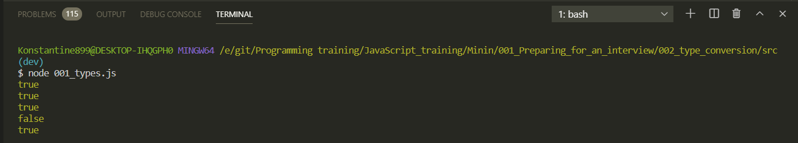

# Приведение типов

```js
// 001_types.js

// 001_types.js

// null, undefined, boolean, number, string, object,  symbol

// console.log(typeof 0);
// console.log(typeof true);
// console.log(typeof 'JavaScript'); // "", '', `` последняя называется литералами или шаблонная строка
// console.log(typeof undefined);
// console.log(typeof {});

//или же в место {} могу передавать какие-то существующие классы Data, Math

// console.log(typeof Math);
// console.log(typeof Symbol('JS'));
// console.log(typeof null);

// console.log(typeof function () {});
// console.log(typeof NaN);
// console.log(typeof 1 / 0);

// Приведение типов.

let language = 'JavaScript';

if (language) {
  console.log('The best language is:', language);
}
```

Мы берем абсолютно базовый пример из **JS**. Мы берем переменную которая содержит в себе переменную строки. И далее проверяем. Но оператор **if** по сути работает только с boolean значением. Посмотрим на результат который получается.

```shell
node 001_types.js
```

И я получаю строку


По идее все отработало корректоно. Т.е. интерпритатор **JS** когда он идет и видит такой код. Условно говоря он видит вместо переменной **language** строчку **JS**. Он видит что жто строка. И что он делает? Он берет и приводит строковый тип данных к **boolean** типу данных т.е. либо **true** либо **false**. И соответственно наша строка приводится к значению **true** после чего наша строка выводится в консоль.

Вообще приведение типов достаточно обширная тема в **JS**, но по сути что важно про нее понимать? Что существуют определенные значения которые приводятся к **False**, так называемые **false values**. И из них можно перечислить такие как

```js
// '', null, undefined, NaN, false
```

Вот эти значения когда приводятся к **boolean** значению они выдают нам **false**. В этом можно легко убедится допустим если мы будем обращаться к глобальному классу **Boolean()** И в его конструктор мы можем передавать какие-либо значения.

```js
// 001_types.js

// 001_types.js

// null, undefined, boolean, number, string, object,  symbol

// console.log(typeof 0);
// console.log(typeof true);
// console.log(typeof 'JavaScript'); // "", '', `` последняя называется литералами или шаблонная строка
// console.log(typeof undefined);
// console.log(typeof {});

//или же в место {} могу передавать какие-то существующие классы Data, Math

// console.log(typeof Math);
// console.log(typeof Symbol('JS'));
// console.log(typeof null);

// console.log(typeof function () {});
// console.log(typeof NaN);
// console.log(typeof 1 / 0);

// Приведение типов.

// let language = 'JavaScript';

// if (language) {
//   console.log('The best language is:', language);
// }

// '', null, undefined, NaN, false

console.log(Boolean(''));
console.log(Boolean(null));
console.log(Boolean(undefined));
console.log(Boolean(NaN));
console.log(Boolean(false));
```


Все было бы хорошо, но это **JS**. Если я передам пустой массив то это будет **true**

Выше него представлены варианты о которых я и так знал. Основные это пробел в пустой строке **true**, Строковый ноль **true**, числовой ноль **false**.

```js
// 001_types.js

// 001_types.js

// null, undefined, boolean, number, string, object,  symbol

// console.log(typeof 0);
// console.log(typeof true);
// console.log(typeof 'JavaScript'); // "", '', `` последняя называется литералами или шаблонная строка
// console.log(typeof undefined);
// console.log(typeof {});

//или же в место {} могу передавать какие-то существующие классы Data, Math

// console.log(typeof Math);
// console.log(typeof Symbol('JS'));
// console.log(typeof null);

// console.log(typeof function () {});
// console.log(typeof NaN);
// console.log(typeof 1 / 0);

// Приведение типов.

// let language = 'JavaScript';

// if (language) {
//   console.log('The best language is:', language);
// }

// '', null, undefined, NaN, false

// console.log(Boolean(''));
// console.log(Boolean(null));
// console.log(Boolean(undefined));
// console.log(Boolean(NaN));
// console.log(Boolean(false));

console.log(Boolean('Hello'));
console.log(Boolean(' '));
console.log(Boolean('0'));
console.log(Boolean(0));
console.log(Boolean([]));
```



И действительно пустой массив приводится к положительному значение **true**. Ровно как и пустой объект и ровно как и функция

```js
console.log(Boolean([]));
console.log(Boolean({}));
console.log(Boolean(function () {}));
```


И про это стоит помнить.
