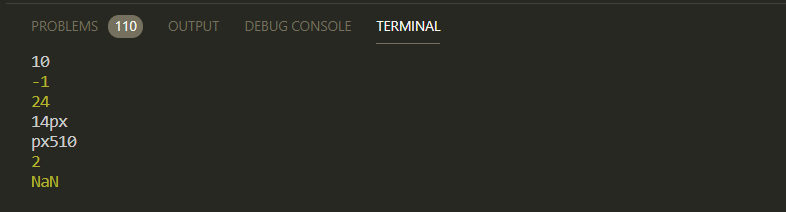

# Строки и числа.

Это достаточно обширная тема и здесь важно понимать что вообще происходит т.к. на собеседованиях часто это спрашвают.

```js
// 001_types.js

//Строки и числа.

console.log(1 + '2');
```

Здесь стоит помнить такой момент что и для чисел присутствует оператор сложения и для строк присутствует оператор сложения (для строк он выполняет роль конкотенации.)


12 потому что когда **JS** интерпретирует данную строчку он видит что первым параметром идет **number** а втором **string**. Учитывая что здесь есть строка, то он символ **+** использует как символ конкотенации. И по этому он приводит еденицу к строковому формату и мы получаем на выходе строку **12**.

```js
//Строки и числа.

console.log(1 + '2'); // string 12
```

То же самое

```js
// 001_types.js

//Строки и числа.

console.log(1 + '2'); // string 12
console.log('' + 1 + 0); // string 10
```


Это важно понимать что это не число.

Однако другой пример

```js
// 001_types.js

//Строки и числа.

console.log(1 + '2'); // string 12
console.log('' + 1 + 0); // string 10

console.log('' - 1 + 0); // string 10
```


Для строк не определен оператор **минус(-)**, по этому он читает это все как число.

Следующий пример умножения строк.

```js
// 001_types.js

//Строки и числа.

console.log(1 + '2'); // string 12
console.log('' + 1 + 0); // string 10

console.log('' - 1 + 0); // string 10
console.log('3' * '8'); //
```

Здесь мы руководствуемся точно такой же логикой. Т.е. для строк не определен оператор **умножения(\*)** по этому все приводится к числу.


Однако порядок очень важен. Потому что если мы запишем к примеру вот такой пример

```js
// 001_types.js

//Строки и числа.

console.log(1 + '2'); // string 12
console.log('' + 1 + 0); // string 10

console.log('' - 1 + 0); // string 10
console.log('3' * '8'); // number 24
console.log(4 + 10 + 'px'); // 14px
```


**JS** смотрит на **4** и **10** и видит в них числа, он их суммирует и получает **14**. Дальше он видит строку px и далее од конкотенирует **14** и px переопределяет все в строку.

Если мы изменим порядок.

```js
// 001_types.js

//Строки и числа.

console.log(1 + '2'); // string 12
console.log('' + 1 + 0); // string 10

console.log('' - 1 + 0); // string 10
console.log('3' * '8'); // number 24
console.log(4 + 10 + 'px'); // 14px
console.log('px' + 5 + 10); // px4510
```


Потому что изначально это было приведено к строке. И далее по очереди происходила конкотенация и преобразование числа в строку.

При этом если у нас есть значение **42** строка и число **40**.

```js
// 001_types.js

//Строки и числа.

console.log(1 + '2'); // string 12
console.log('' + 1 + 0); // string 10

console.log('' - 1 + 0); // string 10
console.log('3' * '8'); // number 24
console.log(4 + 10 + 'px'); // 14px
console.log('px' + 5 + 10); // px4510
console.log('42' - 40); // number 2
```


Учитывая что для строк нет оператора вычетания, то мы получим 2 так как **JS** приведет все к числу.

Но с другой строны если у нас будет строка **'42px'** и мы хоти вычесть **2**.

```js
// 001_types.js

//Строки и числа.

console.log(1 + '2'); // string 12
console.log('' + 1 + 0); // string 10

console.log('' - 1 + 0); // string 10
console.log('3' * '8'); // number 24
console.log(4 + 10 + 'px'); // 14px
console.log('px' + 5 + 10); // px4510
console.log('42' - 40); // number 2
console.log('42px' - 2); // number 2
```



NaN получается потому что при приведении строки** '42px'** к числу мы получаем **NaN** и **NaN** - 2\***\* будет **NaN\*\*.

Допустим если к **null** мы прибавим **2** то получится **2**.

```js
// 001_types.js

//Строки и числа.

console.log(1 + '2'); // string 12
console.log('' + 1 + 0); // string 10

console.log('' - 1 + 0); // string 10
console.log('3' * '8'); // number 24
console.log(4 + 10 + 'px'); // 14px
console.log('px' + 5 + 10); // px4510
console.log('42' - 40); // number 2
console.log('42px' - 2); // number 2
console.log(null + 2); // number 2
```

Потому что **null** при приведении к числу будет равняться **0**. А **0 + 2 = 2**.

И если к **undefined + число**, то мы получим NaN потому что **undefined** невозможно привести к числу.


