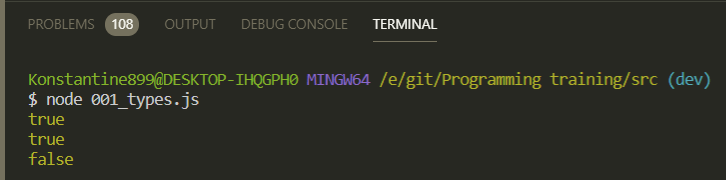

# Равенство и эквивалентность.

На собеседовании зачастую можно услышать ответ что двойное равно сравнивает только по значению, а тройное еще и по типу и по значению.

На самом деле это не совсем корректно потому что **==** сравнивает значение но с приведением типов т.е. JS интерпретатор пытается привести типы, а **===** оператор эквивалентности сравнивает без приведения типов. И тем самым мы получаем другую формулировку, но более точную.

```js
// 001_types.js

// == vs ===

console.log(2 == '2');
```


Происходит это потому что **JS** интерпретатор пытается это все привести к одному типу.

```js
// 001_types.js

// == vs ===

console.log(2 == '2'); // true
console.log(2 === '2'); // false
```


**false** потому что **JS** не приводит все к одному типу, сравнивает по значению.

Тоже самое если мы будем сравнивать **undefined** и **null**.

```js
// 001_types.js

// == vs ===

// console.log(2 == '2'); // true
// console.log(2 === '2'); // false

console.log(undefined == null); // true
console.log(undefined === null); // false
```


Поэтому всегда рекомендуется использовать оператор эквивалентности что бы небыло каких либо ошибок т.к. очень много проблем связано с приведением типов.

Если мы сравним строку **'0'** и **false**

```js
// 001_types.js

// == vs ===

// console.log(2 == '2'); // true
// console.log(2 === '2'); // false

// console.log(undefined == null); // true
// console.log(undefined === null); // false

console.log('0' == false); // true
```


Потому что на самом деле интерпретарор когда мы используем **==** он пытается это все привести к числу, **false** выдает нам **0**, строка так же выдает **0** и поэтому мы так же получаем **true**.

Далее рассмотрим список некоторых сравнений, которые могут быть супер не однозначные. Которые могут спрашивать на собеседовании

```js
// 001_types.js

// == vs ===

// console.log(2 == '2'); // true
// console.log(2 === '2'); // false

// console.log(undefined == null); // true
// console.log(undefined === null); // false

// console.log('0' == false); // true

//========

console.log(false == '');
```

То я получаю **true**

```js
// 001_types.js

// == vs ===

// console.log(2 == '2'); // true
// console.log(2 === '2'); // false

// console.log(undefined == null); // true
// console.log(undefined === null); // false

// console.log('0' == false); // true

//========

console.log(false == ''); // true
console.log(false == []); // true
console.log(false == {}); // false
```


```js
// 001_types.js

// == vs ===

// console.log(2 == '2'); // true
// console.log(2 === '2'); // false

// console.log(undefined == null); // true
// console.log(undefined === null); // false

// console.log('0' == false); // true

//========

// console.log(false == ''); // true
// console.log(false == []); // true
// console.log(false == {}); // false
console.log('' == 0); //
console.log('' == []); //
console.log('' == {}); //
```

То на выходе мы получаем вот такие интересные значения.



Все было бы хорошо если бы не следующий пример.

```js
// 001_types.js

// == vs ===

// console.log(2 == '2'); // true
// console.log(2 === '2'); // false

// console.log(undefined == null); // true
// console.log(undefined === null); // false

// console.log('0' == false); // true

//========

// console.log(false == ''); // true
// console.log(false == []); // true
// console.log(false == {}); // false
// console.log('' == 0); //
// console.log('' == []); //
// console.log('' == {}); //

console.log(0 == []); //
console.log(0 == {}); //
console.log(0 == null); //
```


То в данном случае при сравнении **0** и **null** я получаю **false**.

C пустыми объектами и массивами не так все просто.
