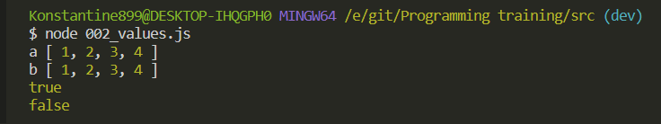

# Значения и ссылки

В **JS** примитивные типы данных которые мы рассмотрели чуть ранее. По сути они передаются как значения.

Но если это типы данных которые вычисляемые т.е. это объекты, массивы, функции, то они берут и передают ссылку при, допустим создании новых переменных, и из-за этого могут возникать определенные мутации.

```js
//002_values.js
let a = 42;
let b = a;
b++;
console.log('a', a);
console.log('b', b);
```

```shell
node 002_values.js
```


Мы получаем ожидаемый результат. Т.е. у нас есть переменная **а** которая как была **42** так и осталась **42**.
А переменна **b = 43** потому что мы получили в эту переменную значение переменной а т.е. просто скопировали его по **reference**. И дальше с **b** мы работаем изолированно.

Теперь следующий пример который показывает как работают вычисляемые типы данных. Например массивы.

```js
//002_values.js

// let a = 42;
// let b = a;
// b++;
// console.log('a', a);
// console.log('b', b);

let a = [1, 2, 3];
let b = a;
b.push(4);

console.log('a', a);
console.log('b', b);
```


Как мы видим что теперь в обоих этих переменных храниться одно и то же значение. Т.е. когды мы инициализировали переменную **b** через переменную **a**. Мы взяли скопировали не само значение которое есть в массиве переменной **а**. Мы скопировали это как ссылку на массив. И посути в переменной **b** храниться ссылка на значение переменной **a**. Т.е. грубо говоря ссылаются на одну и ту же область оперативной памяти. И учитывая то что мы меняем переменную **b**, так же меняется и переменная **a**.

Для того что бы этого избежать мы можем возвращать клон массива для того что бы от не мутировал. Например в значении переменной **b** мы можем вызвать метод **concat()**

```js
//002_values.js

// let a = 42;
// let b = a;
// b++;
// console.log('a', a);
// console.log('b', b);

let a = [1, 2, 3];
let b = a.concat();
b.push(4);

console.log('a', a);
console.log('b', b);
```


Теперь переменная **b** у нас работает изолированно. Не мутирует он потому что метод **concat()** вызванный без параметров возвращает копию массива.

Далее если я создаю переменную **с** и проверяю ее на эквивалентность с переменной **b** то я получаю **true**

```js
//002_values.js

// let a = 42;
// let b = a;
// b++;
// console.log('a', a);
// console.log('b', b);

let a = [1, 2, 3];
let b = a;
b.push(4);

let c = [1, 2, 3, 4];

console.log('a', a);
console.log('b', b);

console.log(a === b);
```


Но так же я могу спросить эквивалентность **a** и **с**.

```js
//002_values.js

// let a = 42;
// let b = a;
// b++;
// console.log('a', a);
// console.log('b', b);

let a = [1, 2, 3];
let b = a;
b.push(4);

let c = [1, 2, 3, 4];

console.log('a', a);
console.log('b', b);

console.log(a === b);
console.log(a === c);
```



Получаю **false** потому что в действительности это уже разные объекты и при приведении типов они имеют разные значения.
