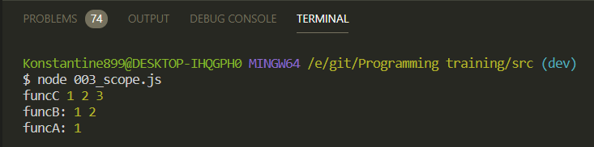

# scope

Это что-то что говорит нам о дуступности переменных в функциях.
По сути существует два понятия это глобальный **scope**, и локальный **scope**.

Глобальный scope это переменные объявленные вне функции, но при этом доступны внутри всех функций которые находятся внутри этого **scope**.

Например в браузере объект **document** и **window** относятся именно к глобальному **scope** т.е. они доступны во всех функциях сразу же.

При этом есть локальный **scope** это когда переменная доступна в рамках одной функции, ну или в дочерних функциях.

То что стоит запомнить про **scope** это то что **scope** указывает на доступность определенных переменных. Это именно область видимости.

Создаю глобальную функцию **funcA**

```js
// 003_scope.js

function funcA() {
  let a = 1;
}
```

Данная функция является самой обычной функцией. И внури функции мы можем создавать другие функции

```js
// 003_scope.js

function funcA() {
  let a = 1;

  function funcB() {
    let b = 2;

    function funcC() {
      let c = 3;

      console.log('funcC', a, b, c);
    }
  }
}
```

В функции **funcB** после того как я пределил **funC** я буду вызывать **funC** и с другими функциями так же.

```js
// 003_scope.js

function funcA() {
  let a = 1;

  function funcB() {
    let b = 2;

    function funcC() {
      let c = 3;

      console.log('funcC', a, b, c);
    }
    funcC();
    console.log('funcB:', a, b);
  }
  funcB();
  console.log('funcA:', a);
}
funcA();
```



Если мы посмотрим то **funcA** содержит только переменную **a**. Функция **funcB** выводит **a** и **b**. Но в самой функции **b** орпеделена только переменная **b**. Однако **funcB** находится в **scope** функции **funcA**. По этому мы можем так же обратится к переменной **a**. Ну а функция **funcC** кроме своей переменной **с** видит так же переменные **а** и **b**.
