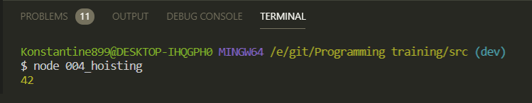
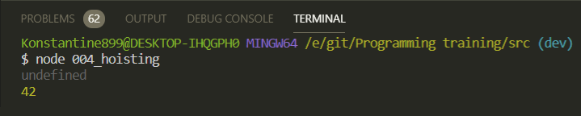
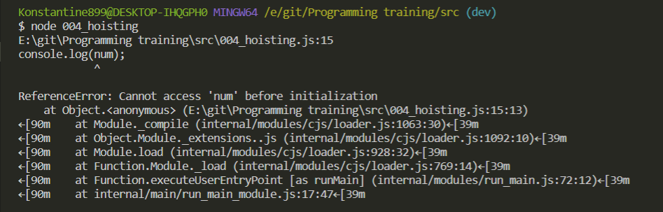
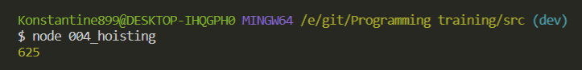
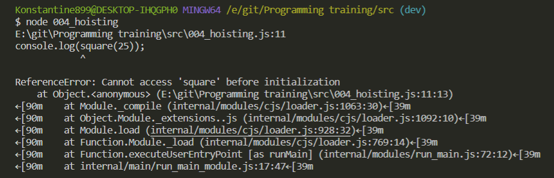
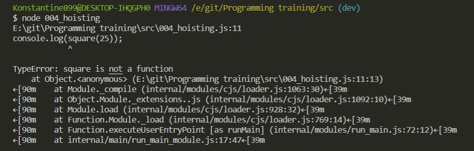
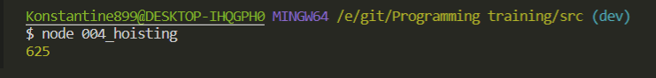

# hoisting

[https://www.youtube.com/watch?v=M_pclb-58ZY&t=990s](https://www.youtube.com/watch?v=M_pclb-58ZY&t=990s)

Очень важная тема для **JS** которая по сути показывает как вообще работает интерпретатор.

Сразу пример

```js
// hoisting.js

function sum(a, b) {
  return a + b;
}
console.log(sum(1, 41));
```



Все происходит как и должно быть.

Однако **JS** позволяет делать немного иначе. Мы можем вызывать функцию перед тем как мы ее опредилили.

```js
// hoisting.js

console.log(sum(1, 41));

function sum(a, b) {
  return a + b;
}
```


Условно **hoisting(подъем)** что эт такое? Это когда **JS** при интерпретации кокого либо файла берет и как бы перемещает определение некоторых вещей, например функций, в начало файла. Т.е. мы можем к ним обращаться еще до того как мы их определили.

Разберем некоторые примеры того что вообще стоит знать по **hoisting**.

```js
// hoisting.js

// console.log(sum(1, 41));

// function sum(a, b) {
//   return a + b;
// }

var i = 42;
console.log(i);
```


Но что если я попробую вызвать переменную до того как я ее определил?

```js
// hoisting.js

// console.log(sum(1, 41));

// function sum(a, b) {
//   return a + b;
// }

console.log(i);
var i = 42;
console.log(i);
```



Я получаю **undefined**. Т.е. мы не получаем ни какой ошибки. Просто говорим о том что переменная еще не определена. Но при это интерпретатор уже знает что дальше оп скрипту эта переменная будет определена и по этому он выдает значение **undefined**.

Ровно таким же образом если я сначало создам переменную и после ее переопределю. Будет всю то же самое

```js
// hoisting.js

// console.log(sum(1, 41));

// function sum(a, b) {
//   return a + b;
// }

var i;

console.log(i);
i = 42;
console.log(i);
```


Потому что когда я создал переменную и не передал в нее значение, то по умолчанию переменная без значения **= undefined**.

Есть разница между использованием ключевого слова **var** и **const**. т.е. переменные const и **let** они не подвержены **hoisting**

```js
// hoisting.js

// console.log(sum(1, 41));

// function sum(a, b) {
//   return a + b;
// }

// var i;

// console.log(i);
// i = 42;
// console.log(i);

console.log(num);
const num = 42;
console.log(num);
```



Мы не можем получить доступ к переменной **num** до ее инициализации.

Тоже самое происходит и сключевым словом **let**.

Так же в этой теме затронем **Function expression & Function Declaration** т.е. разные способы объявления функций.

```js
// hoisting.js

// Function expression & Function Declaration

console.log(square(25));

function square(num) {
  return num ** 2; // Возвожу в степень
}
```



Подобный способ создания функций называется **Function Declaration**.

Однако мы можем создавать функции через **Function Expression**

```js
// hoisting.js

// Function expression & Function Declaration

// console.log(square(25));

// function square(num) {
//  return num ** 2; // Возвожу в степень
// }

console.log(square(25));

const square = function (num) {
  return num ** 2; // Возвожу в степень
};
```

Мы в переменную заносим значение функции. Но при вызовее ее мы получим ошибку так как переменная square не является функцией.

Если **const** или **let** пишет что не удается получить доступ до инициализации.



Но он меняет на **var** и получает ошибку что переменная не является функцией.

```js
// hoisting.js

// Function expression & Function Declaration

// console.log(square(25));

// function square(num) {
//  return num ** 2; // Возвожу в степень
// }

console.log(square(25));

var square = function (num) {
  return num ** 2; // Возвожу в степень
};
```



Присутствует разница что если мы используем **Function Expression**, то функция которая задана таким образом

```js
// hoisting.js

// Function expression & Function Declaration

// console.log(square(25));

// function square(num) {
//  return num ** 2; // Возвожу в степень
// }

console.log(square(25));

var square = function (num) {
  return num ** 2; // Возвожу в степень
};
```

Такую функцию мы можем использовать только после того как переменная было определена.

```js
// hoisting.js

// Function expression & Function Declaration

// console.log(square(25));

// function square(num) {
//  return num ** 2; // Возвожу в степень
// }

var square = function (num) {
  return num ** 2; // Возвожу в степень
};

console.log(square(25));
```



Но если мы используем **Function Declaration**, то мы можем вызывать функцию где угодно и нам все равно где она определена.

На собеседовании часто спрашивают в чем отличие от **Function Declaration и Function Exprassion**.
