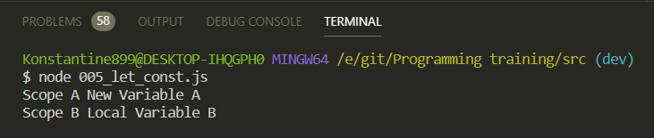
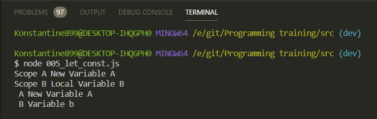
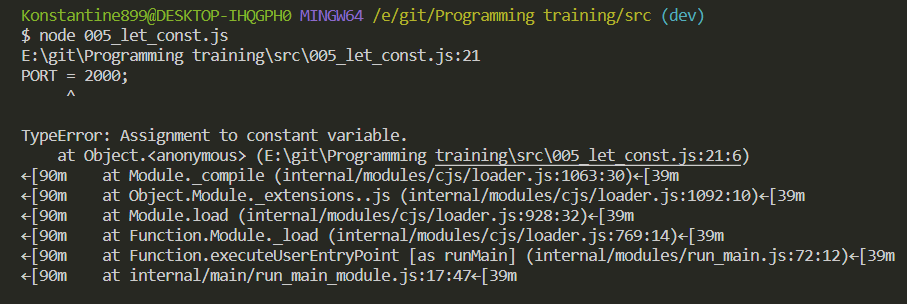
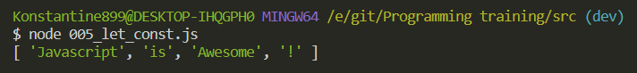
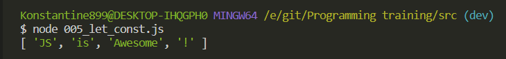
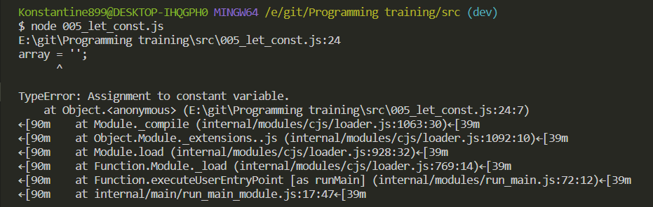
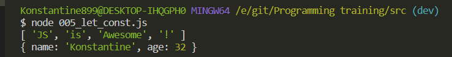
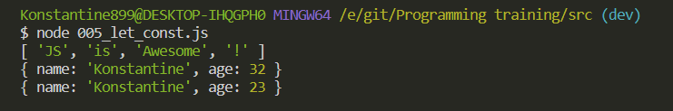
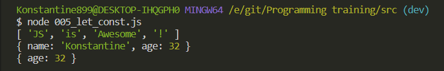

# let const

С появлением нового синтаксиса. В место ключевого слова **var** оно обозначает **variable** мы можем создавать различные переменные через два ключевых слова **let** и **const**.

**let** позволяет создавать переменные которые мы можем в последствии мы можем изменить

```js
// let

let a = 'Variable a';
let b = 'Variable b';

{
}
```

Помимо переменных я использую фигурные скобки. В **ES6** это называется **block scope** одна из статей которую я нашел [https://medium.com/edge-coders/function-scopes-and-block-scopes-in-javascript-25bbd7f293d7](https://medium.com/edge-coders/function-scopes-and-block-scopes-in-javascript-25bbd7f293d7)

Теперь в **ES6** подобные скобки как бы создают свой определенный **scope**.

В скобках я могу обратится к переменной **a** и сазать что она будет равняться.

```js
// let

let a = 'Variable a';
let b = 'Variable b';

{
  a = 'New Variable A';
}
```

И учитывая что в **scope** фигурных скобок мне доступна переменная **a**, то все должно работать красиво.

Однако если в новом **scope** я создам переменную **let** **b**

```js
// let

let a = 'Variable a';
let b = 'Variable b';

{
  a = 'New Variable A';
  let b = 'Local Variable B';
  console.log('Scope A', a);
  console.log('Scope B', b);
}
```



Мы получаем ожидаемое значение т.е. у переменной a значение **'New Variable A'**. Потому что мы внутри данного **scope** ее изменили. А переменная **b** береться от этого значения **let b = 'Local Variable B';** потому что переменная созданная через ключевое слово **let** она доступна только в рамках блочного **scope** т.е. только в рамках фигурных скобок. И соответственно локальная переменная находящаяся в **block scope** ни как не затрагивает глобальную переменную **b**.

В этом можно легко убедится.

```js
// let

let a = 'Variable a';
let b = 'Variable b';

{
  a = 'New Variable A';
  let b = 'Local Variable B';
  console.log('Scope A', a);
  console.log('Scope B', b);
}

console.log(' A', a);
console.log(' B', b);
```



И теперь что касается переменной **a**. Она у нас в локальном **scope** была изменена. Потому что мы обращались, по средством **reference** к глобальной переменной a и переопределяли ее значение.

При этом глобальная переменная **b** у нас осталась той же самой, которую мы оставляли по умолчанию.

Потому что когда мы внутри блочного **scope** попытались завести переменную **b**, то она доступна только внутри этих фигурных скобок. И она ни как не кофликтует с глобальной переменной **b**.

Все что стоит понимать про **let** это то что в данном случае она может изменяться и при этом она доступна внутри блочного **scope**.

<br>
<br>
<br>
<br>

Теперь что косается **const**.

В действительности это не совсем константа потому что мы работаем внутри **JS**, и все непременно приводится к переменным **var**.

Константа действительна если мы допустим объявим переменную **PORT**. И потом попробуем перезаписать ее значение.

```js
// let

// let a = 'Variable a';
// let b = 'Variable b';

// {
//   a = 'New Variable A';
//   let b = 'Local Variable B';
//   console.log('Scope A', a);
//   console.log('Scope B', b);
// }

// console.log(' A', a);
// console.log(' B', b);

///////////////////////////////

// Const

const PORT = 8080;
PORT = 2000;
```



Мы не можем изменять констану. Но это касается примитивных типов.

При этом присутствуют такие вещи как массивы и объекты.

```js
// let

// let a = 'Variable a';
// let b = 'Variable b';

// {
//   a = 'New Variable A';
//   let b = 'Local Variable B';
//   console.log('Scope A', a);
//   console.log('Scope B', b);
// }

// console.log(' A', a);
// console.log(' B', b);

///////////////////////////////

// Const

const PORT = 8080;
const array = ['Javascript', 'is', 'Awesome'];
```

Очевидно что сейчас в массиве у нас присутствует просто набор строк.

Но я могу изменять состовляющие массива.

```js
// let

// let a = 'Variable a';
// let b = 'Variable b';

// {
//   a = 'New Variable A';
//   let b = 'Local Variable B';
//   console.log('Scope A', a);
//   console.log('Scope B', b);
// }

// console.log(' A', a);
// console.log(' B', b);

///////////////////////////////

// Const

const PORT = 8080;
const array = ['Javascript', 'is', 'Awesome'];
array.push('!');
console.log(array);
```



Так же нам доступны такие методы как [shift](https://developer.mozilla.org/ru/docs/Web/JavaScript/Reference/Global_Objects/Array/shift) и , [unshift](https://developer.mozilla.org/ru/docs/Web/JavaScript/Reference/Global_Objects/Array/unshift) и т.д.
С помощью их мы можем спокойно изменять массив про эти [методы](https://learn.javascript.ru/array).

Более того мы можем не просто изменять с помощью этих методов массив. Мы можем напрямую обращаться к индексу и перезаписывать его значение.

```js
// let

// let a = 'Variable a';
// let b = 'Variable b';

// {
//   a = 'New Variable A';
//   let b = 'Local Variable B';
//   console.log('Scope A', a);
//   console.log('Scope B', b);
// }

// console.log(' A', a);
// console.log(' B', b);

///////////////////////////////

// Const

const PORT = 8080;
const array = ['Javascript', 'is', 'Awesome'];
array.push('!');
array[0] = 'JS';

console.log(array);
```



Но фишка заключается в том что мы можем изменять значение массива, но не переопределять сам массив.

```js
// let

// let a = 'Variable a';
// let b = 'Variable b';

// {
//   a = 'New Variable A';
//   let b = 'Local Variable B';
//   console.log('Scope A', a);
//   console.log('Scope B', b);
// }

// console.log(' A', a);
// console.log(' B', b);

///////////////////////////////

// Const

const PORT = 8080;
const array = ['Javascript', 'is', 'Awesome'];
array.push('!');
array[0] = 'JS';
array = '';

console.log(array);
```



Если рассматривать контекст объектов, то здесь все достаточно просто. Т.е. если я создаю пустой объект, то я могу изменять поля этого объекта.

```js
// let

// let a = 'Variable a';
// let b = 'Variable b';

// {
//   a = 'New Variable A';
//   let b = 'Local Variable B';
//   console.log('Scope A', a);
//   console.log('Scope B', b);
// }

// console.log(' A', a);
// console.log(' B', b);

///////////////////////////////

// Const

const PORT = 8080;
const array = ['Javascript', 'is', 'Awesome'];
array.push('!');
array[0] = 'JS';

console.log(array);

const obj = {};
obj.name = 'Konstantine';
obj.age = 32;

console.log(obj);
```



Мы получаем наполненный объект.

При этом я могу менять эти значения.

```js
// let

// let a = 'Variable a';
// let b = 'Variable b';

// {
//   a = 'New Variable A';
//   let b = 'Local Variable B';
//   console.log('Scope A', a);
//   console.log('Scope B', b);
// }

// console.log(' A', a);
// console.log(' B', b);

///////////////////////////////

// Const

const PORT = 8080;
const array = ['Javascript', 'is', 'Awesome'];
array.push('!');
array[0] = 'JS';

console.log(array);

const obj = {};
obj.name = 'Konstantine';
obj.age = 32;

console.log(obj);

obj.age = 23;

console.log(obj);
```



Внутреннее значение объекта я могу спокойно менять.

могу удалять поля с помощью оператора **delete**.

```js
// let

// let a = 'Variable a';
// let b = 'Variable b';

// {
//   a = 'New Variable A';
//   let b = 'Local Variable B';
//   console.log('Scope A', a);
//   console.log('Scope B', b);
// }

// console.log(' A', a);
// console.log(' B', b);

///////////////////////////////

// Const

const PORT = 8080;
const array = ['Javascript', 'is', 'Awesome'];
array.push('!');
array[0] = 'JS';

console.log(array);

const obj = {};
obj.name = 'Konstantine';
obj.age = 32;

console.log(obj);

delete obj.name;

console.log(obj);
```



И точно так же как и смассивами я не могу переобределить сам объект. Потому что мы можем только менять внутреннее состояние объекта.
