# Замыкание

Крайне важная тема для **JS** это замыкания.

Замыкание - это момент когда функция имеет доступ до перменных из вышестоящего **scope**. И впринципе это все. Можно говорить что это функция внутри функции, но в действительности это когда функция замыкает в себе определенные значения их вышестоящего b.

Рассмотрим простой пример.

```js
// closures

function sayHelloTo(name) {
  const message = 'Hello ' + name;
}
```

Но что я буду возвращать из этой функции? Из этой функции я буду возвращать не переменную **message**. А я буду возвращать новую функцию.

```js
// closures

function sayHelloTo(name) {
  const message = 'Hello ' + name;

  return function () {
    console.log(message);
  };
}
```

Т.е. как я говорил ранее замыкание это функция имеющая доступ до вышестоящего **scope**, а точнее их переменных.

Вот эта анонимная функция она имеет доступ до выше стоящего **scope**, где есть переменная **message**.

Посмотрим как это работает. Т.е. я могу создать переменную и эта переменная будет содержать результат работы функции **sayHelloTo** в параметры которой я должен передать какое-то имя.

```js
// closures

function sayHelloTo(name) {
  const message = 'Hello ' + name;

  return function () {
    console.log(message);
  };
}

const hello = sayHelloTo('Konstantine');
```

Но функция **sayHelloTo** нам возвращает функцию, т.е. переменная **hello** является функцией **sayHelloTo**. B анонимной функции нет такой переменной как **message** например. Но она доступна в **scope** на уровень выше. Анонимная функция как бы в себе замкнула переменную **message**.

И если сейчас я посомтрю что их себя представляет переменная **hello**.

```js
// closures

function sayHelloTo(name) {
  const message = 'Hello ' + name;

  return function () {
    console.log(message);
  };
}

const hello = sayHelloTo('Konstantine');
console.log(hello);
```

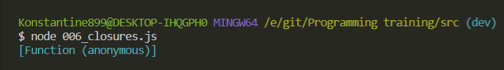

Раз это функция, то я могу ее вызвать. Вызываю без всяких параметров.

```js
// closures

function sayHelloTo(name) {
  const message = 'Hello ' + name;

  return function () {
    console.log(message);
  };
}

const hello = sayHelloTo('Konstantine');
console.log(hello);
console.log(hello());
```

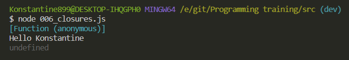

Так же я получил **undefined** по одной простой причине то что анонимная функция ничего не возвращает. А как мы знаем функция которая ничего не возвращает, по умолчанию возвращает **undefined**.

Если я при вызове функции уберу **console.log**. То у меня замыкание отработает так как надо. Так как внутри анонимной функции есть **console.log**, он его и вернет.

```js
// closures

function sayHelloTo(name) {
  const message = 'Hello ' + name;

  return function () {
    console.log(message);
  };
}

const hello = sayHelloTo('Konstantine');
console.log(hello);
hello();
```

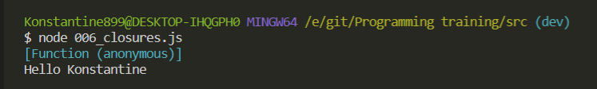

Ровно такая же история и сдругими созданными переменными в которые я помещаю результат работы замыкания.

```js
// closures

function sayHelloTo(name) {
  const message = 'Hello ' + name;

  return function () {
    console.log(message);
  };
}

const helloKonstantine = sayHelloTo('Konstantine');
const helloEkaterina = sayHelloTo('Ekaterina');
const helloIlya = sayHelloTo('Ilya');
const helloNikita = sayHelloTo('Nikita');

helloKonstantine();
helloEkaterina();
helloIlya();
helloNikita();
```

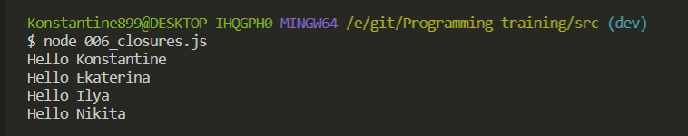

<br>
<br>
<br>
<br>

Рассмотрим практическое применение замыкания.

Я могу создать функцию **frameworkManager**

```js
// closures

// function sayHelloTo(name) {
//   const message = 'Hello ' + name;

//   return function () {
//     console.log(message);
//   };
// }

// const helloKonstantine = sayHelloTo('Konstantine');
// const helloEkaterina = sayHelloTo('Ekaterina');
// const helloIlya = sayHelloTo('Ilya');
// const helloNikita = sayHelloTo('Nikita');

// helloKonstantine();
// helloEkaterina();
// helloIlya();
// helloNikita();

function createFrameworkManager() {}
```

И допустим данная функция в себя ничего не будет принимать. В ней будет массив

```js
// closures

// function sayHelloTo(name) {
//   const message = 'Hello ' + name;

//   return function () {
//     console.log(message);
//   };
// }

// const helloKonstantine = sayHelloTo('Konstantine');
// const helloEkaterina = sayHelloTo('Ekaterina');
// const helloIlya = sayHelloTo('Ilya');
// const helloNikita = sayHelloTo('Nikita');

// helloKonstantine();
// helloEkaterina();
// helloIlya();
// helloNikita();

function createFrameworkManager() {
  const fw = ['Angular', 'React'];
}
```

Далее что будет нам возвращать эта функция?

Она будет возвращать объект. И у объекта я могу так же создавать определенные функции

```js
// closures

// function sayHelloTo(name) {
//   const message = 'Hello ' + name;

//   return function () {
//     console.log(message);
//   };
// }

// const helloKonstantine = sayHelloTo('Konstantine');
// const helloEkaterina = sayHelloTo('Ekaterina');
// const helloIlya = sayHelloTo('Ilya');
// const helloNikita = sayHelloTo('Nikita');

// helloKonstantine();
// helloEkaterina();
// helloIlya();
// helloNikita();

function createFrameworkManager() {
  const fw = ['Angular', 'React'];

  return {
    get: function () {},
  };
}
```

Данная функция будет получать доступ до выше стоящего **scope** т.е. в данном случае ключ **get** и его ключ анонимная функция, она так же является внутренней функцией, которая имеет доступ к переменным из выше стоящего **scope**.

Для лучшей наглядности переименую **get** на **print**.

И в данной функции буду просто выводить в консоль значения массива **fw**.

```js
// closures

// function sayHelloTo(name) {
//   const message = 'Hello ' + name;

//   return function () {
//     console.log(message);
//   };
// }

// const helloKonstantine = sayHelloTo('Konstantine');
// const helloEkaterina = sayHelloTo('Ekaterina');
// const helloIlya = sayHelloTo('Ilya');
// const helloNikita = sayHelloTo('Nikita');

// helloKonstantine();
// helloEkaterina();
// helloIlya();
// helloNikita();

function createFrameworkManager() {
  const fw = ['Angular', 'React'];

  return {
    print: function () {
      console.log(fw);
    },
  };
}
```

И например я реализую метод **add** который будет так же фвлятся функцией. Он будет принимать в себя параметр **framework**.

```js
// closures

// function sayHelloTo(name) {
//   const message = 'Hello ' + name;

//   return function () {
//     console.log(message);
//   };
// }

// const helloKonstantine = sayHelloTo('Konstantine');
// const helloEkaterina = sayHelloTo('Ekaterina');
// const helloIlya = sayHelloTo('Ilya');
// const helloNikita = sayHelloTo('Nikita');

// helloKonstantine();
// helloEkaterina();
// helloIlya();
// helloNikita();

function createFrameworkManager() {
  const fw = ['Angular', 'React'];

  return {
    print: function () {
      console.log(fw);
    },
    add: function (framework) {},
  };
}
```

В этой функции я так же ничего хранить не буду. В ней я буду обращаться к массиву и добавлять в него новый **famework**.

```js
// closures

// function sayHelloTo(name) {
//   const message = 'Hello ' + name;

//   return function () {
//     console.log(message);
//   };
// }

// const helloKonstantine = sayHelloTo('Konstantine');
// const helloEkaterina = sayHelloTo('Ekaterina');
// const helloIlya = sayHelloTo('Ilya');
// const helloNikita = sayHelloTo('Nikita');

// helloKonstantine();
// helloEkaterina();
// helloIlya();
// helloNikita();

function createFrameworkManager() {
  const fw = ['Angular', 'React'];

  return {
    print: function () {
      console.log(fw);
    },
    add: function (framework) {
      fw.push(framework);
    },
  };
}
```

Теперь как я могу с этим работать?

К примеру я могу создать переменную **manager** из функции **createFrameworkManager**

```js
// closures

// function sayHelloTo(name) {
//   const message = 'Hello ' + name;

//   return function () {
//     console.log(message);
//   };
// }

// const helloKonstantine = sayHelloTo('Konstantine');
// const helloEkaterina = sayHelloTo('Ekaterina');
// const helloIlya = sayHelloTo('Ilya');
// const helloNikita = sayHelloTo('Nikita');

// helloKonstantine();
// helloEkaterina();
// helloIlya();
// helloNikita();

function createFrameworkManager() {
  const fw = ['Angular', 'React'];

  return {
    print: function () {
      console.log(fw);
    },
    add: function (framework) {
      fw.push(framework);
    },
  };
}

const manager = createFrameworkManager();
console.log(manager);
```

Теперь если я поспотрю в консоли то я увижу что это обычный объект у которого есть два метода **print** и **add**.

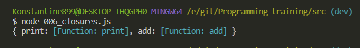

Что в этом примере интересного?

Дело в том что если мы попробуем посомотреть на переменную **fw**.

```js
// closures

// function sayHelloTo(name) {
//   const message = 'Hello ' + name;

//   return function () {
//     console.log(message);
//   };
// }

// const helloKonstantine = sayHelloTo('Konstantine');
// const helloEkaterina = sayHelloTo('Ekaterina');
// const helloIlya = sayHelloTo('Ilya');
// const helloNikita = sayHelloTo('Nikita');

// helloKonstantine();
// helloEkaterina();
// helloIlya();
// helloNikita();

function createFrameworkManager() {
  const fw = ['Angular', 'React'];

  return {
    print: function () {
      console.log(fw);
    },
    add: function (framework) {
      fw.push(framework);
    },
  };
}

const manager = createFrameworkManager();
console.log(manager);
console.log(fw);
```

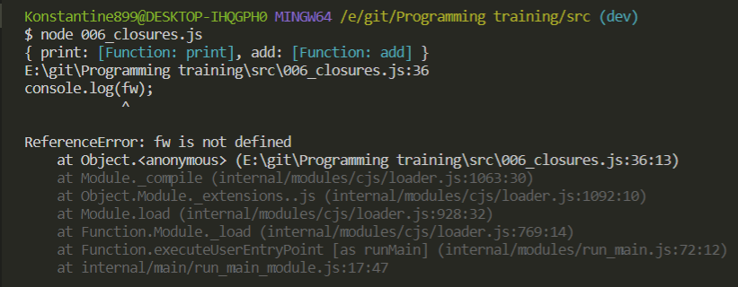

То мы получаем ошибку. Потому что он **is not defined**.
Т.е. у нас нигде нет переменной **fw**. Однако мы все равно можем с ней взаимодействовать через объект **manager**.

Ну тоесть мы можем обратится к manager и вызвать метод **print**

```js
// closures

// function sayHelloTo(name) {
//   const message = 'Hello ' + name;

//   return function () {
//     console.log(message);
//   };
// }

// const helloKonstantine = sayHelloTo('Konstantine');
// const helloEkaterina = sayHelloTo('Ekaterina');
// const helloIlya = sayHelloTo('Ilya');
// const helloNikita = sayHelloTo('Nikita');

// helloKonstantine();
// helloEkaterina();
// helloIlya();
// helloNikita();

function createFrameworkManager() {
  const fw = ['Angular', 'React'];

  return {
    print: function () {
      console.log(fw);
    },
    add: function (framework) {
      fw.push(framework);
    },
  };
}

const manager = createFrameworkManager();
manager.print();
```

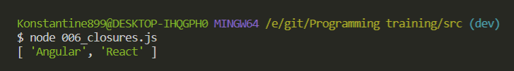

Я так же могу использовать **join** и добавить им по пустой строке.

```js
// closures

// function sayHelloTo(name) {
//   const message = 'Hello ' + name;

//   return function () {
//     console.log(message);
//   };
// }

// const helloKonstantine = sayHelloTo('Konstantine');
// const helloEkaterina = sayHelloTo('Ekaterina');
// const helloIlya = sayHelloTo('Ilya');
// const helloNikita = sayHelloTo('Nikita');

// helloKonstantine();
// helloEkaterina();
// helloIlya();
// helloNikita();

function createFrameworkManager() {
  const fw = ['Angular', 'React'];

  return {
    print: function () {
      console.log(fw.join(' '));
    },
    add: function (framework) {
      fw.push(framework);
    },
  };
}

const manager = createFrameworkManager();
manager.print();
```

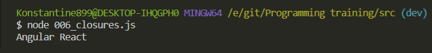

Т.е. я уже получаю доступ до переменной **fw**.

Если я попробую что, то положить в этот массив.

```js
// closures

// function sayHelloTo(name) {
//   const message = 'Hello ' + name;

//   return function () {
//     console.log(message);
//   };
// }

// const helloKonstantine = sayHelloTo('Konstantine');
// const helloEkaterina = sayHelloTo('Ekaterina');
// const helloIlya = sayHelloTo('Ilya');
// const helloNikita = sayHelloTo('Nikita');

// helloKonstantine();
// helloEkaterina();
// helloIlya();
// helloNikita();

function createFrameworkManager() {
  const fw = ['Angular', 'React'];

  return {
    print: function () {
      console.log(fw.join(' '));
    },
    add: function (framework) {
      fw.push(framework);
    },
  };
}

const manager = createFrameworkManager();
manager.print();
manager.add('VueJS');

manager.print();
```

То я уже получаю новое значение.

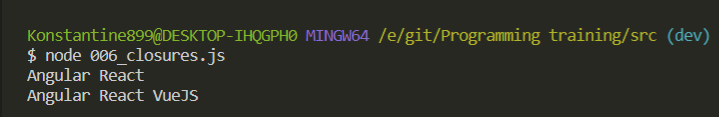

Мы все равно взаимодействуем с **fw**, но она как бы уже является приватной переменной объекта **manager**. И это реализовано с помощью замыкания.

Потому что этои две фугкции **print** и **add** они как бы замкнули в себе значение переменно **fw**.

Оно нигде нам не доступно из вне, но при этом мы можем все равно с ним взаимодействовать.

<br>
<br>
<br>
<br>

Рассмотрим класический пример который часто спрашивают на собеседовании.

Замыкиния с **setTimeout**.

Создаю массив фибоначчи.

```js
// closures

// function sayHelloTo(name) {
//   const message = 'Hello ' + name;

//   return function () {
//     console.log(message);
//   };
// }

// const helloKonstantine = sayHelloTo('Konstantine');
// const helloEkaterina = sayHelloTo('Ekaterina');
// const helloIlya = sayHelloTo('Ilya');
// const helloNikita = sayHelloTo('Nikita');

// helloKonstantine();
// helloEkaterina();
// helloIlya();
// helloNikita();

// function createFrameworkManager() {
//   const fw = ['Angular', 'React'];

//   return {
//     print: function () {
//       console.log(fw.join(' '));
//     },
//     add: function (framework) {
//       fw.push(framework);
//     },
//   };
// }

// const manager = createFrameworkManager();
// manager.print();
// manager.add('VueJS');

// manager.print();

///////////////////////////////////////////////

const fib = [1, 2, 3, 5, 8, 13];
```

И у нас есть задача. У нас есть цикл **for**, где на каждой итерации я создаю индекс **i**, который по умолчанию **i = 0**. Далее я пробегаюсь по длинне всего массива **i < fib.length**, и далее инкремент **i++**.

```js
// closures

const fib = [1, 2, 3, 5, 8, 13];

for (var i = 0; i < fib.length; i++) {}
```

В чем заключается наша задача?

Нам нужно через определенную задержку вывести все числа фибоначчи в консоль.

С помощью **setTimeout** мы можем в него передать функцию. Данная функция ничего не будет принимать.

```js
// closures

const fib = [1, 2, 3, 5, 8, 13];

for (var i = 0; i < fib.length; i++) {
  setTimeout(function () {});
}
```

Допустим мы все будем выводит через 1500 секунды

```js
// closures

const fib = [1, 2, 3, 5, 8, 13];

for (var i = 0; i < fib.length; i++) {
  setTimeout(function () {
    console.log(`fib[${i}] = ${fib[i]}`);
  }, 1500);
}
```

Если я запущу скрипт

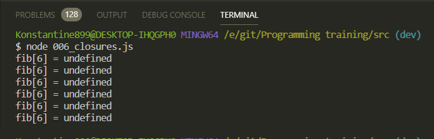

Через 1500 сек я получаю вот такую картину. Мы каждый раз обращаемся к 6 индексу.

И здесь возникает вопрос. Что вообще происходит? И вам нужно будет на собеседовании объяснить как это работет.

В действительности мы один раз создаем переменную **i** и дальше она у нас изменяется как **reference**.

Т.е. массив фибоначчи у нас равен 6 ти элементам. Он проверяет 6 < 6, т.е. **i < fib.length**. Нет **false**. И после этого цикл for у нас не работает. Но **i** у нас уже принимает значение 6-ти.

Такого индекса кстати нет. Максимальный индекс в массиве **5-ть**. И по этому у нас везде выводится 6. А **undefined** происходит потому что мы каждые 1500 секунды ображаемся к 6-му индексу.

Существует два способа как это починить. Самый простой способ это поменять на переменную **let**.

```js
// closures

const fib = [1, 2, 3, 5, 8, 13];

for (let i = 0; i < fib.length; i++) {
  setTimeout(function () {
    console.log(`fib[${i}] = ${fib[i]}`);
  }, 1500);
}
```

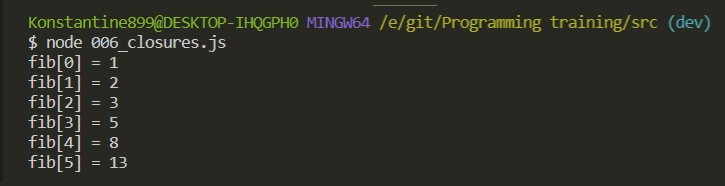

**let** происходит так потому что как я уже говорил потому что она сущетвует только внутри **block scope**. Блочным **scope** в данном случае являются фигурные скобки тела цикла.

Однако если же мы не можем использовать **ES6** синтаксис, то напомощь в этом случае к нам приходит замыкание.

В теле функции мы все оборачиваем в круглые скобки. И дальше мы эти круглые скобки сразу же вызываем.

```js
// closures


const fib = [1, 2, 3, 5, 8, 13];

for (var i = 0; i < fib.length; i++) {
  ()()
  setTimeout(function () {
    console.log(`fib[${i}] = ${fib[i]}`);
  }, 1500);
}

```

Внутри этих круглых скобок создаю функцию, которая будет вводить в **setTimeout** определенные значения. И эта функция будет принимать в себя параметр например **j**.

```js
// closures

const fib = [1, 2, 3, 5, 8, 13];

for (var i = 0; i < fib.length; i++) {
  (function (j) {
    setTimeout(function () {
      console.log(`fib[${j}] = ${fib[j]}`);
    }, 1500);
  })();
}
```

Но откуда возьмется эта переменная **j**? Мы будем ее брать из текущей итерации **i**. Данную **i** передаю в как параметр при вызове данной анонимной функции т.е. в круглые скобки вызова.

```js
// closures

const fib = [1, 2, 3, 5, 8, 13];

for (var i = 0; i < fib.length; i++) {
  (function (j) {
    setTimeout(function () {
      console.log(`fib[${j}] = ${fib[j]}`);
    }, 1500);
  })(i);
}
```

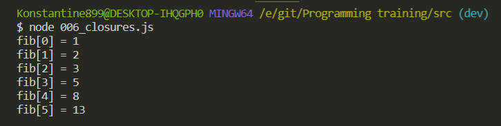
