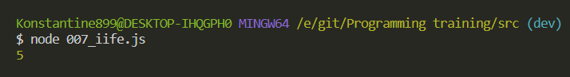
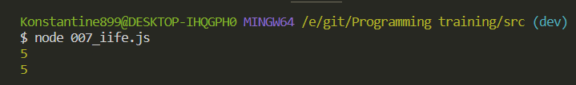
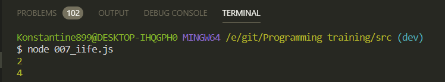

# IIFE

Если переводить данную обревиатуру то она пишется следующим образом. **Immediate Invoked Function Expression** [https://developer.mozilla.org/en-US/docs/Glossary/IIFE](https://developer.mozilla.org/en-US/docs/Glossary/IIFE)

Это некоторый **function expression** который моментально выполняется.

Вся идея сводится к тому что мы можем создавать определенные функции которые будут моментально вызваны. И зачастую они используются для создания какого-то локального **scope**. Например как в прошлом принмере

```js
const fib = [1, 2, 3, 5, 8, 13];

for (var i = 0; i < fib.length; i++) {
  (function (j) {
    setTimeout(function () {
      console.log(`fib[${j}] = ${fib[j]}`);
    }, 1500);
  })(i);
}
```

Такие функции обычно окружены круглыми скобками. И по сути они вызываютя моментально. Это все что по сути о них нужно знать.

Здесь мы можем в качестве примера создать массив результата

```js
// Immediate Invoked Function Expression

let result = [];

for (var i = 0; i < 5; i++) {
  result.push();
}
```

И здесь с помощью метода **push** я хочу положить функцию, т.е. каждым элементом данного массива будет являться функция, которая будет возвращать переменную **i**.

```js
// Immediate Invoked Function Expression

let result = [];

for (var i = 0; i < 5; i++) {
  result.push(function () {
    return i;
  });
}
```

И теперь что мы можем посмотреть?

В теле цикла изменю на вывод в консоль **i**

```js
// Immediate Invoked Function Expression

let result = [];

for (var i = 0; i < 5; i++) {
  result.push(function () {
    console.log(i);
  });
}
```

И теперь я могу обратится к **result** его индексу например **2**. И учитывая что это у нас функция, то я могу сразу ее вызвать.

```js
// Immediate Invoked Function Expression

let result = [];

for (var i = 0; i < 5; i++) {
  result.push(function () {
    console.log(i);
  });
}
result[2]();
```



Если я например обращусь например к последнему 4-му индексу то я все равно получаю **5**.

```js
// Immediate Invoked Function Expression

let result = [];

for (var i = 0; i < 5; i++) {
  result.push(function () {
    console.log(i);
  });
}
result[2]();
result[4]();
```



Это происходит потому что мы здесь используетм ключевое слово **var**. И когда мы обращаемся к данному **console.log**, то мы обращаемся к переменной **i** которая в данном случае **= 5**.

Как нам поправить данное значение для того что бы все работало?

Мы можем повторить подобный подход как делали до этого.

```js
// Immediate Invoked Function Expression

let result = [];

// for (var i = 0; i < 5; i++) {
//   result.push(function () {
//     console.log(i);
//   });
// }
// result[2]();
// result[4]();

for (var i = 0; i < 5; i++) {}
```

И далее в теле цикла мы можем создать копию переменной **i** уже используюя **iife**. Т.е. я беру в круглые скобки оборачиваю анонимную функцию

```js
// Immediate Invoked Function Expression

let result = [];

// for (var i = 0; i < 5; i++) {
//   result.push(function () {
//     console.log(i);
//   });
// }
// result[2]();
// result[4]();

for (var i = 0; i < 5; i++) {
  (function () {})();
}
```

И данная анонимная функция будет вызвана сразу же.

В теле анонимной функции я могу создать переменную **j**, т.е. скопировать значение переменно **i** в своем собственно **scope**.

```js
// Immediate Invoked Function Expression

let result = [];

// for (var i = 0; i < 5; i++) {
//   result.push(function () {
//     console.log(i);
//   });
// }
// result[2]();
// result[4]();

for (var i = 0; i < 5; i++) {
  (function () {
    j = i;
  })();
}
```

И дальше в результат я буду добавлять функцию

```js
// Immediate Invoked Function Expression

let result = [];

// for (var i = 0; i < 5; i++) {
//   result.push(function () {
//     console.log(i);
//   });
// }
// result[2]();
// result[4]();

for (var i = 0; i < 5; i++) {
  (function () {
    j = i;
    result.push(function () {
      console.log(j);
    });
  })();
}
```

И сейчас по идее все должно работать. Не внимательно писал до этого. Вот правильный

```js
// Immediate Invoked Function Expression

let result = [];

// for (var i = 0; i < 5; i++) {
//   result.push(function () {
//     console.log(i);
//   });
// }
// result[2]();
// result[4]();

for (var i = 0; i < 5; i++) {
  (function () {
    var j = i;
    result.push(function () {
      console.log(j);
    });
  })();
}
result[2]();
result[4]();
```


