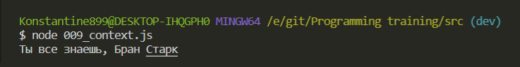
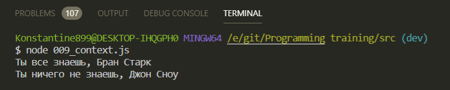
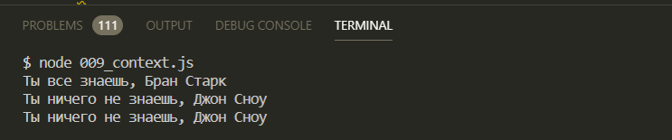
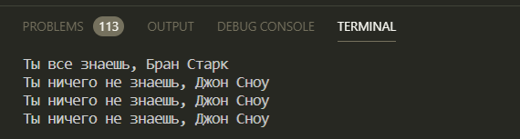
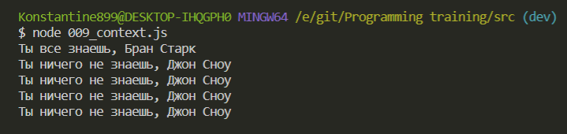
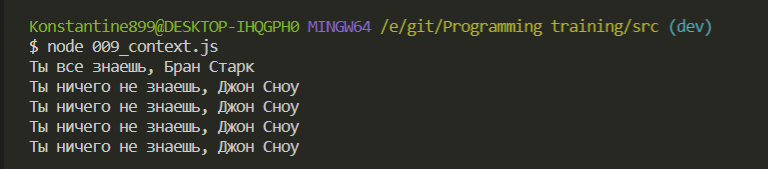
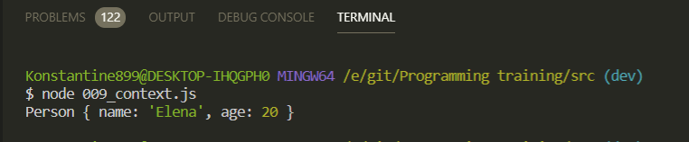
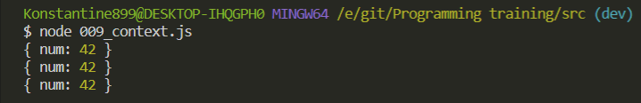
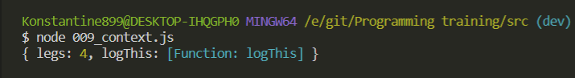
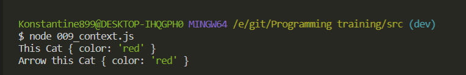

# context

Очень важная тема.

Что такое контекст? Зачастую контекст путают с таким понятием как **scope**.

Если мы вспомним про то что такое **scope**, то по сути **scope** указывает на видимость определенных переменных.

Если же говорить про **context**, то **context** он определяет как функция была вызвана. И он постоянноу указывает на ключевое слово **this**. В текущем участке кода в котором мы работаем.

И с контекстом связаны такие тематики как функция **call**, **apply**, и **bind**. Мы их сейчас рассмотрим.

Пока рассмотрим пример как **JS** работает с контекстом.

```js
// context

const person = {
  surname: 'Старк',
  knows: function (what, name) {},
};
```

Все что будет делать данная функция она будет в литералах выводить следующее значение

```js
// context

const person = {
  surname: 'Старк',
  knows: function (what, name) {
    console.log(`Ты ${what} знаешь, ${name} ${}`)
  },
};

```

Помимо всего этого я хочу вывести фамилию, для этого я буду использовать контекст **this**. При обращении к **this** выходит на уровень выше. Т.е. анонимная функция ключа **knows** создала свой контекст. Однако данная функция находится в контексте объекта **person**. И скажем так, для того что бы выйти из контекста анонимной функции, я использую ключевое слово **this**. **this** становится равна объекту **person**. А значит я могу обращатся к ключам этого объекта.

```js
// context

const person = {
  surname: 'Старк',
  knows: function (what, name) {
    console.log(`Ты ${what} знаешь, ${name} ${this.surname}`);
  },
};
```

Теперь мы можем обратиться к объекту **person** и вызвать его метод **knows**. И при вызове данной функции я передаю параметры.

```js
// context

const person = {
  surname: 'Старк',
  knows: function (what, name) {
    console.log(`Ты ${what} знаешь, ${name} ${this.surname}`);
  },
};

person.knows('все', 'Бран');
```



Что здесь происходить? Переданные параметры функции являются обычными параметрами которые мы передаем в функцию и они просто выводятся. А **this.surname** берется у объекта **person**.

Но тут в систему входит другой персонаж

```js
// context

const person = {
  surname: 'Старк',
  knows: function (what, name) {
    console.log(`Ты ${what} знаешь, ${name} ${this.surname}`);
  },
};

const john = { surname: 'Сноу' };

person.knows('все', 'Бран');
```

Теперь я хочу воспользоваться методом **knows** у объекта **person** для того что бы так же вывети ключевую фразу для **john**.

Для этого я могу воспользоватся форсированной передачей контекста. т.е. я хочу вызвать метод knows в контексте объекта **john**.

Допустим я могу обратится к объекту person и вызвать метод **knows**, но сейчас я не вызываю этот метод, а у функции в **JS** так же присутствуют матоды, потому что функции на самом деле являются объектами. И у данного метода **knows** я могу вызвать метод **call**, который первым параметром принимает в себя новый какой-то контекст. А контекст в **JS** является объектом. Т.е. в параметр я могу смело передать **jhon**

```js
// context

const person = {
  surname: 'Старк',
  knows: function (what, name) {
    console.log(`Ты ${what} знаешь, ${name} ${this.surname}`);
  },
};

const john = { surname: 'Сноу' };

person.knows('все', 'Бран');
person.knows.call(john);
```

Метод **call** работает следующим образом. Он сразу же вызывает эту функцию с нужным контекстом, который мы передали в первый параметр т.е. контекст объекта **jhon**. Но далее через запятую он принимает остальные параметры которые нужны для этой функции.

```js
// context

const person = {
  surname: 'Старк',
  knows: function (what, name) {
    console.log(`Ты ${what} знаешь, ${name} ${this.surname}`);
  },
};

const john = { surname: 'Сноу' };

person.knows('все', 'Бран');
person.knows.call(john, 'ничего не', 'Джон');
```



Мы вызвали метод **knows** у объекта **person** но при этом мы получаем другую строчку. Потому что мы вызвали с контекстом **jhon**. И учитывая то что мы это вызывали в контексте **jhon** то **${this.surname}** указывает на **jhon** у которого есть фамилия **Сноу**.

По аналогии с методом **call** в **JS** присутствует метод **apply**. И единственное его отличие заключается в том что у него всего лишь два параметра. Второй параметр всегда массив. Т.е. массив аргументов которые нужны для работы функции **knows**.

```js
// context

const person = {
  surname: 'Старк',
  knows: function (what, name) {
    console.log(`Ты ${what} знаешь, ${name} ${this.surname}`);
  },
};

const john = { surname: 'Сноу' };

person.knows('все', 'Бран');
person.knows.call(john, 'ничего не', 'Джон');
person.knows.apply(john, ['ничего не', 'Джон']);
```



Кстати мы так же можем использовать **ES6** синтаксис и контекст так же передавать в метод **call** и передавать его в качестве массива, но здесь мы его можем разворачивать с помощью оператора **spreed**.

```js
// context

const person = {
  surname: 'Старк',
  knows: function (what, name) {
    console.log(`Ты ${what} знаешь, ${name} ${this.surname}`);
  },
};

const john = { surname: 'Сноу' };

person.knows('все', 'Бран');
person.knows.call(john, 'ничего не', 'Джон');
person.knows.apply(john, ['ничего не', 'Джон']);
person.knows.call(john, ...['ничего не', 'Джон']);
```



На подобие метода **call** и **apply** так же присутствует метод **bind**.

Как и метод **call** он первым параметром принимает контекст. После этого он принимает не ограниченное количество аргументов, которые нужны для функции. Но едиственно отличие метода **bind** от остальных методов в том что он не вызывает функцию сразу же, а он возвращает новую функцию т.е. либо мы можем вызвать данную функцию сразу же с помощью **()**.

```js
// context

const person = {
  surname: 'Старк',
  knows: function (what, name) {
    console.log(`Ты ${what} знаешь, ${name} ${this.surname}`);
  },
};

const john = { surname: 'Сноу' };

person.knows('все', 'Бран');
person.knows.call(john, 'ничего не', 'Джон');
person.knows.apply(john, ['ничего не', 'Джон']);
person.knows.call(john, ...['ничего не', 'Джон']);
person.knows.bind(john, 'ничего не', 'Джон')();
```



Либо мы можем создать переменную в которую поместим резултат данной функции и после вызвать данную переменную.

```js
// context

const person = {
  surname: 'Старк',
  knows: function (what, name) {
    console.log(`Ты ${what} знаешь, ${name} ${this.surname}`);
  },
};

const john = { surname: 'Сноу' };

person.knows('все', 'Бран');
person.knows.call(john, 'ничего не', 'Джон');
person.knows.apply(john, ['ничего не', 'Джон']);
person.knows.call(john, ...['ничего не', 'Джон']);
const bound = person.knows.bind(john, 'ничего не', 'Джон');

bound();
```



<br>
<br>
<br>

Следующий пример с контекстом. В **JS** если еще говорить про **ES5** мы могли создавать классы через ключевое слово **function**.

Допустим я создам класс Person который в качестве параметров будет принимать два параметра **name**, **age**

```js
// context

const person = {
  surname: 'Старк',
  knows: function (what, name) {
    console.log(`Ты ${what} знаешь, ${name} ${this.surname}`);
  },
};

const john = { surname: 'Сноу' };

person.knows('все', 'Бран');
person.knows.call(john, 'ничего не', 'Джон');
person.knows.apply(john, ['ничего не', 'Джон']);
person.knows.call(john, ...['ничего не', 'Джон']);
const bound = person.knows.bind(john, 'ничего не', 'Джон');

bound();

//==========================================================

function Person(name, age) {}
```

И учитывая то что данная функция у нас будет классом мы можем здесь использовать контекст

```js
// context

const person = {
  surname: 'Старк',
  knows: function (what, name) {
    console.log(`Ты ${what} знаешь, ${name} ${this.surname}`);
  },
};

const john = { surname: 'Сноу' };

person.knows('все', 'Бран');
person.knows.call(john, 'ничего не', 'Джон');
person.knows.apply(john, ['ничего не', 'Джон']);
person.knows.call(john, ...['ничего не', 'Джон']);
const bound = person.knows.bind(john, 'ничего не', 'Джон');

bound();

//==========================================================

function Person(name, age) {
  this.name = name;
  this.age = age;
}
```

т.е. те параметры которые мы передаем в **constructor**.

И теперь мы можем сразу в консоли посмотреть на контекст.

```js
// context

const person = {
  surname: 'Старк',
  knows: function (what, name) {
    console.log(`Ты ${what} знаешь, ${name} ${this.surname}`);
  },
};

const john = { surname: 'Сноу' };

person.knows('все', 'Бран');
person.knows.call(john, 'ничего не', 'Джон');
person.knows.apply(john, ['ничего не', 'Джон']);
person.knows.call(john, ...['ничего не', 'Джон']);
const bound = person.knows.bind(john, 'ничего не', 'Джон');

bound();

//==========================================================

function Person(name, age) {
  this.name = name;
  this.age = age;

  console.log(this);
}
```

Теперь мы можем создавать объекты от данного класса т.е. как **instance** данного класса через ключевое слово **new**.

```js
function Person(name, age) {
  this.name = name;
  this.age = age;

  console.log(this);
}

const elena = new Person('Elena', 20);
```



Видно что данный объект **elena** является **instance** класса **Person**.

Если мы создаем функции которые у нас являются классами, то контекст у нас доступен таким образом. И объект **elena** равняется объекту **this**.

Существуют такие понятия как **binding** т.е. от метода **bind**. Можно запоминать что мы явно передаем какой-то контекст.

Так вот существует явный **binding**. По английски он называется **explicit**. Т.е. мы явно указываем с каким контекстом нам нужно вызывать функцию.

Как пример можно разобрать следующее.

```js
function logThis() {
  console.log(this);
}
```

И к примеру у меня будет какой - нибудь объект.

```js
function logThis() {
  console.log(this);
}

const obj = { num: 42 };
```

И теперь я могу разными способами вызывать, передавая явно контекст в эту функцию.

```js
function logThis() {
  console.log(this);
}

const obj = { num: 42 };

logThis.apply(obj);
logThis.call(obj);
logThis.bind(obj)(); // всегда возвращает функции поэтому сразу ее вызываю
```



Т.е. мы явно передаем контекст. В принципе на этом и завязан весь концепт.

<br>
<br>
<br>

Так же присутствует не явная передача параметров. Не передача контекста. По Английски это **implicit**

```js
const animal = {
  legs: 4, // количество ног
  logThis: function () {
    console.log(this);
  },
};
```

Если я сейчас вызову у объекта **animal** метод logT**his()** то мы получим объект в контексте которого был вызван данный метод.

```js
const animal = {
  legs: 4, // количество ног
  logThis: function () {
    console.log(this);
  },
};

animal.logThis();
```



В данном случае это у нас не вная привязка к контексту, потому что к функции **logThis** у нас привязался контекст того объекта в котором был вызван этот метод.

<br>
<br>
<br>

стрелочные ффункции и контекст.

Когда мы создаем функцию через ключевое слово **function**, то данная функция внутри себя создает новый контекст.

Рассмотрим такой пример

```js
function Cat(color) {
  this.color = color;
  console.log('This', this);
}
```

Далее применим концепт **iife**

```js
function Cat(color) {
  this.color = color;
  console.log('This', this)()();
}
```

Здесь внутри я могу определить стрелочную функцию которая будет вызвана. И данная стрелочная функция будет в консоль выводить значение. Здесь, кстати, это один из немногих случаев где нужна точка с запятой. Короче ставит он ее перед **iife т.е. ;()()**. Текстовый редактор у меня ее убирает.

```js
function Cat(color) {
  this.color = color;
  console.log('This', this);
  (() => console.log('Arrow this', this))();
}

new Cat('red');
```



Мы в обоих случаях получаем контекст **this** который относится к конструктору кошки. Потому что стрелочная функция не создает свой собственный контекст. Это и есть одно из главный приимуществ стрелочной функции.
