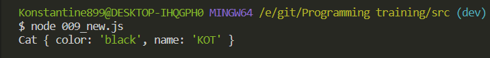
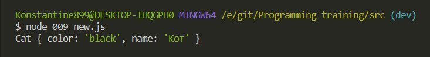
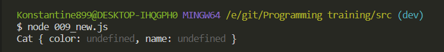

# new

Посути это базовая теория в **JS**. Но мы должны понимать как она работает.

Безусловно вы знаете что мы можем создавать какой-нибудь класс. Скажем **Cat**.

```js
// new

function Cat(color, name) {
  this.color = color;
  this.name = name;
}
```

Допустим я хочу создать переменную **cat**. Через ключевое слово **new** т.е. когда я его применяю к какой-нибудь функции, у меня появляется новый **instance** этого класса, в данном случае **Cat**, у которого будут доступны эти поля.

```js
// new

function Cat(color, name) {
  this.color = color;
  this.name = name;
}

const cat = new Cat('black', 'КОТ');
console.log(cat);
```



В классе **Cat** присутсттвуют те поля которые мы передавали в конструктор.

В действительности будет интересно разобрать как работает это ключевое слово new, потому что на самом деле мы можем создавать свое собственное ключевое слово **new**.

И работать это будет примерно таким образом. Я создаю функцию **myNew** и в него мы помещаем **constructor** т.е. та функция которая является конструктором. И вторым аргументом с помощью оператора **rest** получу массив **args**. т.е. все те поля которые нам нужны для создания нового экземпляра класса.

```js
// new

function Cat(color, name) {
  this.color = color;
  this.name = name;
}

// const cat = new Cat('black', 'КОТ');
// console.log(cat);

function myNew(constructor, ...args) {}
```

В теле цикла, на выходе у оператора new я должен вернуть объект. Поэтому в теле функции я создаю пустой объект.

```js
// new

function Cat(color, name) {
  this.color = color;
  this.name = name;
}

// const cat = new Cat('black', 'КОТ');
// console.log(cat);

function myNew(constructor, ...args) {
  const obj = {};
}
```

Далее с помощью глобального класса **Object** и его метода **setPrototypeOf()**. Я указываю для нового созданного объекта прототип функции конструктора т.е. **constructor.prototype**. И далее мне необходимо просто вернуть объект. Для этого возвращаю **constructor**, **consctructor** это у нас функция, у фукции у нас присутствует метод **apply()** куда я могу передавать контекст **obj**, и все те параметры в массиве **args**. Ну и на всякий случай сделаю проверку что если это все не работает то я просто возвращаю сам объект.

```js
// new

function Cat(color, name) {
  this.color = color;
  this.name = name;
}

// const cat = new Cat('black', 'КОТ');
// console.log(cat);

function myNew(constructor, ...args) {
  const obj = {};
  Object.setPrototypeOf(obj, constructor.prototype);
  return constructor.apply(obj, args) || obj;
}
```

Теперь получается что кота я могу создать через функцию **myNew**. Куда первым параметром я передаю конструктор это функция **Cat**, ну и дальше собственно аргументы.

```js
// new

function Cat(color, name) {
  this.color = color;
  this.name = name;
}

// const cat = new Cat('black', 'КОТ');
// console.log(cat);

function myNew(constructor, ...args) {
  const obj = {};
  Object.setPrototypeOf(obj, constructor.prototype);
  return constructor.apply(obj, args) || obj;
}

const cat = myNew(Cat, 'black', 'Кот');

console.log(cat);
```



Мы получаем тот же самый результат.

Таким образом выглядит нативная реализация в **ES5** синтаксисе ключевого слова **new**. На самом деле видно что это всего лишь взаимодействие между объектами.

И еще пару примеров ключевого слова **new** и того как создаются **instance** классов в **JS**.

Мы не можем создать переменную **cat** допустим таким образом.

```js
const cat = Cat();
```

В переменной **cat** будет **undefined** потому что функция **Cat** ничего не возвращает. И для того что бы все работало мы применяем оператор **new**.

```js
// new

function Cat(color, name) {
  this.color = color;
  this.name = name;
}

// const cat = new Cat('black', 'КОТ');
// console.log(cat);

// function myNew(constructor, ...args) {
//   const obj = {};
//   Object.setPrototypeOf(obj, constructor.prototype);
//   return constructor.apply(obj, args) || obj;
// }

// const cat = myNew(Cat, 'black', 'Кот');

// console.log(cat);

const cat = new Cat();
console.log(cat);
```



И теперь мы получаем значения.
