# prototype

На самом деле это относиельно не понятная конструкция в **JS** потому что как минимум она используется в двух разных контекстах.

И что очень важно понимать?

Что во-первых каждый объект имеет свой прототип который берется от родительского элемента от которого был создан данный объект. Для того что бы получить этот родительский прототип используется специальное слово **\_\_proto\_\_** который по сути берет и указывает на прототип родительского класса или объекта от которого был создан данный объект.

Но безусловно стоит оговорится что в **JS** любое наследование происходит как прототипированное наследование, когда все идет по цепочке, по дереву. Существует какой-то базовый класс. От него допустим создаются другие классы. И дальше если мы обращаемся к какому нибудь свойству объекта, то он сначало начинает смотреть сначало на само свойство, если этого свойства нет то он смотрит в прототип, который является объектом. Если и там не находит то смотрит в прототип прототипа этого объекта и т.д.

Так вот с помощью свойства **\_\_proto\_\_** мы можем получить доступ до родительского прототипа. И по сути стоит так же оговорится что это стало доступно относительно не давно, в **ES6** синтаксисе. Потому что до этого, в **ES5** синтаксисе у нас для этого служило свойство **Object.getPrototypeOf()**

```js
// __proto__ ES6
// Object.getPrototypeOf() ES5
```

И существует второй контекст в котором мы говорим про прототип это свойство **prototype** у различных функций, которые по сути служат для того что бы передавать эти свойства для объектов которые создаются допустим через ключевое слово **new**.

Рассмотрим.

```js
// __proto__ ES6
// Object.getPrototypeOf() ES5

function Cat(name, color) {
  this.name = name;
  this.color = color;
}
```

Тут нет ничего не обычного. Самый обычный класс на **ES5** синтаксисе.

Данная функция **Cat** по сути выступает у нас в роли класса. По этому как я говорил, у функции мы можем использовать свойство **prototype**, с помощью которого мы можем расширять функционал данного класса. Например я могу занести функцию **voice**

```js
// __proto__ ES6
// Object.getPrototypeOf() ES5

function Cat(name, color) {
  this.name = name;
  this.color = color;
}

Cat.prototype.voice = function () {
  console.log(`Cat ${this.name}`);
};
```

Мы обращаемся к ключевому слову **this**. Учитывая то что ключевое слово **function** нам создает свой контекст, с помощью **this** мы обращаемся к контексту класса **Cat**.

Теперь я могу создать переменную **cat** и поместить в нее вызов класса через **new Cat()** и передаю параметры.

```js
// __proto__ ES6
// Object.getPrototypeOf() ES5

function Cat(name, color) {
  this.name = name;
  this.color = color;
}

Cat.prototype.voice = function () {
  console.log(`Cat ${this.name}`);
};

const cat = new Cat('Kot', 'white');
```

то теперь у объекта **cat** нам доступно несколько полей

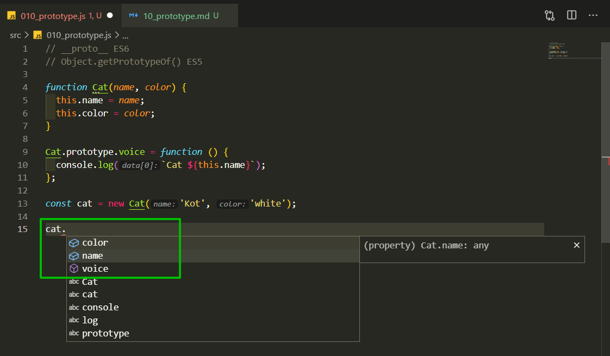

```js
// __proto__ ES6
// Object.getPrototypeOf() ES5

function Cat(name, color) {
  this.name = name;
  this.color = color;
}

Cat.prototype.voice = function () {
  console.log(`Cat ${this.name}`);
};

const cat = new Cat('Kot', 'white');

cat.voice();
```

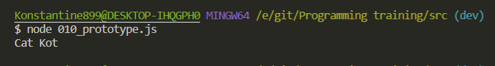

Т.е. путем расширения родительского класса для **instance cat**

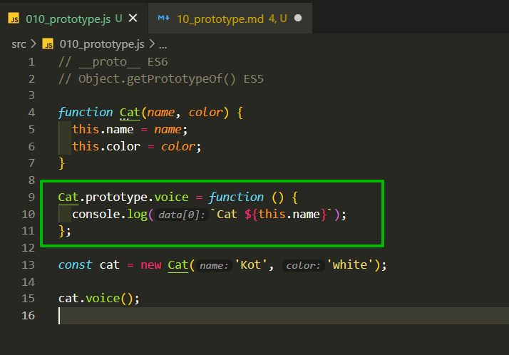

мы получили доступ в объекте к методу **voice**. т.е. все это работает через прототип.

При этом если мы посмотрим что такое **Cat.prototype**

```js
// __proto__ ES6
// Object.getPrototypeOf() ES5

function Cat(name, color) {
  this.name = name;
  this.color = color;
}

Cat.prototype.voice = function () {
  console.log(`Cat ${this.name}`);
};

const cat = new Cat('Kot', 'white');
console.log(Cat.prototype);

// cat.voice();
```

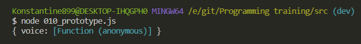

Мы получаем объект. Но в действительности, если мы посмотрим допустим в **hrome**, то там будет еще больше свойств. Т.е. в данном случае это поле является указателем на объект, у которого есть конструктор и соответствующие поля


которые будут добавлены для объектов которые будут созданы от класса **Cat**.

Если мы посмотрим на **instance** класса **cat**, то я думаю понятно что у нас тут будут присутствовать только поля **name** и **color**.

```js
// __proto__ ES6
// Object.getPrototypeOf() ES5

function Cat(name, color) {
  this.name = name;
  this.color = color;
}

Cat.prototype.voice = function () {
  console.log(`Cat ${this.name}`);
};

const cat = new Cat('Kot', 'white');
console.log(Cat.prototype);
console.log(cat);

// cat.voice();
```

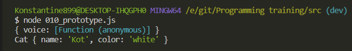

Но мы в прототипе данного объекта имеем метод **voice**. И соотвтественно, учитывая то что мы вызываем в контексте объекта **cat** метод **voice()**. Он не находит его в самом объекте. Поэтому он спускается в **prototype**, а в нем уже есть метод **voice**.

Если мы посмотрим на **console.log(cat.proto);**.

```js
// __proto__ ES6
// Object.getPrototypeOf() ES5

function Cat(name, color) {
  this.name = name;
  this.color = color;
}

Cat.prototype.voice = function () {
  console.log(`Cat ${this.name}`);
};

const cat = new Cat('Kot', 'white');
console.log(Cat.prototype);
console.log(cat);
console.log(cat.__proto__);

// cat.voice();
```

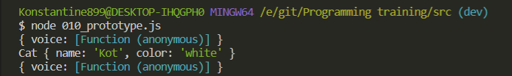

То мы увидим по сути тот же самый объект который по сути и является прототипом класса **Cat**. Более того мы можем их сравнить.

```js
// __proto__ ES6
// Object.getPrototypeOf() ES5

function Cat(name, color) {
  this.name = name;
  this.color = color;
}

Cat.prototype.voice = function () {
  console.log(`Cat ${this.name}`);
};

const cat = new Cat('Kot', 'white');
console.log(Cat.prototype);
console.log(cat);
console.log(cat.__proto__ === Cat.prototype);

// cat.voice();
```

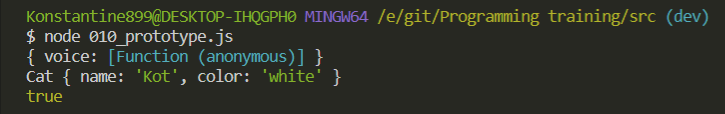

Что еще интересно, то что мы можем посмотреть на конструктор. Есть такой специальный объект который указывает на конструкторский родительский класс.

```js
// __proto__ ES6
// Object.getPrototypeOf() ES5

function Cat(name, color) {
  this.name = name;
  this.color = color;
}

Cat.prototype.voice = function () {
  console.log(`Cat ${this.name}`);
};

const cat = new Cat('Kot', 'white');
console.log(Cat.prototype);
console.log(cat);
console.log(cat.__proto__ === Cat.prototype);
console.log(cat.constructor);

// cat.voice();
```

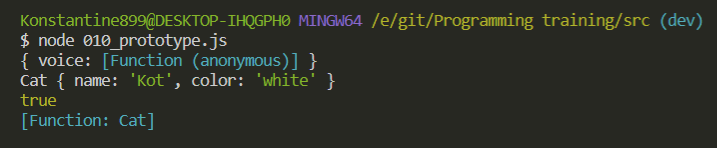

Это идет автоматически если мы используем ключевое слово **new**.

<br>
<br>
<br>
<br>

Теперь следующая тема которая так же относится к прототипам. Это собственные свойства объектов или свойства которые доступны в прототипе.

Создаю класс **Person**.

```js
function Person() {}
Person.prototype.legs = 2;
Person.prototype.skin = 'white';
```

Теперь соответственно я могу создать переменную **person** и поместить в нее результат вызова new **Person()**. И например этой персоне я задам поле **name**.

```js
function Person() {}
Person.prototype.legs = 2;
Person.prototype.skin = 'white';

const person = new Person();
person.name = 'Константин';
```

Т.е. я уже обращась к самому объекту а не к прототипу.

И теперь я могу сделать несколько проверок которая показывает как работает цепочка прототипов.

```js
// __proto__ ES6
// Object.getPrototypeOf() ES5

function Person() {}
Person.prototype.legs = 2;
Person.prototype.skin = 'white';

const person = new Person();
person.name = 'Константин';

console.log('skin' in person); // т.е. спрашиваю есть ли в объекте person поле skin
```

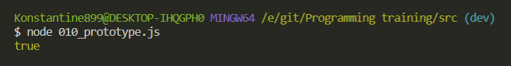

Действительно оператор **in** проверяет есть ли такое свойство в объекте или в его прототипе. Мы так же можем посмотреть на количество ног т.к. это свойство доступно в прототипе данного объекта.

```js
// __proto__ ES6
// Object.getPrototypeOf() ES5

function Person() {}
Person.prototype.legs = 2;
Person.prototype.skin = 'white';

const person = new Person();
person.name = 'Константин';

console.log('skin' in person); // т.е. спрашиваю есть ли в объекте person поле skin
console.log(person.legs);
```

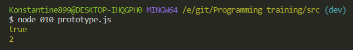

Как нам определить какие свойства у нас есть в прототипе, а какие свойства собственные.

Для этого у объектов, которые по сути имеют как родительский класс класс **Object**. За счет этого класса у объектов доступны некоторые методы такие как **person.toString()** которую мы вызовем и получим строчку **Object: object**.

Но что более интересно мы можем узнать с помощью свойсва **hasOwnProperty()** Есть ли такое свойство у самого объекта.

```js
// __proto__ ES6
// Object.getPrototypeOf() ES5

function Person() {}
Person.prototype.legs = 2;
Person.prototype.skin = 'white';

const person = new Person();
person.name = 'Константин';

console.log('skin' in person); // т.е. спрашиваю есть ли в объекте person поле skin
console.log(person.legs);
console.log(person.hasOwnProperty('name'));
```

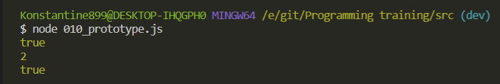

Но при этом если мы спроим есть ли свойсво **skin**, то мы получим **false**.

```js
// __proto__ ES6
// Object.getPrototypeOf() ES5

function Person() {}
Person.prototype.legs = 2;
Person.prototype.skin = 'white';

const person = new Person();
person.name = 'Константин';

console.log('skin' in person); // т.е. спрашиваю есть ли в объекте person поле skin
console.log(person.legs);
console.log(person.hasOwnProperty('name'));
console.log(person.hasOwnProperty('skin'));
```

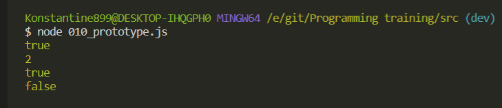

Потому что **skin** находится в прототипе.

<br>
<br>
<br>
<br>

Так же к теме наследование через прототипы я могу рассказать еще про один спооб **Object.create()** который позволяет нам создавать некоторые объекты используя уже существующий прототип.

К примеру у меня будет переменная , **proto**я ее сам так назвал.

```js
// Object.create()

const proto = { year: 2019 };
```

Далее я могу создать переменную **myYear** c помощью функции **Object.create()**. Где первым параметром передаю объект который будет являться прототипом для данного объекта т.е. в нашем случае это **proto**.

```js
// Object.create()

const proto = { year: 2019 };
const myYear = Object.create(proto);
```

Вторым параметром я могу передавать различные свойства которые будт дополнительные для объекта. Но вы можете почитать документацию.

И теперь что интересно у переменной **myYear** присутствует свойство **year**

```js
// Object.create()

const proto = { year: 2019 };
const myYear = Object.create(proto);

console.log(myYear.year);
```

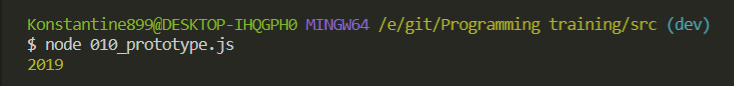

Так же мы можем спросить есть ли у данного объекта свойство **year**.

```js
// Object.create()

const proto = { year: 2019 };
const myYear = Object.create(proto);

console.log(myYear.year);
console.log(myYear.hasOwnProperty('year'));
```

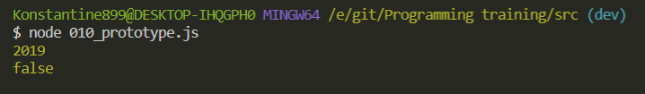

И мы получаем **false** потому что он у нас доступен из прототипа.

И так же можем спросить

```js
// Object.create()

const proto = { year: 2019 };
const myYear = Object.create(proto);

console.log(myYear.year);
console.log(myYear.hasOwnProperty('year'));
console.log(myYear.__proto__ === proto);
```

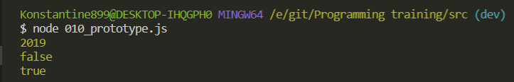

Потому что объект **proto** является прототипом т.е. мы использовали функцию **Object.create()**.

Но здесь присутствует одна небольшая особенность которую нужно учитывать. Если я сейчас обращусь к объекту **proto** и скажем изменю у него год на

```js
// Object.create()

const proto = { year: 2019 };
const myYear = Object.create(proto);

console.log(myYear.year);
proto.year = 2021;
console.log(myYear.year);
```

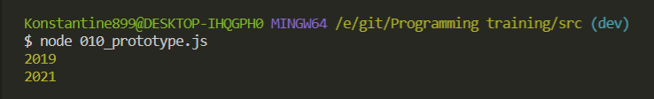

Изменилось данное значение потому что мы его изменили в прототипе.

И второй момент что если мы меняем целиком обект **proto**

```js
// Object.create()

let proto = { year: 2019 };
const myYear = Object.create(proto);

console.log(myYear.year);
// proto.year = 2021;
proto = { year: 999 };
console.log(myYear.year);
```

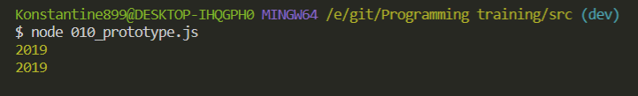

Объект не поменялся а остался таким как есть. Раньше было немного по другому. Возможно интерпретатор зафиксили в этом плане.
