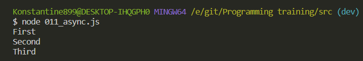
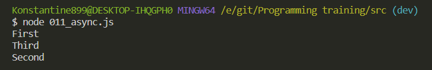

# async

По сути здесь нам нужно учитывать не так уж много информации потому что на самом деле **JS** работает в одном потоке. Это означает что ни о какой асинхронности и речи быть не может. Тем не менее **JS** не плохо справляется с какими-нибудь асинхронными вещами, по типу различных **timeout**, запросов на сервер.

Как же все это работает?

Все это стало доступно концепции **Event loop** и того как реализован **call stack**.

Рассмотрим простой пример

```js
// async

const first = () => console.log('First');
const second = () => console.log('Second');
const third = () => console.log('Third');
```

И пока что я их просто вызову

```js
// async

const first = () => console.log('First');
const second = () => console.log('Second');
const third = () => console.log('Third');

first();
second();
third();
```



Тут все понятно. Они последовательно выводятся и тут нет никакого сюрприза.

Сюрпризы начинаются тогда когда мы хотим обернуть в **setTimeout** например поместить функцию **second**.

```js
// async

const first = () => console.log('First');
const second = () => console.log('Second');
const third = () => console.log('Third');

first();
setTimeout(second, 0);
third();
```

И вызвать этот **setTimeout** мы хотим через 0 милисекунд. т.е. он у нас по сути является асинхронным. И если сейчас я запущу скрипт то у нас будет другая ситуация.



Вы можете спросить как это работает. Потому что здесь мы передаем 0 количество милисекунд и по идее данный **timeout** должен отрабатывать сразуже.

Пробежимся по тому как это происходит. Интерпретатор доходит до строчки **first()**. Он берет и закидывает в **call stack** функцию **first**, она выполняется. После выполнения интерпретатор выкидывает из **call stack** функцию **first**. Т.е. **call stack** пуст.

Далее он находит строчку **setTimeout**. Сам **JS** не понимает как работать с **timeout** различными. По этому он использует сторонний **API**. Он видит асинхронность и с помощью стронних **API** он начинает выполнять **setTimeout**. т.е. он видит что когда **setTimeout** выполнится нужно выполнить функцию **second**. И он его закидывает на сторонний **API**. Так как он закидывает выполнение на сторонний **API**, то **call stack** снова очищается.

После чего он заходит в функцию **third**, так же закидывает ее в **call stack**, она выполняется, он выкидывает ее из **call stack** и он опять пуст.

Во время выполнения **third** сторонний **API** видит что **setTimeout** он моментальный. И поэтому он помечает функцию, находящуюся в **setTimeout**, а именно **second**, нужную для выполнения. И момещает ее в такой концепт который называется **callback** **q** переводится как очередь из **callback**. И там же действует **Event loop**. Он бегает по этой очереди. И когда **call stack** у нас становится пустым. Он закидывает функцию **second** в **call stack** и выполняет ее. Ищи на канале более подробное у него есть. Вот данный урок бесполезен абсолютно!!!! Подробности надо подробности.
