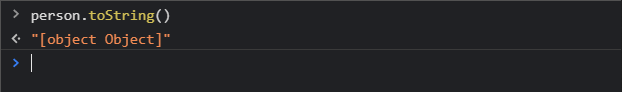
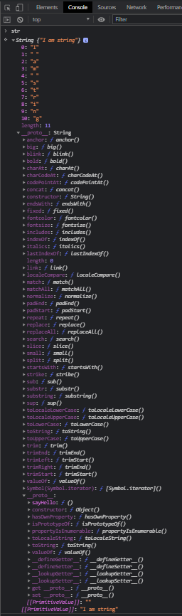

# prototype

[https://www.youtube.com/watch?v=aQkgUUmUJy4&list=PLqKQF2ojwm3l4oPjsB9chrJmlhZ-zOzWT&index=1](https://www.youtube.com/watch?v=aQkgUUmUJy4&list=PLqKQF2ojwm3l4oPjsB9chrJmlhZ-zOzWT&index=1)

Создам объект и немного поиграю с ним.

```js
const person = {
  name: 'Maxim',
  age: 25,
  greet: function () {
    console.log('Greet!');
  },
};
```

Теперь если в консоли браузера я обращусь к объекту **person**, то я увижу те поля которые мы и выводили.


Т.е. у нас есть некоторый объект и мы можем получать доступ до определенных полей которые в нем есть. Нарпимер мы можем получить его имя через поле **name**. Так же поле age и функцию **greet**. Для того что бы посмотреть результат функции не забывай как говориться ее вызывать.


Здесь нет ничего не обычного.

Теперь я попробую сделать нечто странное. Например я попробую обратится к нашему объекту **person** и выведу у него значение функции например **sayHello**.


Мы получаем ошибку потому что у объекта **person** нет такой функции как **sayHello**. Потому что мы ее не определили.

Но вот в чем загвоздка. Если я например у этого объекта вызову метод **toString()**.



Мы не получаем ни какой ошибки. А получаем сообщение **"[object Object]"** которое является по сути строкой.

Почему на функцию **sayHello** выдается ошибка, а на вызов метода **toString** ни какой ошибки нет?

На самом деле все очень просто. Так работают прототипы.
И учитывая что у объекта нет функции **sayHello** мы получили ошибку.

Но у прототипа есть функция **toString** и мы получили некоторое значение.

Помимо тех полей которые мы заводили браузер нам показывает некоторе свойство **\_\_proto\_\_**. Это специальное свойство которое является ссылкой на прототип объекта. И здесь мы можем видить название **Object**.


Это название некоторого родительского класса который является родителем для этого объекта. Если мы расскроем данное свойство, то мы увидим большое количество методов где мы можем найти метод **toString()**.


Т.е. когда мы вызывали метод **toString()** мы сначало смотрели на верхний уровень объекта т.е. те поля которые мы сами определили. Если мы его не находилиб то мы шли в прототип и в нем находили данный метод.

Как это работает и почему мы вообще взаимодействуем с прототипами?

Перепишем. Помимо того что мы можем создавать объекты через фигурные скобки. На самом деле это просто определенный ярлык для упрощения создания объектов.

Мы можем переписать создание объекта немного иначе.

```js
const person = new Object();
```

И в конструктор данного объекта мы можем передать те свойства которые определяли ранее.

```js
const person = new Object({
  name: 'Maxim',
  age: 25,
  greet: function () {
    console.log('Greet!');
  },
});
```

Т.е. сейчас мы более очевидно видим как происходит создание объекта. На самом деле переменная person является **instance** класса **Object**.


Я вижу тот же самый результат.

По сути в **JS** любые вещи которые создаются они на самом деле являются объектами. Данный случай не исключение. Мы видим как мы создаем переменную person от класса **Object**. И когда в данный класс мы передаем какие-то параметры т.е. наши поля, помимо этих параметров, нам так же в объект попадает прототип самого главного класса в **JS** т.е. **Object**. И он несет в себе другие поля которые мы можем использовать.


На самом деле прототип это тот же самый объект, но который присутствует у родительских каких-то сущностей.

Теперь что мы можем с этим сделать?

Допустим мы можем обратится к глобальному классу **Object** и дальше мы можем обратится к его свойству которое называется **prototype**. И в этом прототипе мы можем создавать какие-нибудь новые поля. Например функцию **sayHello**

```js
const person = new Object({
  name: 'Maxim',
  age: 25,
  greet: function () {
    console.log('Greet!');
  },
});

Object.prototype.sayHello = function () {
  console.log('Hello');
};
```


Благодаря такой конструкции мы расширили базовый функционал класса **Object** и добавили в него новый метод. И после чего он стал доступен для того объекта который мы создаем т.е. объекта **person**.

На самом деле прототипы так и работают. На самом деле это определенный объект который присутствует у родительских элементов. И с помощью него мы можем наследоваться от разных объектов и иметь доступ к более расширенным функциям.

Теперь для примера рассмотрим еще один момент. Теперь я могу создать переменную **lena**, обратится к глобальному классу **Object** и у него есть метод который называется **create** c помощью которого мы создаем новые объекты. Далее в метод **create** мы можем передать какой-то объект, который на самом деле будет являтся прототипом для объекта **lena**. Например в качестве прототипа я могу указать объект **person** потому что прототип это объект и переменная **person** так же является объектом.

Теперь если я все сохраню и посмотрю в брауузере. То я увижу что это пустой объект.

```js
const person = new Object({
  name: 'Maxim',
  age: 25,
  greet: function () {
    console.log('Greet!');
  },
});

Object.prototype.sayHello = function () {
  console.log('Hello');
};

const lena = Object.create(person);
```


Однако если я к чему либо обращусь.


Но объект **lena** на самом деле ведь пустой!!

На верхнем уровне у него ничего нет. Однако если мы откроем прототип, то мы увидим первый уровень прототипа того объекта от которого мы создавались.


Т.е. это в нашем случае объект **person**.

Дальше у нас есть вложенный прототип у которого есть функция **sayHello** или например функция **toString** которую мы вызывали.

И теперь мы можем делать с объектом **lena** что угодно.


Однако это не логично. У объекта **lena** должно быть свое имя. Мы можем сделать так.

```js
const person = new Object({
  name: 'Maxim',
  age: 25,
  greet: function () {
    console.log('Greet!');
  },
});

Object.prototype.sayHello = function () {
  console.log('Hello');
};

const lena = Object.create(person);
lena.name = 'Elena';
```


Если же я раскрою данный объект я увижу что в прототипе есть так же поле **name**.


Прототип как работает? Он идет сверху вниз. Если он на верхнем уровне находит какое-то поле или какую-то функцию, он сразу же его вызывает. Но если он ничего не находит, то тогда он обращается к прототипу и пытается найти что-то в нем. Если же и в этом прототипе ничего нет он дальше идет по цепочке прототипов и находит тот метод который он должен вызвать. Т.е. например мы так пользуемся функцией **toString**. Но если же он ничего не находит в прототипе, то тогда он выдает ошибку.

Теперь что я говорил в начале что в **JS** все является объектами. Как это работает?

Допустим я могу создать переменную которая будет являтся строкой.

```js
const person = new Object({
  name: 'Maxim',
  age: 25,
  greet: function () {
    console.log('Greet!');
  },
});

Object.prototype.sayHello = function () {
  console.log('Hello');
};

const lena = Object.create(person);
lena.name = 'Elena';

const str = 'I am string';
```

И если мы посморим в браузере что такое **str** то мы получим ожидаемый результат


Но если мы вызовем **str** и нажмем точку, то мы увидим какие методы есть у данного объекта


Т.е. например мы можем получить длинну жанной строки


Например метод **bold** где мы получим нашу строку обернутую в тег **b**.


Но как нам впринципе узнать какие поля есть у данного объекта? У данной строки.

Для этого нам нужно немного переписать инициализацию этой строки. Потому что это на самом деле тоже определенный ярлык.


И то что происходит за кулисами выглядит примерно так. Мы создем строку через глобальный класс **new String()**.

```js
const person = new Object({
  name: 'Maxim',
  age: 25,
  greet: function () {
    console.log('Greet!');
  },
});

Object.prototype.sayHello = function () {
  console.log('Hello');
};

const lena = Object.create(person);
lena.name = 'Elena';

const str = new String('I am string');
```


**String** это некий родительский класс в котором указано значение этой строки. Если мы расскроем этот объект то мы увидим поле **length**. И дальше у этой строки есть объект **proto** который если мы расскроем мы увидим прототип строки. Мы увидим большое количество методов которые мы можем вызывать у строки.

Однако если мы раскроем вложенный **proto**, то мы увидим **sayHello** который мы создавали у объекта. Происходит это потому что класс **Object** в **JS** является самым главным классом в **JS** и все от него идет. Тем самым мы доказали что строка так же является объектом. Но у него над классом **Object** есть еще один класс **String**.




Мы получаем тот же результат, но при этом мы работаем со строкой.
