# 002 this call bind apply

Сразу же разберемся на простом примере

```js
function hello() {
  console.log('Hello', this);
}
```

Вторым параметром **this** указывает на текущий контекст. Если я сейчас в браузере выведу функцию **hello**, то я увижу следующий результат.

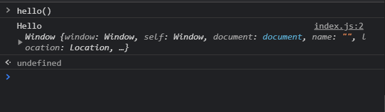

Мы получаем строчку **Hello** и вторым параметром мы получаем объект, который на самом деле является объектом **window**.

Объект **window** это глобальый объект, который если мы расскроем мы получим тот же самый набор функций.

Создам объект **person** с полями **name**, **age** и еще один ключ **sayHello** в которую в качестве значения помещу функцию которую ранее создал.

```js
function hello() {
  console.log('Hello', this);
}

const person = {
  name: 'Konstantine',
  age: 32,
  sayHello: hello,
};
```

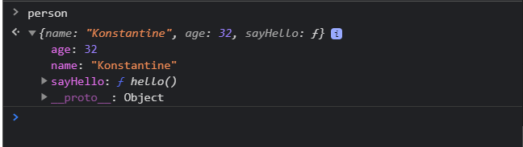

Все вроде нормально. Но если мы у данного объекта вызовем функцию, то мы получим следующий результат.

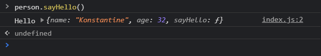

Мы получаем значение **Hello**, но дальше вместо ключевого слова **this** мы получаем сам объект.

Теперь как это работает?

На самом деле вызов функции **hello** мы можем переписать немного иначе. Вместо того что бы просто вызывать функцию **hello** мы можем так же обратится к глобальному объекту **window** и к его функции **hello**.

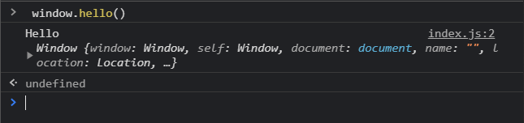

И как видите я получаю старый результат.

И вот в чем заключается идея. По сути когда мы вызываем функцию либо **sayHello** либо просто функцию **hello** мы всегда выводим в консоль ключевое слово **this**. О оно указывает на тот объект в контексте которого это было вызвано. Т.е. то что стоит слева от точки где мы вызываем данную функцию. Т.е. когда мы делаем у глобального объекта **window** вызов функции **hello** мы получаем вместо ключевого слова **this** этот объект **window**

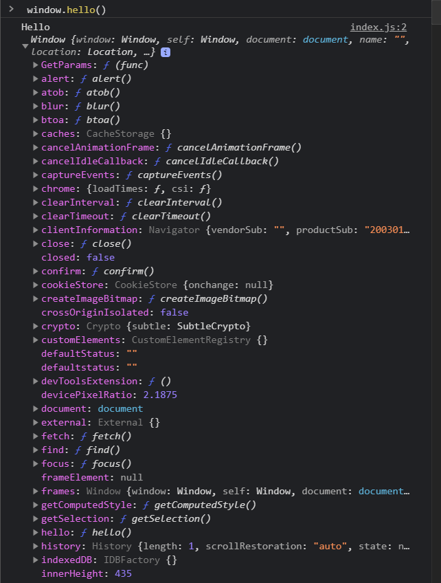

Если у объекта person мы вызываем функцию **sayHello**, то вместо ключевого слова **this** мы получаем сам объект **person**. Ключевое слово **this** оно всегда динамичное. Оно указывает на тот объект в контексте которого оно было вызвано. И на самом деле это и есть вся теория относительно контекста.

Теперь посмотрим как мы можем взаимодействовать с контекстом. Предположим что мы хотим создать еще одну функцию в объекте **person**, но которая так же будет ссылаться на функцию **hello**. Но мы хотим что бы там был контекст глобального объекта **window**, а не самого объекта **person**.

Допустим я заведу функцию **sayHelloWindow** и в нее как **reference** передаю ссылку на функцию **hello**.

```js
function hello() {
  console.log('Hello', this);
}

const person = {
  name: 'Konstantine',
  age: 32,
  sayHello: hello,
  sayHelloWindow: hello,
};
```

Но если мы все оставим в таком виде то очевидно что контекстом будет объект **person**. Т.е. в качестве ключевого слова **this** мы опять получим объект **person**.

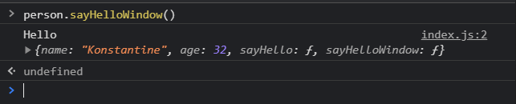

Т.е. контекстом будет то что стоит слева до точки.

Так вот для того что бы передавать какой-либо контекст и вызывать функцию с нужным указанным контекстом мы можем воспользоваться встроенными методами которые есть у функции в **JS**.

Напоминаю что в **JS** любые объекты являются объектами в том числе и функции у которых есть свои определенные методы.

Так вот у функции **hello** мы можем вызывать специальный метод который называется **bind()**. И в качестве значения данной функции мы можем передать тот контекст который будет привязан к этой функции т.е. например глобальный объект **window**.

```js
function hello() {
  console.log('Hello', this);
}

const person = {
  name: 'Konstantine',
  age: 32,
  sayHello: hello,
  sayHelloWindow: hello.bind(window),
};
```

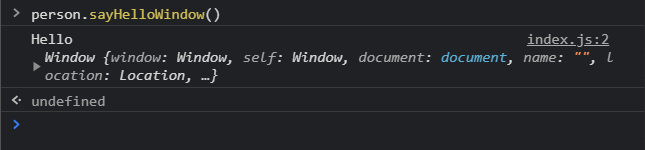

и смотрите хоть мы и вызываем данную функцию у объекта **person** в консоли мы все равно получаем объект **window**. Потому что мы привязали данный контекст.

Кстати вместо **window** мы можем передавать ключевое слово **this**

```js
function hello() {
  console.log('Hello', this);
}

const person = {
  name: 'Konstantine',
  age: 32,
  sayHello: hello,
  sayHelloWindow: hello.bind(this),
};
```

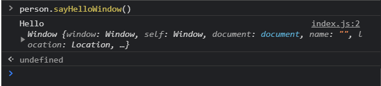

Все равно мы получаем глобальный объект **window**. Потому что на самом деле если мы просто напишем в консоли **this** то мы увидим что он указывает на глобальный объект **window**.

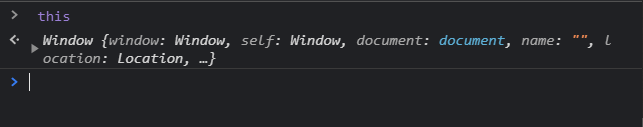

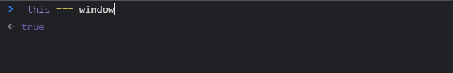

Если же мы например будем передавать какой - нибудь другой объект, например **document**

```js
function hello() {
  console.log('Hello', this);
}

const person = {
  name: 'Konstantine',
  age: 32,
  sayHello: hello,
  sayHelloWindow: hello.bind(document),
};
```

То мы и получим соответствующий результат.

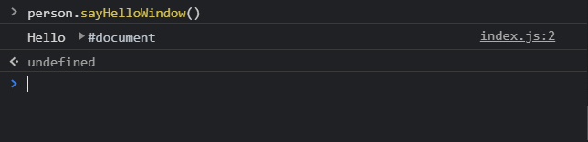

В качестве ключевого слова **this** мы получаем **document**.

Теперь давайте подумаем как мы можем это использовать в своих целях?

Предположим у объекта person мы заведем еще одну функцию **logInfo**. И допустим мы в этой фунции хотим выводить информацию по данному объекту.

```js
function hello() {
  console.log('Hello', this);
}

const person = {
  name: 'Konstantine',
  age: 32,
  sayHello: hello,
  sayHelloWindow: hello.bind(document),
  logInfo: function () {
    console.log(`Name is ${this}`);
  },
};
```

**this** в строке является объектом person. Потому что функцию **logInfo** мы создаем в контексте этого объекта. Если я запишу **person.name** или **this.name** это будет являтся одной и той же записью.

```js
function hello() {
  console.log('Hello', this);
}

const person = {
  name: 'Konstantine',
  age: 32,
  sayHello: hello,
  sayHelloWindow: hello.bind(document),
  logInfo: function () {
    console.log(`Name is ${this.name}`);
  },
};
```

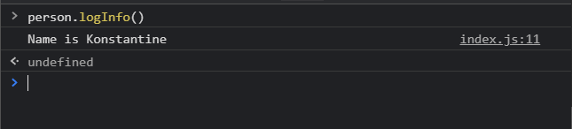

```js
function hello() {
  console.log('Hello', this);
}

const person = {
  name: 'Konstantine',
  age: 32,
  sayHello: hello,
  sayHelloWindow: hello.bind(document),
  logInfo: function () {
    console.log(`Name is ${this.name}`);
    console.log(`Age is ${this.age}`);
  },
};
```

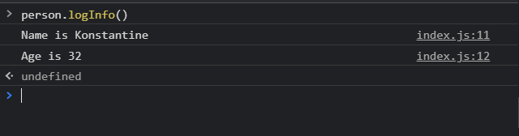

Но допустим у нас будет другой объект. И опять **lena**.

```js
function hello() {
  console.log('Hello', this);
}

const person = {
  name: 'Konstantine',
  age: 32,
  sayHello: hello,
  sayHelloWindow: hello.bind(document),
  logInfo: function () {
    console.log(`Name is ${this.name}`);
    console.log(`Age is ${this.age}`);
  },
};

const lena = {
  name: 'Elena',
  age: 23,
};
```

У объекта **lena** нет функции **logInfo**. можем ли мы воспользоваться функцией **logInfo** для того что бы вывести значение не объекта **person**, а значение объекта **lena**.

Для того что бы передавать нужный контекст который мы сами указываем у функции **logInfo** мы можем вызвать метод **bind** куда передаем нужный нам контекст.

```js
function hello() {
  console.log('Hello', this);
}

const person = {
  name: 'Konstantine',
  age: 32,
  sayHello: hello,
  sayHelloWindow: hello.bind(document),
  logInfo: function () {
    console.log(`Name is ${this.name}`);
    console.log(`Age is ${this.age}`);
  },
};

const lena = {
  name: 'Elena',
  age: 23,
};

person.logInfo.bind(lena);
```

Однако сейчас мы не получим ни какого значения потому что метод **bind** на самом деле не вызывает функцию, а он возвращает новую функцию которая привязала новый контекст.
Поэтому мы можем сразу функцию вызвать.

```js
function hello() {
  console.log('Hello', this);
}

const person = {
  name: 'Konstantine',
  age: 32,
  sayHello: hello,
  sayHelloWindow: hello.bind(document),
  logInfo: function () {
    console.log(`Name is ${this.name}`);
    console.log(`Age is ${this.age}`);
  },
};

const lena = {
  name: 'Elena',
  age: 23,
};

person.logInfo.bind(lena)();
```

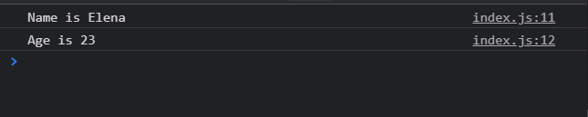

Сейчас мы вызываем функцию **logInfo**, но в нее мы передали другой контекст. Ключевое слово **this** указывает на контекст того объекта который мы передавали.

Теперь давайте немного усложним наш код. И допустим метод **logInfo** сделаем более красивым.

Для этого мы можем воспользоваться объектом **console** и у него есть метод который называется **group**. Cюда мы можем передать какую-нибудь строчку которая будет являться заголовком данной группы т.е. это не относится к контексту. Просто показываю некоторые возможности в **JS**.
И допустим заголовком буду указывать **${this.name} info**.

```js
function hello() {
  console.log('Hello', this);
}

const person = {
  name: 'Konstantine',
  age: 32,
  sayHello: hello,
  sayHelloWindow: hello.bind(document),
  logInfo: function () {
    console.group(`${this.name} info:`);
    console.log(`Name is ${this.name}`);
    console.log(`Age is ${this.age}`);
  },
};

const lena = {
  name: 'Elena',
  age: 23,
};

person.logInfo.bind(lena)();
```

Далее мы будем указывать некоторые **console.log** которые будут относится к этой группе.
И в конце нам необходимо закрыть эту группу т.е. вызвать метод **console.groupEnd()**

```js
function hello() {
  console.log('Hello', this);
}

const person = {
  name: 'Konstantine',
  age: 32,
  sayHello: hello,
  sayHelloWindow: hello.bind(document),
  logInfo: function () {
    console.group(`${this.name} info:`);
    console.log(`Name is ${this.name}`);
    console.log(`Age is ${this.age}`);
    console.groupEnd();
  },
};

const lena = {
  name: 'Elena',
  age: 23,
};

person.logInfo.bind(lena)();
```

Т.е. мы получим примерно такой результат.

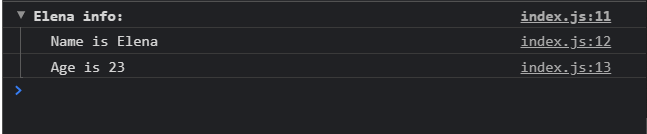

и мы видим что заголовок данной группы относится к имени этого человека и внутри уже есть перечисление определенных полей.

Теперь например мы хотим в **logInfo** передавать дополнительные параметры. Например работу данного человека т.е. параметр **job** и так же выводить его в группе.

```js
function hello() {
  console.log('Hello', this);
}

const person = {
  name: 'Konstantine',
  age: 32,
  sayHello: hello,
  sayHelloWindow: hello.bind(document),
  logInfo: function (job) {
    console.group(`${this.name} info:`);
    console.log(`Name is ${this.name}`);
    console.log(`Age is ${this.age}`);
    console.log(`Job is ${job}`);
    console.groupEnd();
  },
};

const lena = {
  name: 'Elena',
  age: 23,
};

person.logInfo.bind(lena)();
```

Здесь мы не передаем **this** потому что мы параметр **job** передаем в функцию.

И к примеру будем выводить **phone**.

```js
function hello() {
  console.log('Hello', this);
}

const person = {
  name: 'Konstantine',
  age: 32,
  sayHello: hello,
  sayHelloWindow: hello.bind(document),
  logInfo: function (job, phone) {
    console.group(`${this.name} info:`);
    console.log(`Name is ${this.name}`);
    console.log(`Age is ${this.age}`);
    console.log(`Job is ${job}`);
    console.log(`Phone is ${phone}`);
    console.groupEnd();
  },
};

const lena = {
  name: 'Elena',
  age: 23,
};

person.logInfo.bind(lena)();
```

Если мы сейчас оставим все в таком виде, то в консоли мы пока что вызываем функцию **logInfo** с объектом **lena**. Но мы вызываем донную функцию без параметров. И в консоли мы получим соответствующий результат.

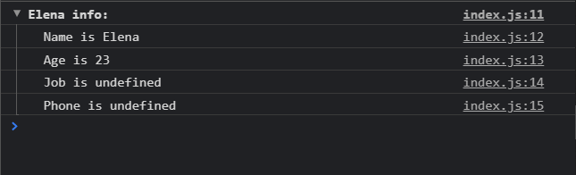

и на этом примере я хочу показать как с помощью метода **bind** мы передаем свойства.

Первый способ это когда мы получаем новую функцию. Для наглядности результат функции занесу в переменную **fnLenaInfoLog**.

```js
function hello() {
  console.log('Hello', this);
}

const person = {
  name: 'Konstantine',
  age: 32,
  sayHello: hello,
  sayHelloWindow: hello.bind(document),
  logInfo: function (job, phone) {
    console.group(`${this.name} info:`);
    console.log(`Name is ${this.name}`);
    console.log(`Age is ${this.age}`);
    console.log(`Job is ${job}`);
    console.log(`Phone is ${phone}`);
    console.groupEnd();
  },
};

const lena = {
  name: 'Elena',
  age: 23,
};

const fnLenaInfoLog = person.logInfo.bind(lena)();
```

Т.е. это новая функция которую мы можем вызвать.

```js
function hello() {
  console.log('Hello', this);
}

const person = {
  name: 'Konstantine',
  age: 32,
  sayHello: hello,
  sayHelloWindow: hello.bind(document),
  logInfo: function (job, phone) {
    console.group(`${this.name} info:`);
    console.log(`Name is ${this.name}`);
    console.log(`Age is ${this.age}`);
    console.log(`Job is ${job}`);
    console.log(`Phone is ${phone}`);
    console.groupEnd();
  },
};

const lena = {
  name: 'Elena',
  age: 23,
};

const fnLenaInfoLog = person.logInfo.bind(lena);
fnLenaInfoLog();
```

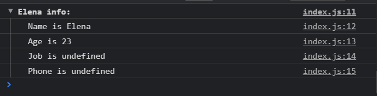

В данную функцию мы безусловно можем передавать какие-то параметры.

```js
function hello() {
  console.log('Hello', this);
}

const person = {
  name: 'Konstantine',
  age: 32,
  sayHello: hello,
  sayHelloWindow: hello.bind(document),
  logInfo: function (job, phone) {
    console.group(`${this.name} info:`);
    console.log(`Name is ${this.name}`);
    console.log(`Age is ${this.age}`);
    console.log(`Job is ${job}`);
    console.log(`Phone is ${phone}`);
    console.groupEnd();
  },
};

const lena = {
  name: 'Elena',
  age: 23,
};

const fnLenaInfoLog = person.logInfo.bind(lena);
fnLenaInfoLog('Frontend', '375-29-891-89-71');
```


И впринципе в этом нет ничего не обычного. Так мы передаем параметры в **JS**.

Но с помощью метода **bind** мы можем делать немного иначе. Помимо того что первым параметром мы указываем контекст, который должен быть привязан к новой функции. Далее мы можем передавать следующие параметры которые нужны для функции.

```js
function hello() {
  console.log('Hello', this);
}

const person = {
  name: 'Konstantine',
  age: 32,
  sayHello: hello,
  sayHelloWindow: hello.bind(document),
  logInfo: function (job, phone) {
    console.group(`${this.name} info:`);
    console.log(`Name is ${this.name}`);
    console.log(`Age is ${this.age}`);
    console.log(`Job is ${job}`);
    console.log(`Phone is ${phone}`);
    console.groupEnd();
  },
};

const lena = {
  name: 'Elena',
  age: 23,
};
person.logInfo.bind(lena, 'Frontend', '375-29-891-89-71')();
```

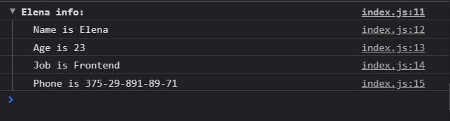

Так же в **JS** присутствуют еще два метода **call** и **apply**.

Метод **call** служит точно для таких же целей, но у него есть одно небольшое отличие от метода **bind**.

Допустим я так же хочу вызвать **logInfo** у объекта **person**. И в него я хочу передать контекст объекта lena. И по сути он принимет те же самые параметры что и метод **bind**.

```js
function hello() {
  console.log('Hello', this);
}

const person = {
  name: 'Konstantine',
  age: 32,
  sayHello: hello,
  sayHelloWindow: hello.bind(document),
  logInfo: function (job, phone) {
    console.group(`${this.name} info:`);
    console.log(`Name is ${this.name}`);
    console.log(`Age is ${this.age}`);
    console.log(`Job is ${job}`);
    console.log(`Phone is ${phone}`);
    console.groupEnd();
  },
};

const lena = {
  name: 'Elena',
  age: 23,
};
// person.logInfo.bind(lena, 'Frontend', '375-29-891-89-71')();
person.logInfo.call(lena, 'Frontend', '375-29-891-89-71');
```

Метод **call** я не вызываю как функцию, но я все равно получаю результат

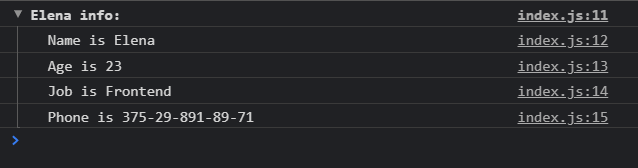

Метод **call** помимо того что он задает определенный контекст в функции и принимает ее параметры, но он сразу же вызывает эту функцию.

Метод **bind** возвращает новую функцию и ее мы можем вызвать тогда когда нам это будет угодно.

И так же присутствует другой метод который называется **apply**. Первым параметром так же передаю объект который должен являться контекстом. И дальше есть небольшое отличие от метода **call**. В метод **apply** мы всегда передаем два параметра. В отличие от метода **call** в который мы можем передавать безконечное число параметров.

В **apply** все переданные параметры мы должны указать в массиве.

```js
function hello() {
  console.log('Hello', this);
}

const person = {
  name: 'Konstantine',
  age: 32,
  sayHello: hello,
  sayHelloWindow: hello.bind(document),
  logInfo: function (job, phone) {
    console.group(`${this.name} info:`);
    console.log(`Name is ${this.name}`);
    console.log(`Age is ${this.age}`);
    console.log(`Job is ${job}`);
    console.log(`Phone is ${phone}`);
    console.groupEnd();
  },
};

const lena = {
  name: 'Elena',
  age: 23,
};
// person.logInfo.bind(lena, 'Frontend', '375-29-891-89-71')();
// person.logInfo.call(lena, 'Frontend', '375-29-891-89-71');
person.logInfo.apply(lena, ['Frontend', '375-29-891-89-71']);
```

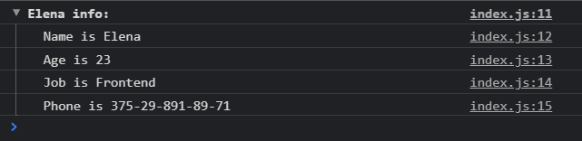

И он так же сразу же вызывает эту функцию.

Теперь немного попрактикуемся с прототипами и контекстом. Разберем пример как мы можем комбинировать контекст и прототипы.

Предположим у меня будет массив

```js
const array = [1, 2, 3, 4, 5];
```

И допустим стоит задача написать такую функцию которая позволит умножить каждое из значений данного массива на определенное число которое мы будем передавать. Обычно мы бы сделали так.

```js
const array = [1, 2, 3, 4, 5];

function multBy(arr, n) {}
```

Я буду в параметры передавать некоторое число **n** и некоторый массив **arr**.

В теле я буду возвращать некоторый массив, пробегаться по нему с помощью **map**, где на каждой итерации я буду вызывать функцию. Функция будет принимать каждый отдельный элемент данного массива **i**. И дальше я буду просто возвращать элемент массива **i** \* **n**.

```js
const array = [1, 2, 3, 4, 5];

function multBy(arr, n) {
  return arr.map(function (i) {
    return i * n;
  });
}
```

и сейчас я могу посмотреть что получится. Вызываю функцию **multBy**, первым аргументом передаю массив, и вторым аргументом указываю число.

```js
const array = [1, 2, 3, 4, 5];

function multBy(arr, n) {
  return arr.map(function (i) {
    return i * n;
  });
}

console.log(multBy(array, 5));
```

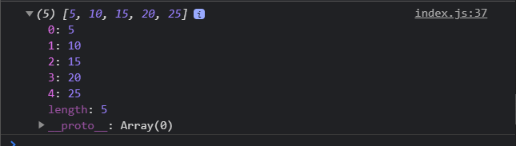

Но на самом деле это не самый удобный вариант в некоторых случаях потому что данную функцию нужно будет импортировать для того что бы вызывать ее. Всегда в нее нужно будет передавать некоторый массив и т.д.

И часто на собеседованиях спрашивают. Как сделать так что бы у этого массива сразу же был метод который позволяет сделать подобный функционал.

И как раз таки для этого мы можем пользоваться прототипами.

Я могу обратиться к глобальному объекту **Array** который является родительским классом для данного объекта массива

```js
const array = [1, 2, 3, 4, 5];

Array;
```

Далее я обращаюсь к его прототипу. И после этого я могу создавать какие-то новые функции, например функцию **multBy**. Данна функция будет так же принимать в себя некоторое число

```js
const array = [1, 2, 3, 4, 5];

Array.prototype.multBy = function (n) {};
```

И далее, в теле функции мне нужно повторить то что я делал. Но как нам определить к какому именно массиву мы будем применять. И как раз таки для этого мы и будем пользоваться ключевым словом **this**.

```js
const array = [1, 2, 3, 4, 5];

Array.prototype.multBy = function (n) {
  console.log('multBy', this);
};
```

И теперь мне нужно переписать вызов функции. Учитывая то что мы расширили прототип массивов. Мы можем обратится к массиву **array**, вызывать у него метод **multBy** c переданным в него значением.

```js
const array = [1, 2, 3, 4, 5];

Array.prototype.multBy = function (n) {
  console.log('multBy', this);
};

array.multBy(2);
```

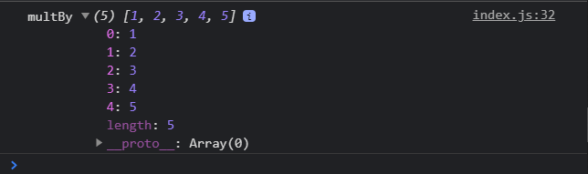

Мы видим сообщение **multBy** и дальше мы видим массив у которого мы делали этот вызов. Т.е. по сути ключевое слово **this** оно и яволяется этим массивом **array** у которого мы вызываем метод **multBy**.

Т.е. дальше мы можем повторить функционал. И вместо того что бы возвращать некоторый массив я просто возвращаю **this**. Потому что это ключевое слово указывает на тот объект который находится слева от точки. И в нашем случае это массив **array**.

```js
const array = [1, 2, 3, 4, 5];

Array.prototype.multBy = function (n) {
  return this.map(function (i) {
    return i * n;
  });
};

console.log(array.multBy(2));
```

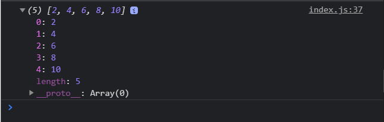

Например я могу сразу же в консоли создать еще один массив и вызвать у него метод **multBy**.

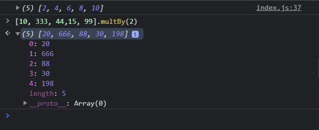

Этим очень удобно пользоваться. Мы так можем расширять объекты ошибок, строк, промисов вообще всех классов которые у нас есть.

А в связке с ключевым словом **this** который находится в связке с элементом который находится слева от точки мы получаем очень гибкий и интересный код.
