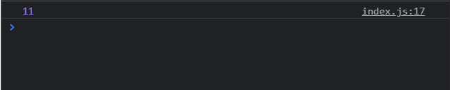

# Замыкания + примеры

[https://www.youtube.com/watch?v=pahO5XjnfLA&list=PLqKQF2ojwm3l4oPjsB9chrJmlhZ-zOzWT&index=4](https://www.youtube.com/watch?v=pahO5XjnfLA&list=PLqKQF2ojwm3l4oPjsB9chrJmlhZ-zOzWT&index=4)

На самом деле это очень простой концепт если его не оборачивать в сложные термины. Замыкание это просто функция внутри другой функции и все.

```js
function createCalcFunction(n) {
  return function () {
    console.log(1000 * n);
  };
}
createCalcFunction(42);
```

И если я сейчас обновлю страницу и посмотрю в консоль, то я ничего не увижу. Происходит это потому что нам возвращается новая функция. Поэтому мы можем занести ее в отдельную переменную.

```js
function createCalcFunction(n) {
  return function () {
    console.log(1000 * n);
  };
}
const calc = createCalcFunction(42);
```

**calc** это на самом деле функция которую мы получаем из другой функции **createCalcFunction(42)**. Посмотрим в консоль.

```js
function createCalcFunction(n) {
  return function () {
    console.log(1000 * n);
  };
}
const calc = createCalcFunction(42);
console.log(calc);
```


теперь мы можем вызвать функцию **calc** без параметров.

```js
function createCalcFunction(n) {
  return function () {
    console.log(1000 * n);
  };
}
const calc = createCalcFunction(42);
calc();
```


И вот как это работает. Когда мы вызывали функцию **createCalcFunction** и мы в нее передавали число **42**, то функция **createCalcFunction** она отработала и вернула нам новую функцию. Но учитывая что данная функция была вызвана в контексте функции **createCalcFunction**, данная переменная n она как бы замкнута в той функции которую мы возвращаем. И поэтому всегда когда мы вызываем функцию **calc** в ней уже хранится значение **n**.
Функция ее замкнула и по этому это называется замыканием.
Т.е. мы получаем определенный доступ до **scope**(область действия функции) верхней функции.

Как это может быть нам полезно и как это работает?

Еще пример.

Рассмотрим функцию инкремента двуж чисел

```js
function createIncrementor(n) {
  return function (num) {
    return n + num;
  };
}
```

Теперь как этим пользоваться.

Я могу создать переменную **addOne** и она у нас будет являться определенной функцией потому что мы ее будем получать из функции **createIncrementor**. И допустим переменную n мы хотим замкнуть на значении **1**.

```js
function createIncrementor(n) {
  return function (num) {
    return n + num;
  };
}

const addOne = createIncrementor(1);
```

теперь посмотрите что получается. Допустим я в консоли буду выводить функцию **addOne**. И в нее я могу передавать какое-то новое значение. И это значение будет совпадать с переменной **num**.

```js
function createIncrementor(n) {
  return function (num) {
    return n + num;
  };
}

const addOne = createIncrementor(1);

console.log(addOne(10));
```



Функция **addOne** замкнула в себе значение **1** и постоянно его возвращает.

Теперь мы можем воспользоваться функцией **createIncrementor** и создать другую функцию.

```js
function createIncrementor(n) {
  return function (num) {
    return n + num;
  };
}

const addOne = createIncrementor(1);
const addTen = createIncrementor(10);

console.log(addOne(10));
console.log(addTen(10));
```


В функции **addTen** мы замкнули **10**.

По сути мы пользуемся одной главной функцией **createIncrementor** в которой мы замыкаем определенное значение. На выходе мы получаем другую функцию которая уже может работать с другими параметрами.

Рассмотрим еще пример

Создам функцию **urlGenerator**. Она будет возвращать функцию которая в свою очередь будет возвращать шаблонную строку, литерал.

```js
function urlGenerator() {
  return function (url) {
    return `https://${url}.`;
  };
}
```

И дальше через точку я хочу добавлять какое-то доменное имя. Но постоянно добавлять его статически не хочеться. Поэтому в верхней функции я буду принимать параметр **domain**.

```js
function urlGenerator(domain) {
  return function (url) {
    return `https://${url}.${domain}`;
  };
}
```

По сути все тоже самое. Я создаю новую функцию **comUrl** которая была получена из другой функции **urlGenerator**. И в нее мы должны передать тот **domain** т.е. значение.

```js
function urlGenerator(domain) {
  return function (url) {
    return `https://${url}.${domain}`;
  };
}

const comUrl = urlGenerator('com');
```

Теперь в консоли сгенерируем несколько ссылок. Т.е. я вызываю функцию **comUrl** и передаю в нее **google**. И данная строчка уже будет совпадать с параметром **url**.

```js
function urlGenerator(domain) {
  return function (url) {
    return `https://${url}.${domain}`;
  };
}

const comUrl = urlGenerator('com');

console.log(comUrl('google'));
```


```js
function urlGenerator(domain) {
  return function (url) {
    return `https://${url}.${domain}`;
  };
}

const comUrl = urlGenerator('com');
const ruUrl = urlGenerator('ru');

console.log(comUrl('google'));
console.log(comUrl('netflix'));
```


Тоже самое я могу создать для доменного имени **ru**.

```js
function urlGenerator(domain) {
  return function (url) {
    return `https://${url}.${domain}`;
  };
}

const comUrl = urlGenerator('com');
const ruUrl = urlGenerator('ru');

console.log(comUrl('google'));
console.log(comUrl('netflix'));

console.log(ruUrl('yandex'));
console.log(ruUrl('vk'));
```


И опять же это просто все. На самом деле про замыкания говорить просто не очем.

Рассмотрим задачу которую часто задают на собеседованиях.
Нам необходимо написать свою собственную функцию **bind**.

Т.е. функция **bind** она принимает в себя некоторый контекст и дальше связывает этот контекст к нужной функции и возвращает новую функцию.

```js
function logPerson() {
  console.log(`Person: ${this.name}, ${this.age},${this.job}`);
}

const person1 = { name: 'Михаил', age: 22, job: 'Frontend' };
const person2 = { name: 'Елена', age: 19, job: 'SMM' };

bind(person1, logPerson);
bind(person2, logPerson);
```

В качестве контекста я использую два объекта **person1** и **person2** и дальше мы вызываем функцию **bind**, уже отдельно потому что мы сами должны ее реализовать а не как метод у существующих функций.

Советует поставить видео на паузу и попробовать реализовать самомстоятельно.

Для начало пишу функцию **bind**. И что данная функция принимает в себя? По сути первым параметром она принимает некоторый контекст который необходимо привязать. По этому первым параметром прописываю **context**. Вторым параметром она принимает функцию **fn**.

```js
function logPerson() {
  console.log(`Person: ${this.name}, ${this.age},${this.job}`);
}

const person1 = { name: 'Михаил', age: 22, job: 'Frontend' };
const person2 = { name: 'Елена', age: 19, job: 'SMM' };

bind(person1, logPerson);
bind(person2, logPerson);

function bind(context, fn) {}
```

Необходимо вернуть новую функцию в которой у функции **fn** я буду вызывать метод **apply**, куда парвым аргументом я буду передавать **context**, а вторым прараметром мы должны передавать массив параметров.
Что бы наша функция **bind** была универсальной и мы могли передавать в нее любое количество параметров нам нужно каким то образом определить каким образом эти параметры передаются и для этого мы используем **apply** потому что в него мы передаем массив. И массив мы можем получить во внутренней функции который мы передадим в аргументы с помощью оператьра **spreed** т.е. массив **args**. В него попадают все необходимы параметры которые будут помещены в данную функцию.

```js
function bind(context, fn) {
  return function (...args) {
    fn.apply(context, args);
  };
}

function logPerson() {
  console.log(`Person: ${this.name}, ${this.age},${this.job}`);
}

const person1 = { name: 'Михаил', age: 22, job: 'Frontend' };
const person2 = { name: 'Елена', age: 19, job: 'SMM' };

bind(person1, logPerson)();
bind(person2, logPerson)();
```


