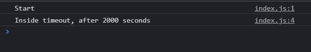
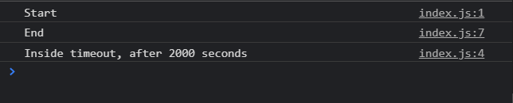
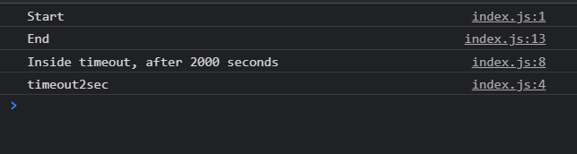

# async_event_loop

Конкретно я хочу показать как работают callback и что такое Event Loop.

Заведем какую-нибудь синхронную функцию.

```js
console.log('Start');
```

Здесь нет ни какой асинхронности. Все выполняется сразу же как толко доходит до этой строчки.

Как нам сделать асинхронность. Для этого в браузере есть специальная функция которая называется setTimeout. Данная функция не входит в спецификацию JS. Данная функция пришла к нам именно из браузерного API.

Мы можем ее вызывать вот так

```js
console.log('Start');

setTimeout();
```

Но в действительности она вызывается у глобального объекта window.

```js
console.log('Start');

window.setTimeout();
```

Т.е. это метод который пришел к нам из браузерного API.

Данный метод первым параметром принимает в себя некоторую функцию. И мы можем передавать ее по разному. Как анонимную функцию

```js
console.log('Start');

window.setTimeout(function () {});
```

Мы можем передать какую-нибудь существующую функцию. Но чаще всего вы будете встречать вариант с анонимной функцией.
Вторым параметром мы передаем количество милисекунд через которое, функция указанная в первом параметре, должна быть выполнена.

```js
console.log('Start');

window.setTimeout(function () {
  console.log('Inside timeout, after 2000 seconds');
}, 2000);
```



Все как положено отрабатывает с задержкой.

Что интересно что если я после этого асинхронного кода опять напишу синхронный. Как оно будет отрабатываться? Ну я и сам знаю что сначало отработает синхронны код, а после освобождения callstack отработает асинхронный код.

```js
console.log('Start');

window.setTimeout(function () {
  console.log('Inside timeout, after 2000 seconds');
}, 2000);

console.log('End');
```



Когда браузер интерпритирует данный скрипт. Он видит синхронный код. Построчно он закидывает его в stack и его выполняет.

Что он делает когда доходит до асинхронного кода? Он видит что есть функция setTimeout и он берет и регистрирует данную функцию как функцию которая должна быть выполнена через 2 секунды.

Но дальше мы сразу же получаем end. Браузер не ждет пока выполнится асинхронна функция и идет дальше. Все что у нас находится в синхронном режиме выполняется сразуже.

Что очень важно что то место где мы регистрируем асинхронность, здесь выполнение скрипта не блокируется. Мы просто закидываем данную функцию в браузерный API и спустя какое-то количество времени она выполняется.

Так же я могу передавать функцию как reference. Самое главное это при указании функции в аргументе ее не вызывать.

```js
console.log('Start');

function timeout2sec() {
  console.log('timeout2sec');
}

window.setTimeout(function () {
  console.log('Inside timeout, after 2000 seconds');
}, 2000);

setTimeout(timeout2sec, 2000);

console.log('End');
```



Как это вообще работает и почему поток не блокируется?

В дествительности здесь кроется очень простой концепт который называется Event loop. Не вижу смысла переписывать одно и тоже. Опять рассказывает про браузерный API и как это выполняется. Как попадает в стек вызовов.

Здесь идет речь не только по setTimeout а вообще про все асинхронные опреации т.е. они выполняются точно таким же образом.
К ним относятся различные слушатели событий EventListenner, scrol, клики на кнопку или работа с сервером.

Рассмотрим сервис который очень хорошо демонстрирует как работает Event loop.

[http://latentflip.com/loupe/?code=JC5vbignYnV0dG9uJywgJ2NsaWNrJywgZnVuY3Rpb24gb25DbGljaygpIHsKICAgIHNldFRpbWVvdXQoZnVuY3Rpb24gdGltZXIoKSB7CiAgICAgICAgY29uc29sZS5sb2coJ1lvdSBjbGlja2VkIHRoZSBidXR0b24hJyk7ICAgIAogICAgfSwgMjAwMCk7Cn0pOwoKY29uc29sZS5sb2coIkhpISIpOwoKc2V0VGltZW91dChmdW5jdGlvbiB0aW1lb3V0KCkgewogICAgY29uc29sZS5sb2coIkNsaWNrIHRoZSBidXR0b24hIik7Cn0sIDUwMDApOwoKY29uc29sZS5sb2coIldlbGNvbWUgdG8gbG91cGUuIik7!!!PGJ1dHRvbj5DbGljayBtZSE8L2J1dHRvbj4%3D](http://latentflip.com/loupe/?code=JC5vbignYnV0dG9uJywgJ2NsaWNrJywgZnVuY3Rpb24gb25DbGljaygpIHsKICAgIHNldFRpbWVvdXQoZnVuY3Rpb24gdGltZXIoKSB7CiAgICAgICAgY29uc29sZS5sb2coJ1lvdSBjbGlja2VkIHRoZSBidXR0b24hJyk7ICAgIAogICAgfSwgMjAwMCk7Cn0pOwoKY29uc29sZS5sb2coIkhpISIpOwoKc2V0VGltZW91dChmdW5jdGlvbiB0aW1lb3V0KCkgewogICAgY29uc29sZS5sb2coIkNsaWNrIHRoZSBidXR0b24hIik7Cn0sIDUwMDApOwoKY29uc29sZS5sb2coIldlbGNvbWUgdG8gbG91cGUuIik7!!!PGJ1dHRvbj5DbGljayBtZSE8L2J1dHRvbj4%3D)

Ничего не обычного не рассказал. Всего лишь в данном сервисе более наглядно видно что и как происходит...... И все. Если что пересматривай видос.
