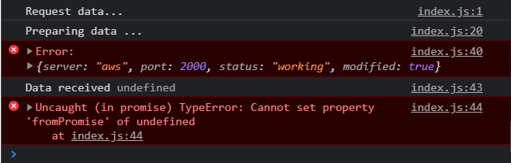

# promise

Сейчас сделаем небольшую эмуляцию работы с сервером через асинхронность и через подход **callback**.

К примеру я сначало буду выводить сообщение

```js
console.log('Request data...');
```

Данным **console.log** мы будем говорить что как бы делаем запрос на сервер.

Далее я вызываю функцию поступающую нам из браузерного **API**. И в первом **setTimeout** мы как будто бы будем находится на сервере и будем говорить что мы готовим некоторые данные.

```js
console.log('Request data...');

setTimeout(() => {
  console.log('Preparing data ...');
});
```

Как буд-то сервер делает запрос к БД и получает некоторые данные. И например он это будет делать две секунды. И мы получим некоторую константу которую назову **backendData**. Это будет объект.

```js
console.log('Request data...');

setTimeout(() => {
  console.log('Preparing data ...');

  const backendData = {
    server: 'aws',
    port: 2000,
    status: 'working',
  };
}, 2000);
```

На этом этапе сервер подготовил некоторые данные и дальше понадобится некоторое количество времени что бы отдать это обратно клиенту. Мы так же эмулируем асинхронность с помощью **setTimeout**. И здесь будем через две секунды выводить данные полученные с сервера.

```js
console.log('Request data...');

setTimeout(() => {
  console.log('Preparing data ...');

  const backendData = {
    server: 'aws',
    port: 2000,
    status: 'working',
  };

  setTimeout(() => {
    console.log('Data received', backendData);
  }, 2000);
}, 2000);
```

Но перед этим давайте сделаем определенную манипуляцию. Допустим объекту **backendData** зададим какой-нибудь новый ключ, например **modified = true**.

```js
console.log('Request data...');

setTimeout(() => {
  console.log('Preparing data ...');

  const backendData = {
    server: 'aws',
    port: 2000,
    status: 'working',
  };

  setTimeout(() => {
    backendData.modified = true;
    console.log('Data received', backendData);
  }, 2000);
}, 2000);
```


И все получилось как и задумали. Запрос, обработка, ответ. Мы получаем все те данные которые как бы пришли с БД.

На самом деле мы реализовали последовательную асинхронность с помощью **callback**. В первом **callback** мы описываем логику. Далее в следующей асинхронности мы используем еще один **callback** и внутри мы уже реализвываем наш функционал.

Чем плох данный подход? Тем что мы получаем довольно большую вложенность. Мы получаем довольно большое количество **callback** внутри других **callback**. И соответственно чем сложнее манипуляция т.е. допустим нам нужно сделать 3-ри запроса к серверу и потом только объеденить все данные. У нас будет достаточно много **callback** внутри друг друга. И такой код потдерживать достаточно сложно.

Так вот **promise** пришли для того что бы решить данную задачу и упростить работу с асинхронными операциями.

Сейчас я сделаю все тоже самое только с помощью **promise**.

Как promise работают?

Для этого нам достаточно создать новую переменную. И в значение данной переменной помещаю глобальный класс **new Promise** т.е. мы создаем некоторый **instance** от класса **promise**. Это класс в конструктор которого мы должны передать **callback** т.е. функцию. Напишу все через **function**, хотя можно и с помощью стрелочных функций.

```js
console.log('Request data...');

const p = new Promise(function () {});
```

Данная функция как параметр принимает в себя два аргумента. Первый аргумент называется **resolve** и второй параметр называется **reject**. Эти два параметра так же являются функциями.

```js
console.log('Request data...');

const p = new Promise(function (resolve, reject) {});
```

Теперь мы получиди нашу функцию **callback** в конструкторе класса **Promise**. И внутри данного **callback** мы должны написать какой-то асинхронный код. На самом деле можно и синхронный писать, но в этом нет ни какого смысла.

Так же воспользуюсь **setTimeout**. В него так же передаю **callback** в котором делаю эмуляцию что сервер готовит некоторые данные.

```js
console.log('Request data...');

const p = new Promise(function (resolve, reject) {
  setTimeout(() => {
    console.log('Preparing data ...');
  });
});
```

Далее создаю объект **backendData**

```js
console.log('Request data...');

const p = new Promise(function (resolve, reject) {
  setTimeout(() => {
    console.log('Preparing data ...');

    const backendData = {
      server: 'aws',
      port: 2000,
      status: 'working',
    };
  }, 2000);
});
```

И вот у нас есть некоторый асинхронный код который мы обернули в **promise**.

Теперь как нам работать с объектом **p** и как нам получить доступ к его данным потому что нам нужно сделать еще одну асинхронную операцию и как буд-то бы отправить на клиенда эти данные.

Для этого как раз таки и существует функция **resolve** и **reject**.
Функция **resolve** вызывается тогда когда закончена асинхронная операция, приччем она закончена успешно. Для этого мы просто, в контексте где мы создали объект **backendData**, мы просто вызываем функцию **resolve**. И таким образом мы говорим **promise** что он завершил свое выполнение.

```js
console.log('Request data...');

const p = new Promise(function (resolve, reject) {
  setTimeout(() => {
    console.log('Preparing data ...');

    const backendData = {
      server: 'aws',
      port: 2000,
      status: 'working',
    };
    resolve();
  }, 2000);
});
```

Теперь у нас есть переменная **p**, которая на самом деле является **promise** потому что мы ее получаем из класса **Promise**.
У каждого **promise** есть определенный набор методов которые мы можем использовать. Мы можеи обратится к промису и вызвать у него метод **then**(т.е. читается это когда) т.е. когда промис выполнится.
В метод **then** мы так же передаем функцию **callback**. Данный **callback** будет вызван после окончания предыдущей асинхронной операции.
Т.е. после вызова **resolve**.

```js
console.log('Request data...');

const p = new Promise(function (resolve, reject) {
  setTimeout(() => {
    console.log('Preparing data ...');

    const backendData = {
      server: 'aws',
      port: 2000,
      status: 'working',
    };
    resolve();
  }, 2000);
});

p.then(() => {
  console.log('Promise resolved');
});
```


и на самом деле это все.

Теперь допишем функционал на примере с **callback**. Но для этого нам нужно использовать еще одну асинхронную операцию т.е. сделать некоторую модификацию над данными **backendData.modified = true**. И после этого сообщить что данные были получены. Мы можем это сделать внутри **then**, однако нам поднадобится доступ до **backendData**. Так вот что бы получить доступ до **backendData** мы можем просто передавать ее в метод **resolve**. И данный параметр передаю в **callback** then как аргумент который называю просто **data**.

```js
const p = new Promise(function (resolve, reject) {
  setTimeout(() => {
    console.log('Preparing data ...');

    const backendData = {
      server: 'aws',
      port: 2000,
      status: 'working',
    };
    resolve(backendData);
  }, 2000);
});

p.then((data) => {
  console.log('Promise resolved', data);
});
```


Мы получаем те данные которые как будь-то бы пришли с БД.

<br>
<br>
<br>

Теперь напишем все тоже самое. В **callback** then создам переменную **p2** это будет новый промис в который мы будем оборачивать еще одну асинхронню операцию.

```js
console.log('Request data...');

const p = new Promise(function (resolve, reject) {
  setTimeout(() => {
    console.log('Preparing data ...');

    const backendData = {
      server: 'aws',
      port: 2000,
      status: 'working',
    };
    resolve(backendData);
  }, 2000);
});

p.then((data) => {
  const p2 = new Promise((resolve, reject) => {});
});
```

Далее делаю асинхронную операцию внутри **promise**

```js
console.log('Request data...');

const p = new Promise(function (resolve, reject) {
  setTimeout(() => {
    console.log('Preparing data ...');

    const backendData = {
      server: 'aws',
      port: 2000,
      status: 'working',
    };
    resolve(backendData);
  }, 2000);
});

p.then((data) => {
  const p2 = new Promise((resolve, reject) => {
    setTimeout(() => {
      backendData.modified = true;
      console.log('Data received', backendData);
    }, 2000);
  });
});
```

И здесь немного поправим ситуацию. Здесь у нас есть объект **data** который нам необходимо изменить т.е. **backendData** меняю на **data**. И вместо **console.log** сообщаю промису что выполнение операции завершилось. Вызываю метод **resolve** куда просто передаю объект **data**

```js
console.log('Request data...');

const p = new Promise(function (resolve, reject) {
  setTimeout(() => {
    console.log('Preparing data ...');

    const backendData = {
      server: 'aws',
      port: 2000,
      status: 'working',
    };
    resolve(backendData);
  }, 2000);
});

p.then((data) => {
  const p2 = new Promise((resolve, reject) => {
    setTimeout(() => {
      data.modified = true;
      resolve(data);
      // console.log('Data received', backendData);
    }, 2000);
  });
});
```

Дальше внутри этого промиса я могу обратится к **p2** и когда он будет выполнен в then мы будем получать некоторый объект **data**, хотя лучше назову его **clienData** т.к. названия переданных данных не должны пересекаться.

```js
console.log('Request data...');

const p = new Promise(function (resolve, reject) {
  setTimeout(() => {
    console.log('Preparing data ...');

    const backendData = {
      server: 'aws',
      port: 2000,
      status: 'working',
    };
    resolve(backendData);
  }, 2000);
});

p.then((data) => {
  const p2 = new Promise((resolve, reject) => {
    setTimeout(() => {
      data.modified = true;
      resolve(data);
    }, 2000);
  });

  p2.then((clientData) => {
    console.log('Data received', clientData);
  });
});
```


Мы получаем те же самые данные плюс здесь есть флаг **modified = true**. Т.е. это означает что мы правильно модифицировали данные. Но теперь логика нашего приложения работает через промисы.

Однако можно спросить зачем нам эта вложенность нужна так как здесь все равно огромная вложенность. По сути они нам здесь и не сильно то и помогли.

Но здесь есть один ключевой момент который и дает промисам приимущество над **callback**. Внутри метода then для того что бы создавть еще один промис и обращаться к новому промису мы можем упростить эту ситуацию. И вместо того что бы создавать новую переменную мы можем возвращать из этого then допустим новый промис.

```js
console.log('Request data...');

const p = new Promise(function (resolve, reject) {
  setTimeout(() => {
    console.log('Preparing data ...');

    const backendData = {
      server: 'aws',
      port: 2000,
      status: 'working',
    };
    resolve(backendData);
  }, 2000);
});

p.then((data) => {
  return new Promise((resolve, reject) => {
    setTimeout(() => {
      data.modified = true;
      resolve(data);
    }, 2000);
  });

  // p2.then((clientData) => {
  //   console.log('Data received', clientData);
  // });
});
```

Т.е. в **then** мы получили какие-то **data**. Мы **return new Promise**. Мы грубо говоря не создаем новую переменную для промисов, но после метода **then** мы можем так же вызвать метод **then**, потому тчто мы возвращаем некоторый **promise**, и здесь мы получаем некоторые новые данные которые мы положили в метод **resolve**.

```js
console.log('Request data...');

const p = new Promise(function (resolve, reject) {
  setTimeout(() => {
    console.log('Preparing data ...');

    const backendData = {
      server: 'aws',
      port: 2000,
      status: 'working',
    };
    resolve(backendData);
  }, 2000);
});

p.then((data) => {
  return new Promise((resolve, reject) => {
    setTimeout(() => {
      data.modified = true;
      resolve(data);
    }, 2000);
  });
}).then((clientData) => {
  console.log('Data received', clientData);
});
```


Посути в этом и заключается прелесть промисов что на самом деле у нас один уровень вложенности. Мы не создаем **callback** внутри **callback**. Мы все время находимся в одном методе **then**. Причем это лучше читается. И все понятно, что когда промис выполнится мы делаем следующую асинхронную операцию. Плюс удобно что объект **p** можно передавать куда угодно. Т.е. например если вы используете систему модулей, то его можно передавать между различными модулями, передавать между функциями и просто с помощью функции **then** говорить что нужно сделать когда промис будет выполнен.

Подобная запись через точку называется **chain**(цепь).Мы можем так же передавать какие-нибудь модификации над данными. К примеру **clientData.fromPromise = true**. И в следующем методе **then** я могу так же получать объект **data** например

```js
console.log('Request data...');

const p = new Promise(function (resolve, reject) {
  setTimeout(() => {
    console.log('Preparing data ...');

    const backendData = {
      server: 'aws',
      port: 2000,
      status: 'working',
    };
    resolve(backendData);
  }, 2000);
});

p.then((data) => {
  return new Promise((resolve, reject) => {
    setTimeout(() => {
      data.modified = true;
      resolve(data);
    }, 2000);
  });
})
  .then((clientData) => {
    console.log('Data received', clientData);
    clientData.fromPromise = true;
    return clientData;
  })
  .then((data) => {
    console.log('Modified', data);
  });
```

Не обязательно возвращать примисы в **then**, можно возвращать обычные данные и последовательно их модифицировать.


Чем еще хороши промисы?

Тем что например когда мы работаем с какими-нибудь асинхронными операциями у нас могут происходить ошибки т.е. например сервер не ответил или мы отправили не те данные и сервер не может понять что же мы от него хотим.

Если мы используем подход **callback**, то нам приходится добавлять кучу **if else**. Все это не очень удобно.

Однако в промисе присутствует еще один метод, который мы можем добавлять куда угодно, который называется **catch**. И в случае если есть какая-то ошибка, то тогда мы будем выпадать в метод **catch** c некотрой ошибкой и допустим в консоль ее выводить.

```js
console.log('Request data...');

const p = new Promise(function (resolve, reject) {
  setTimeout(() => {
    console.log('Preparing data ...');

    const backendData = {
      server: 'aws',
      port: 2000,
      status: 'working',
    };
    resolve(backendData);
  }, 2000);
});

p.then((data) => {
  return new Promise((resolve, reject) => {
    setTimeout(() => {
      data.modified = true;
      resolve(data);
    }, 2000);
  });
})
  .catch((err) => {
    console.error('Error:', err);
  })
  .then((clientData) => {
    console.log('Data received', clientData);
    clientData.fromPromise = true;
    return clientData;
  })
  .then((data) => {
    console.log('Modified', data);
  });
```

Предположим что во втором setTimeout что то пошло не так и в методе **resolve** мы вызовем метод **reject** т.е. сообщим что у нас есть какая-то ошибка.

```js
console.log('Request data...');

const p = new Promise(function (resolve, reject) {
  setTimeout(() => {
    console.log('Preparing data ...');

    const backendData = {
      server: 'aws',
      port: 2000,
      status: 'working',
    };
    resolve(backendData);
  }, 2000);
});

p.then((data) => {
  return new Promise((resolve, reject) => {
    setTimeout(() => {
      data.modified = true;
      reject(data);
    }, 2000);
  });
})
  .catch((err) => {
    console.error('Error:', err);
  })
  .then((clientData) => {
    console.log('Data received', clientData);
    clientData.fromPromise = true;
    return clientData;
  })
  .then((data) => {
    console.log('Modified', data);
  });
```



Мы получаем в консоли сообщение что у нас есть ошибка. Нам выводится объект который попал в метод **reject**. Т.е. по сути меняя методы **resolve** и **reject** мы можем говорить об успехе промиса или об его не успехе.

Корректнее будет переместить метод **catch** в конец.

```js
console.log('Request data...');

// setTimeout(() => {
//   console.log('Preparing data ...');

//   const backendData = {
//     server: 'aws',
//     port: 2000,
//     status: 'working',
//   };

//   setTimeout(() => {
//     backendData.modified = true;
//     console.log('Data received', backendData);
//   }, 2000);
// }, 2000);

const p = new Promise(function (resolve, reject) {
  setTimeout(() => {
    console.log('Preparing data ...');

    const backendData = {
      server: 'aws',
      port: 2000,
      status: 'working',
    };
    resolve(backendData);
  }, 2000);
});

p.then((data) => {
  return new Promise((resolve, reject) => {
    setTimeout(() => {
      data.modified = true;
      reject(data);
    }, 2000);
  });
})

  .then((clientData) => {
    console.log('Data received', clientData);
    clientData.fromPromise = true;
    return clientData;
  })
  .then((data) => {
    console.log('Modified', data);
  })
  .catch((err) => {
    console.error('Error:', err);
  });
```


Помимо этого в промисах присутствует еще один метод **finally**.
Данный метод вызывается в любом случае не зависимо от того была ли ошибка или был ли успех. В данный метод мы так же передаем **callback**

```js
console.log('Request data...');

// setTimeout(() => {
//   console.log('Preparing data ...');

//   const backendData = {
//     server: 'aws',
//     port: 2000,
//     status: 'working',
//   };

//   setTimeout(() => {
//     backendData.modified = true;
//     console.log('Data received', backendData);
//   }, 2000);
// }, 2000);

const p = new Promise(function (resolve, reject) {
  setTimeout(() => {
    console.log('Preparing data ...');

    const backendData = {
      server: 'aws',
      port: 2000,
      status: 'working',
    };
    resolve(backendData);
  }, 2000);
});

p.then((data) => {
  return new Promise((resolve, reject) => {
    setTimeout(() => {
      data.modified = true;
      resolve(data);
    }, 2000);
  });
})

  .then((clientData) => {
    // console.log('Data received', clientData);
    clientData.fromPromise = true;
    return clientData;
  })
  .then((data) => {
    console.log('Modified', data);
  })
  .catch((err) => {
    console.error('Error:', err);
  })
  .finally(() => console.log('Finally'));
```


теперь расскажу про некоторые полезные фишки которые есть в промисах и которые упростят работу с асинхронностью.

Напишу функцию **sleep** которая будет добавлять определенную задержку.

```js
const sleep = (ms) => {
  return new Promise((resolve) => {
    setTimeout(() => resolve(), ms);
  });
};
```

И как теперь пользоваться данной функцией?

Вызываю функцию, передаю количество секунд. И дальше в методе **then** возвращаю.

```js
const sleep = (ms) => {
  return new Promise((resolve) => {
    setTimeout(() => resolve(), ms);
  });
};

sleep(2000).then(() => console.log('After 2 sec'));
sleep(3000).then(() => console.log('After 3 sec'));
```


Этим удобнее пользоваться в отличие от **setTimeout**.

Рассмотрим еще две возможности в промисе.

У глобального класса **Promise** присутствуют еще два метода первый из которых называется **all**. В данный метод мы передаем массив промисов

```js
const sleep = (ms) => {
  return new Promise((resolve) => {
    setTimeout(() => resolve(), ms);
  });
};

Promise.all([sleep(2000), sleep(3000)]);
```

Метод **all** так же озвращает промис т.е. у него есть **then**, **catch**, **finally**. Данный промис возвращенный в методе **all** будет выполнен только тогда когда завершаться все промисы в этом массиве.

```js
const sleep = (ms) => {
  return new Promise((resolve) => {
    setTimeout(() => resolve(), ms);
  });
};

Promise.all([sleep(2000), sleep(3000)]).then(() => {
  console.log('All promises');
});
```


Через пять секунд вывелось сообщение. Промисами в данном случае могут являтся запросы к серверу, когда вам нужно подождать из разных точек набор данных для того что бы их скомбинировать. Это бывает очень удобно и на самом деле этим очень часто пользуются.

И по аналогии с методом **all** у промисов присутствует метод **race**. В него мы так же передаем массив из промисов. Когда выполнится первый промис, то он сразу же и отработает.

```js
const sleep = (ms) => {
  return new Promise((resolve) => {
    setTimeout(() => resolve(), ms);
  });
};

Promise.all([sleep(2000), sleep(3000)]).then(() => {
  console.log('All promises');
});

Promise.race([sleep(2000), sleep(3000)]).then(() => {
  console.log('Race promises');
});
```


