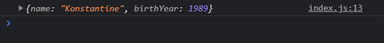
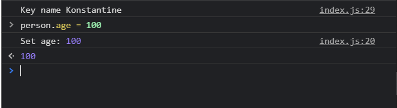

# Object.create, getters, setters

Поговорим про гибкую настройку объектов в **JS**. Поговорим про глубину **JS** при работе с объектами.

Создам объект с помощью глобального класса **Object**. И у данного класса присутствует метод который называется **create**. Данный метод позволяет нам создавать новый объект.

```js
const person = Object.create();
```

метод **create** принимает в себя два параметра. И оба из них являются объектами.

```js
const person = Object.create({}, {});
```

Пока что мы не будем говорить про первый объект. Потому что на самом деле он является прототипом для данного объекта **person**. Мы поговорим про второй параметр где мы можем указать определенные поля для данного объекта. И давайте подумаем вообще какие поля могут быть у объекта **person**.

Допустим я заведу поле name. И уже здесь есть небольшое отличие от привычной нами записи. Мы создаем поле по другому. Ключ является объектом. И для того что бы задать значение мы используем ключ **value** и сюда уже передаем название которое мы хотим задать.

```js
const person = Object.create(
  {},
  {
    name: {
      value: 'Konstantine',
    },
  }
);

console.log(person);
```

И впринципе это ожидаемо.


Создам еще одно поле.

```js
const person = Object.create(
  {},
  {
    name: {
      value: 'Konstantine',
    },
    birthYear: {
      value: 1989,
    },
  }
);

console.log(person);
```



Но теперь если мы расскроем данный объект мы увидим некоторые особенности. И сейчас видно что данные ключи подсвечиваются бледным цветом. Ну это у него.

Что это означает. Это означает что эти поля как бы присутствуют в объекте, но если мы будем делать например итерацию по ключам данного объекта, то эти поля не будут входить в цикл.

С помощью оператора **for** пробегусь по ключам данного объекта.

```js
const person = Object.create(
  {},
  {
    name: {
      value: 'Konstantine',
    },
    birthYear: {
      value: 1989,
    },
  }
);

for (let key in person) {
  console.log('Key', key);
}
```

При обновлении страници я ничего не получаю. Хотя в действительности у объекта **person** ести эти два поля. Для сравнения.

```js
// const person = Object.create(
//   {},
//   {
//     name: {
//       value: 'Konstantine',
//     },
//     birthYear: {
//       value: 1989,
//     },
//   }
// );

const person = {
  name: 'Konstantine',
  birthYear: 1989,
};

for (let key in person) {
  console.log('Key', key);
}
```


Как видите мы получаем значения ключей.

Для того что бы вернуть **default** поведение данных ключей а именно **value: 'Konstantine'**, **value: 1989**. Мы можем настраивать данные поля. В данном случае **name** и **birthYear** это просто разные поля поэтому для них есть разные настройки. Мы можем добавлять различные параметры которые являются **property descriptors**. Например для того что бы поле name было видно в цикле **for** мы можем использовать параметр который называется **enumerable**. По умолчанию когда мы создаем объект с помощью глобального класса **Object** он находится в значении **false**.

```js
const person = Object.create(
  {},
  {
    name: {
      value: 'Konstantine',
      enumerable: true,
    },
    birthYear: {
      value: 1989,
    },
  }
);

for (let key in person) {
  console.log('Key', key);
}
```


И мы кстати в консоли можем выводить и его значение.

```js
const person = Object.create(
  {},
  {
    name: {
      value: 'Konstantine',
      enumerable: true,
    },
    birthYear: {
      value: 1989,
    },
  }
);

for (let key in person) {
  console.log('Key', key, person[key]);
}
```


При этом год рождения у нас не показывается потому что у него **enumerable** стоит в значении **false**.

Второй момент попробую переписать значение.

```js
const person = Object.create(
  {},
  {
    name: {
      value: 'Konstantine',
      enumerable: true,
    },
    birthYear: {
      value: 1989,
    },
  }
);

person.name = 'Maxim';

for (let key in person) {
  console.log('Key', key, person[key]);
}
```


Но ничего не происходит. Даже если я попробую переписать значение в консоли и после заново вызвать объект я все равно получаю старое значение.


Все дело в том что существует другой **property descriptor** который говорит **JS** что данный объект нельзя изменять, а точнее его конкретные поля. И дискриптор называется **writable**. Он так же по умолчанию находится в значении **false**.

```js
const person = Object.create(
  {},
  {
    name: {
      value: 'Konstantine',
      enumerable: true,
      writable: true,
    },
    birthYear: {
      value: 1989,
    },
  }
);

person.name = 'Maxim';

for (let key in person) {
  console.log('Key', key, person[key]);
}
```


При этом если я буду менять год рождения, то ничего не поменяется так как он все еще находится в старом значении.

Так же присутствует еще один дескриптор который позволяет манипулировать с ключами данного объекта. И называется он **configurable**. По умолчанию он так же находится в значении **false**

```js
const person = Object.create(
  {},
  {
    name: {
      value: 'Konstantine',
      enumerable: true,
      writable: true,
      configurable: true,
    },
    birthYear: {
      value: 1989,
      writable: true,
      configurable: false,
    },
  }
);

person.name = 'Maxim';

for (let key in person) {
  console.log('Key', key, person[key]);
}
```

Данный параметр говорит что мы можем удалять какой либо ключ из объекта.


Однако если я попробую удалить поле года рождения.


Если я прописываю **configurable: false**, то я не смогу удалить данное значение из объекта.

Это что касалось именно **property descriptors**.

Теперь поговорим про **getters** и **setters**.

Давате разберем следующую задачу.

У объекта **person** присутствует поле **birthYear**. т.е. тот год когда он родился. Но удобнее показывать его возраст. Для этого мы используем поле **age**. Но как нам вычислить возраст данного человека на основе его года рождения.

Для этого мы можем использовать **getters** и **setters**. В данном объекте конфигурации мы как раз реализуем два метода **get** и **set**.

```js
const person = Object.create(
  {},
  {
    name: {
      value: 'Konstantine',
      enumerable: true,
      writable: true,
      configurable: true,
    },
    birthYear: {
      value: 1989,
      writable: true,
      configurable: false,
    },
    age: {
      get() {},
      set() {},
    },
  }
);

person.name = 'Maxim';

for (let key in person) {
  console.log('Key', key, person[key]);
}
```

И далее мы здесь можем делать определеные манипуляции. Правила **getter** заключается в том что здесь мы должны вернуть какое-то новое значение.

```js
const person = Object.create(
  {},
  {
    name: {
      value: 'Konstantine',
      enumerable: true,
      writable: true,
      configurable: true,
    },
    birthYear: {
      value: 1989,
      writable: true,
      configurable: false,
    },
    age: {
      get() {
        return 'Hello';
      },
      set() {},
    },
  }
);

// person.name = 'Maxim';

for (let key in person) {
  console.log('Key', key, person[key]);
}
```

И далее если я обращусь к этому имени.


Причем обратите внимание что это не функция, это просто его определенное поле. Мы получаем значение **Hello**. Т.е. мы как будто бы реализовывали функцию **get(){}**, но на самом деле данное поле работает как обычное поле в объекте. И это здорово, потому что в этих функциях мы можем выполнять любую логику которую мы захотим. Т.е. для того что бы например вычислить возраст мы можем обратиться к текущему году с помощью глобального класса **Date** и его метода **getFullYear** и вычисть из этого значения т.е. **return new Date().getFullYear() - this.birthYear;**

```js
const person = Object.create(
  {},
  {
    name: {
      value: 'Konstantine',
      enumerable: true,
      writable: true,
      configurable: true,
    },
    birthYear: {
      value: 1989,
      writable: true,
      configurable: false,
    },
    age: {
      get() {
        return new Date().getFullYear() - this.birthYear;
      },
      set() {},
    },
  }
);

// person.name = 'Maxim';

for (let key in person) {
  console.log('Key', key, person[key]);
}
```


У нас нет нигде фиксированного значения возраста. Мы делаем определенные вычисления.

Тоже самое касается метода **set**. В метод **set** мы принимаем некоторый аргумент **value**

```js
const person = Object.create(
  {},
  {
    name: {
      value: 'Konstantine',
      enumerable: true,
      writable: true,
      configurable: true,
    },
    birthYear: {
      value: 1989,
      writable: true,
      configurable: false,
    },
    age: {
      get() {
        return new Date().getFullYear() - this.birthYear;
      },
      set(value) {
        console.log('Set age:', value);
      },
    },
  }
);

// person.name = 'Maxim';

for (let key in person) {
  console.log('Key', key, person[key]);
}
```

И смотрим как это работает.



Хотя на самом деле если мы обратимся опять к полу age оно будет равно предыдущему значению.


Потому что мы не переписываем не какое значение.

И в этих **setters** мы можем делать по сути что угодно. Например мы можем менять **background** всего окна.

```js
const person = Object.create(
  {},
  {
    name: {
      value: 'Konstantine',
      enumerable: true,
      writable: true,
      configurable: true,
    },
    birthYear: {
      value: 1989,
      writable: true,
      configurable: false,
    },
    age: {
      get() {
        return new Date().getFullYear() - this.birthYear;
      },
      set(value) {
        document.body.style.background = 'red';
        console.log('Set age:', value);
      },
    },
  }
);

// person.name = 'Maxim';

for (let key in person) {
  console.log('Key', key, person[key]);
}
```

И теперь если я попробую поменять значение в поле **age**, то с ним поменяется и цвет.


На самом деле на этих **getter** и **setter** построено большое количество **frameworks** для того что бы смотреть за изменением определенных полей и выполнять например дополнительную логику. Например по отрисовке приложения.

И теперь поговорим про первый параметр который мы передаем в функцию **Object.create**. В данном объекта мы можем указывать прототип нового созданного объекта **person**.

Например мы можем создать новый метод **calculateAge**

```js
const person = Object.create(
  {
    calculateAge() {
      console.log('Age: ', new Date().getFullYear() - this.birthYear);
    },
  },
  {
    name: {
      value: 'Konstantine',
      enumerable: true,
      writable: true,
      configurable: true,
    },
    birthYear: {
      value: 1989,
      writable: true,
      configurable: false,
    },
    age: {
      get() {
        return new Date().getFullYear() - this.birthYear;
      },
      set(value) {
        document.body.style.background = 'red';
        console.log('Set age:', value);
      },
    },
  }
);

// person.name = 'Maxim';

for (let key in person) {
  console.log('Key', key, person[key]);
}
```


Мы получаем **console.log** данного метода потому что цикл **for in** так же пробегается и по прототипу данного объекта. Теперь если я в person вызову метод **calculateAge** я так же получу результат.

```js
const person = Object.create(
  {
    calculateAge() {
      console.log('Age: ', new Date().getFullYear() - this.birthYear);
    },
  },
  {
    name: {
      value: 'Konstantine',
      enumerable: true,
      writable: true,
      configurable: true,
    },
    birthYear: {
      value: 1989,
      writable: true,
      configurable: false,
    },
    age: {
      get() {
        return new Date().getFullYear() - this.birthYear;
      },
      set(value) {
        document.body.style.background = 'red';
        console.log('Set age:', value);
      },
    },
  }
);

// person.name = 'Maxim';

for (let key in person) {
  console.log('Key', key, person[key]);
}
```


Теперь пару слов о цикле **for in**. Как вы видили помимо того что мы получаем определенные ключи, мы помимо этого получили значение функции которая находится в прототипе.


так вот для того что бы нам не пробегаться по прототипу, а пробегаться по собственным ключам данного объекта мы можем добавить проверку.

```js
const person = Object.create(
  {
    calculateAge() {
      console.log('Age: ', new Date().getFullYear() - this.birthYear);
    },
  },
  {
    name: {
      value: 'Konstantine',
      enumerable: true,
      writable: true,
      configurable: true,
    },
    birthYear: {
      value: 1989,
      writable: true,
      configurable: false,
    },
    age: {
      get() {
        return new Date().getFullYear() - this.birthYear;
      },
      set(value) {
        document.body.style.background = 'red';
        console.log('Set age:', value);
      },
    },
  }
);

// person.name = 'Maxim';

for (let key in person) {
  if (person.hasOwnProperty(key)) {
    console.log('Key', key, person[key]);
  }
}
```


Метод **hasOwnProperty** позволяет нам не пробегаться по прототипу. И данный метод рекомендуется использовать всегда когда вы делаете итерацию с помощью цикла **for in**. Надеюсь что вам стало немного понятнее как работать с **getters** и **setters** потому что они по сути предоставляют не ограниченное количество возможностей как вы можете написать реактивный и динамический функционал
