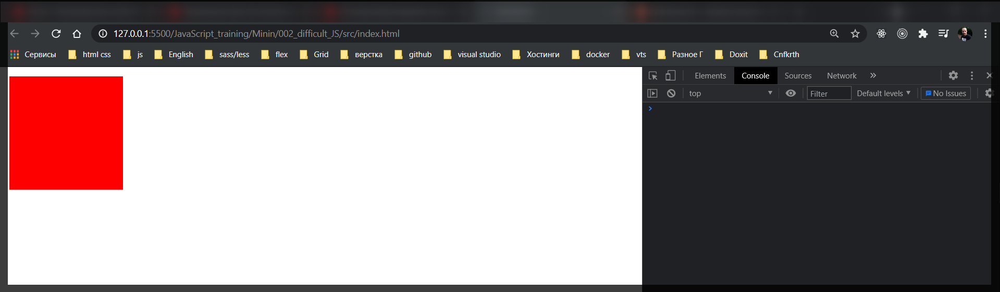

# ES6 classes

Сразу же разберем на простом примере зачем нам нужны классы и что они делают. Для начало я создам простой объект и назову например **animal**.

```js
const animal = {
  name: 'Animal',
  age: 5,
  hasTail: true,
};
```


Это обычный объект у которого есть те поля которые мы перечислили. И прототип указывает на глобальный класс **Object**.

Однако в **JS** присутствует специальный синтаксис классов который позволяет более удобно создавать подобные объекты.

С помощью ключевого слова **class** я называю класс, по конвенции я его называю с большой буквы.

```js
class Animal {}
```

Далее в фигурных скобках мы описываем этот класс. Для того что бы поинициализировать начальные значения объекта данного класса мы должны реализовать специальный метод который называется **constructor**.

```js
class Animal {
  constructor() {}
}
```

И в **constructor** мы будем принимать некоторый объект **options** который мы будем перечислять в данный **class**.

```js
class Animal {
  constructor(options) {}
}
```

Для того что бы у **instance** класса **Animal** были поля объекта, мы должны их проинициализировать через ключевое слово **this**. Т.е. контекст который будет указывать на текущий объект.

```js
class Animal {
  constructor(options) {
    this.name = options.name;
    this.age = options.age;
    this.hasTail = options.hasTail;
  }
}
```

Теперь как нам создать объект **animal** но уже с помощью класса. Посути мы делаем тоже самое. Создаю переменную **const animal** и в значении с помощью ключевого слова new указываем от какого класса мы будем его создавать.

```js
class Animal {
  constructor(options) {
    this.name = options.name;
    this.age = options.age;
    this.hasTail = options.hasTail;
  }
}

const animal = new Animal();
```

И теперь в вызов класса я буду принимать те переметры которые я принимаю в кострукторе т.е. это некоторый объект.

```js
class Animal {
  constructor(options) {
    this.name = options.name;
    this.age = options.age;
    this.hasTail = options.hasTail;
  }
}

const animal = new Animal({
  name: 'Animal',
  age: 5,
  hasTail: true,
});
```

Теперь если я в консоли обращусь к объекту **Animal**, то по сути мы получим тот же самый результат. Однако hrome показывает что данный объект не просто объект, он является наследником от класса **Animal**.


Что интересно. Если мы посмотрим в прототип, то в первую очередь мы не увидим прототип объекта. Мы увидим прототип класса **Animal**.
И только после этого мы увидим прототип самого объекта.


Соответственно мы можем в классе **Animal** реализовывать какие либо методы которые попадут в прототип нашего будущего объекта.
Например я реализую метод **voice**.

```js
class Animal {
  constructor(options) {
    this.name = options.name;
    this.age = options.age;
    this.hasTail = options.hasTail;
  }
  voice() {
    console.log('I am animal!');
  }
}

const animal = new Animal({
  name: 'Animal',
  age: 5,
  hasTail: true,
});
```


Однако если мы посмотрим на сам объект то увидим что данного метода у него нет на верхем уровне. Он присутствует в прототипе.


Что мы еще можем делать с классами?

Допустим мы можем реализовывать некоторые статические методы или переменные с помощью ключевого слова **static**.

```js
class Animal {
  static type = 'ANIMAL';

  constructor(options) {
    this.name = options.name;
    this.age = options.age;
    this.hasTail = options.hasTail;
  }
  voice() {
    console.log('I am animal!');
  }
}

const animal = new Animal({
  name: 'Animal',
  age: 5,
  hasTail: true,
});
```

Как теперь этим пользоваться?

Допустим если я попробую обратится к объекту **animal** и вызову **type** то я получу **undefined**.


Если переменнаяили метод является статическим, то тогда она доступна только у самого класса.


Теперь разберем следующий момент. Почему классы могут быть удобными?

Потому что мы можем настраивать полноценное наследование.

Например я могу создать **class** **Cat**. И для того что бы мне наследоваться от класса **Animal** я воспользуюсь ключевым словом **extends** и дальше указываю название родительского класса.

```js
class Animal {
  static type = 'ANIMAL';

  constructor(options) {
    this.name = options.name;
    this.age = options.age;
    this.hasTail = options.hasTail;
  }
  voice() {
    console.log('I am animal!');
  }
}

class Cat extends Animal {}

const cat = new Cat({
  name: 'Cat',
  age: 7,
  hasTail: true,
});
```


По сути это самый обычный объект. Ожнако объект **cat** относится к классу **Cat**. И если мы посмотрим на прототип, то сначало мы увидим **Cat**, потом мы увидим класс **Animal** и только потом мы увидим **Object**. Что по сути нам не мешает так же с помощью прототипированного наследования вызывать методы которые определены в родительском классе.


В классе Cat мы так же можем заводить статические поля.

```js
class Animal {
  static type = 'ANIMAL';

  constructor(options) {
    this.name = options.name;
    this.age = options.age;
    this.hasTail = options.hasTail;
  }
  voice() {
    console.log('I am animal!');
  }
}

class Cat extends Animal {
  static type = 'CAT';
}

const cat = new Cat({
  name: 'Cat',
  age: 7,
  hasTail: true,
});
```


Но что нам делать если для класса **Cat** мы хотим передавать дополнительные параметры например цвет данного животного. И мы так же хотим передавать его в конструктор.

```js
class Animal {
  static type = 'ANIMAL';

  constructor(options) {
    this.name = options.name;
    this.age = options.age;
    this.hasTail = options.hasTail;
  }
  voice() {
    console.log('I am animal!');
  }
}

class Cat extends Animal {
  static type = 'CAT';
}

const cat = new Cat({
  name: 'Cat',
  age: 7,
  hasTail: true,
  color: 'black',
});
```

И если я сейчас обращусь к объекту **cat** то я не увижу его поля **color** потому что мы не инициализируем данное поле через **this.color**. Допустим цвет мы хотим присваивать только для кошек.

Для этого в интересующем классе я реализую **constructor** как в предыдущем примере. И определяю поле **color**. После чего смотрю на ошибку в консоли.

```js
class Animal {
  static type = 'ANIMAL';

  constructor(options) {
    this.name = options.name;
    this.age = options.age;
    this.hasTail = options.hasTail;
  }
  voice() {
    console.log('I am animal!');
  }
}

class Cat extends Animal {
  static type = 'CAT';

  constructor(options) {
    this.color = options.color;
  }
}

const cat = new Cat({
  name: 'Cat',
  age: 7,
  hasTail: true,
  color: 'black',
});
```


Это связано стем что когда мы реализуем метод **constructor** в дочернем классе, который наследуется от другого класса, мы для начало должны вызвать родительский конструктор. И для этого присутствует специальное ключевое слово **super**, которое по сути является методом. В данный метод мы должны передать набор опций. Т.е. по сути данной строчкой **super()** мы вызываем родителский конструктор.
Родительский конструктор принимает аргумент **options** и поэтому в **super** мы должны передать точно такой же аргумент.

```js
class Animal {
  static type = 'ANIMAL';

  constructor(options) {
    this.name = options.name;
    this.age = options.age;
    this.hasTail = options.hasTail;
  }
  voice() {
    console.log('I am animal!');
  }
}

class Cat extends Animal {
  static type = 'CAT';

  constructor(options) {
    super(options);
    this.color = options.color;
  }
}

const cat = new Cat({
  name: 'Cat',
  age: 7,
  hasTail: true,
  color: 'black',
});
```


Что интересно. В классе **Cat** мы можем переписывать некоторые родительские методы. К примеру метод **voice**.

```js
class Animal {
  static type = 'ANIMAL';

  constructor(options) {
    this.name = options.name;
    this.age = options.age;
    this.hasTail = options.hasTail;
  }
  voice() {
    console.log('I am animal!');
  }
}

class Cat extends Animal {
  static type = 'CAT';

  constructor(options) {
    super(options);
    this.color = options.color;
  }
  voice() {
    console.log('I am cat');
  }
}

const cat = new Cat({
  name: 'Cat',
  age: 7,
  hasTail: true,
  color: 'black',
});
```


Значение метода дочернего класса перетирает значение родитеского.

Но бывают случаи когда в дочернем классе необходимо вызывать метод родительского класса.
И для этого в методе мы можем так же вызывать ключевое слово **super** но мы его ны вызываем его как метод, а ображаемся к нему как к объекту и вызываем у него тот метод который нам нужен.

```js
class Animal {
  static type = 'ANIMAL';

  constructor(options) {
    this.name = options.name;
    this.age = options.age;
    this.hasTail = options.hasTail;
  }
  voice() {
    console.log('I am animal!');
  }
}

class Cat extends Animal {
  static type = 'CAT';

  constructor(options) {
    super(options);
    this.color = options.color;
  }
  voice() {
    super.voice();
    console.log('I am cat');
  }
}

const cat = new Cat({
  name: 'Cat',
  age: 7,
  hasTail: true,
  color: 'black',
});
```


И сначало я получаю сообщение от родительского класса, и толко после этого получаю результат вызова метода класса **Cat**.

Так же в классах присутствуют **getters** и **setters**. И реализуются они с помощью ключевых слов **get** и **set**.

Допустим мы хотим показывать настоящий возраст животного. К примеру реализую геттер **ageInfo** и как результат я буду возвращать **this.age \* 7**.

```js
class Animal {
  static type = 'ANIMAL';

  constructor(options) {
    this.name = options.name;
    this.age = options.age;
    this.hasTail = options.hasTail;
  }
  voice() {
    console.log('I am animal!');
  }
}

class Cat extends Animal {
  static type = 'CAT';

  constructor(options) {
    super(options);
    this.color = options.color;
  }
  voice() {
    super.voice();
    console.log('I am cat');
  }

  get ageInfo() {
    return this.age * 7;
  }
}

const cat = new Cat({
  name: 'Cat',
  age: 7,
  hasTail: true,
  color: 'black',
});
```

Только помним что это не функция а поле поэтому и вызываю соответствующим образом.


Если в консоли мы посмотрим что такое **getter** то мы увидим что **hrome** его показывает следующим образом.


Если мы нажмем, то получим некоторый результат. Именно так работают **getters**


По аналогии мы можем делать некоторые **setter**. Принимаю аргумент **newAge** и в теле **this.age = newAge;** т.е. я буду менять поле в самом объекте

```js
class Animal {
  static type = 'ANIMAL';

  constructor(options) {
    this.name = options.name;
    this.age = options.age;
    this.hasTail = options.hasTail;
  }
  voice() {
    console.log('I am animal!');
  }
}

class Cat extends Animal {
  static type = 'CAT';

  constructor(options) {
    super(options);
    this.color = options.color;
  }
  voice() {
    super.voice();
    console.log('I am cat');
  }

  get ageInfo() {
    return this.age * 7;
  }

  set ageInfo(newAge) {
    this.age = newAge;
  }
}

const cat = new Cat({
  name: 'Cat',
  age: 7,
  hasTail: true,
  color: 'black',
});
```


Потому что в **setter** мы изменили поле **this.age**, а в **getter** мы обращаемся у же к измененному полю.

Теперь я закоментирую весь код. И напишу некторый практический пример для того что бы разобраться как вообще работают классы именно в практике с использованием **JS**.

Для этого я создаю новый класс **Component**. У него будет метод **constructor** который в себя будет допустим принимать параметр **selector**.

```js
class Component {
  constructor(selector) {}
}
```

Дальше в этом конструкторе я создам приватное поле **this.$el**. Обычно через **\$** называют те переменные которые содержат **node** **DOM**.

```js
class Component {
  constructor(selector) {
    this.$el = document.querySelector(selector);
  }
}
```

В **querySelector()** передаю **selector** который получаю из конструктора.

И допустим в родительском классе я создам два метода **hide** и метод **how**. Которые позволят скрывать элементы и показывать элементы.

```js
class Component {
  constructor(selector) {
    this.$el = document.querySelector(selector);
  }

  hide() {
    this.$el.style.display = 'none';
  }

  show() {
    this.$el.style.display = 'block';
  }
}
```

и дальше я создам еще один класс Box который будет наследоваться от нашего **Component**.

В классе Box я так же реалиую **constructor** в который я буду принимать некоторый набор **options**.

```js
class Component {
  constructor(selector) {
    this.$el = document.querySelector(selector);
  }

  hide() {
    this.$el.style.display = 'none';
  }

  show() {
    this.$el.style.display = 'block';
  }
}

class Box extends Component {
  constructor(options) {}
}

const box1 = new Box({});
```

Так же создаю переменную **box1**. И давайте подумем какие параметры я могу в нее передавать?

Во-первых мне понадобится **selector**.

```js
class Component {
  constructor(selector) {
    this.$el = document.querySelector(selector);
  }

  hide() {
    this.$el.style.display = 'none';
  }

  show() {
    this.$el.style.display = 'block';
  }
}

class Box extends Component {
  constructor(options) {}
}

const box1 = new Box({
  selector: '#box1',
});
```

И дальше кроме **id** я хочу задать какие-то специфические какие-то значения именно для **Box**. К примеру **size** и **color**.

```js
class Component {
  constructor(selector) {
    this.$el = document.querySelector(selector);
  }

  hide() {
    this.$el.style.display = 'none';
  }

  show() {
    this.$el.style.display = 'block';
  }
}

class Box extends Component {
  constructor(options) {}
}

const box1 = new Box({
  selector: '#box1',
  size: 100,
  color: 'red',
});
```

теперь мы знаем что в **constructor** класса **Box** мы принимаем набор опций. Но мы знаем что в родительском классе в **constructor** мы принимаем только **selector**.

Поэтому в классе **Box** в **constructor** вызываю **super** и внем обращаюсь к **options.selector**

```js
class Component {
  constructor(selector) {
    this.$el = document.querySelector(selector);
  }

  hide() {
    this.$el.style.display = 'none';
  }

  show() {
    this.$el.style.display = 'block';
  }
}

class Box extends Component {
  constructor(options) {
    super(options.selector);
  }
}

const box1 = new Box({
  selector: '#box1',
  size: 100,
  color: 'red',
});
```

И теперь в теле конструктора я могу обратится к переменной **this.\$el** и написать что у нас высота равна ширине и приплюсовать **px**. а именно **this.\$el.style.width = this.\$el.style.height = options.size + 'px';**.

```js
class Component {
  constructor(selector) {
    this.$el = document.querySelector(selector);
  }

  hide() {
    this.$el.style.display = 'none';
  }

  show() {
    this.$el.style.display = 'block';
  }
}

class Box extends Component {
  constructor(options) {
    super(options.selector);
    this.$el.style.width = this.$el.style.height = options.size + 'px';
  }
}

const box1 = new Box({
  selector: '#box1',
  size: 100,
  color: 'red',
});
```

И тоже самое сделаем для цвета. **this.$el.style.color = options.color;**

После чего в **html** необходимо создать данный селектор.

```html
<!DOCTYPE html>
<html lang="en">
  <head>
    <meta charset="UTF-8" />
    <meta http-equiv="X-UA-Compatible" content="IE=edge" />
    <meta name="viewport" content="width=device-width, initial-scale=1.0" />
    <title>Document</title>
  </head>
  <body>
    <div id="box1"></div>
    <script src="index.js"></script>
  </body>
</html>
```

```js
class Component {
  constructor(selector) {
    this.$el = document.querySelector(selector);
  }

  hide() {
    this.$el.style.display = 'none';
  }

  show() {
    this.$el.style.display = 'block';
  }
}

class Box extends Component {
  constructor(options) {
    super(options.selector);
    this.$el.style.width = this.$el.style.height = options.size + 'px';
    this.$el.style.color = options.color;
  }
}

const box1 = new Box({
  selector: '#box1',
  size: 100,
  color: 'red',
});
```

И я ничего не получаю так как вместо **color** мне нужет **background**.

```js
class Component {
  constructor(selector) {
    this.$el = document.querySelector(selector);
  }

  hide() {
    this.$el.style.display = 'none';
  }

  show() {
    this.$el.style.display = 'block';
  }
}

class Box extends Component {
  constructor(options) {
    super(options.selector);
    this.$el.style.width = this.$el.style.height = options.size + 'px';
    this.$el.style.background = options.color;
  }
}

const box1 = new Box({
  selector: '#box1',
  size: 100,
  color: 'red',
});
```



Теперь смотрите что интересно. Если я обращусь к переменной **box1**, то у него я могу вызывать методы которые мы реализовывали.


И как видим квадрат исчезает.


Я вызываю метод который обращается к классу **Component** и дальше выполняет свою логику. Однако в самом классе Box этот метод не присутствует.

Если мы хотим создать еще какой-то объект например **box2**

```html
<!DOCTYPE html>
<html lang="en">
  <head>
    <meta charset="UTF-8" />
    <meta http-equiv="X-UA-Compatible" content="IE=edge" />
    <meta name="viewport" content="width=device-width, initial-scale=1.0" />
    <title>Document</title>
  </head>
  <body>
    <div id="box1"></div>
    <div id="box2"></div>
    <script src="index.js"></script>
  </body>
</html>
```

```js
class Component {
  constructor(selector) {
    this.$el = document.querySelector(selector);
  }

  hide() {
    this.$el.style.display = 'none';
  }

  show() {
    this.$el.style.display = 'block';
  }
}

class Box extends Component {
  constructor(options) {
    super(options.selector);
    this.$el.style.width = this.$el.style.height = options.size + 'px';
    this.$el.style.background = options.color;
  }
}

const box1 = new Box({
  selector: '#box1',
  size: 100,
  color: 'red',
});

const box2 = new Box({
  selector: '#box2',
  size: 120,
  color: 'blue',
});
```

то ка результат я получаю синий квадрат.


И тоже самое я могу сделать с методом **box2**. Спрятать его с помощью метода **hide** или показать с помощью метода **show**.

Теперь что мы можем сделать? А теперь мы можем еще больше создавать классов и наследоваться от этих классов.

К примеру я могу создать еще один класс **Circle**. И он уже будет наследоваться от класса **Box**. Далее я так же реализую метод конструктор который будет принимать некоторые **options**. И так как мы наследуемся от класса Box то уже в конструктор мы должны передавать **options** т.е. **super(options)**.

```js
class Component {
  constructor(selector) {
    this.$el = document.querySelector(selector);
  }

  hide() {
    this.$el.style.display = 'none';
  }

  show() {
    this.$el.style.display = 'block';
  }
}

class Box extends Component {
  constructor(options) {
    super(options.selector);
    this.$el.style.width = this.$el.style.height = options.size + 'px';
    this.$el.style.background = options.color;
  }
}

const box1 = new Box({
  selector: '#box1',
  size: 100,
  color: 'red',
});

const box2 = new Box({
  selector: '#box2',
  size: 120,
  color: 'blue',
});

class Circle extends Box {
  constructor(options) {
    super(options);
  }
}
```

Но так как сейчас у нас происходит реализация класса Circle то мы должны его сделать кругом.

```js
class Component {
  constructor(selector) {
    this.$el = document.querySelector(selector);
  }

  hide() {
    this.$el.style.display = 'none';
  }

  show() {
    this.$el.style.display = 'block';
  }
}

class Box extends Component {
  constructor(options) {
    super(options.selector);
    this.$el.style.width = this.$el.style.height = options.size + 'px';
    this.$el.style.background = options.color;
  }
}

const box1 = new Box({
  selector: '#box1',
  size: 100,
  color: 'red',
});

const box2 = new Box({
  selector: '#box2',
  size: 120,
  color: 'blue',
});

class Circle extends Box {
  constructor(options) {
    super(options);
    this.$el.style.borderRadius = '50%';
  }
}
```

И теперь вот что здорово. Если я создам переменную **с** от класса new Circle. Куда в объекте передаю определенные параметры

```js
class Component {
  constructor(selector) {
    this.$el = document.querySelector(selector);
  }

  hide() {
    this.$el.style.display = 'none';
  }

  show() {
    this.$el.style.display = 'block';
  }
}

class Box extends Component {
  constructor(options) {
    super(options.selector);
    this.$el.style.width = this.$el.style.height = options.size + 'px';
    this.$el.style.background = options.color;
  }
}

const box1 = new Box({
  selector: '#box1',
  size: 100,
  color: 'red',
});

const box2 = new Box({
  selector: '#box2',
  size: 120,
  color: 'blue',
});

class Circle extends Box {
  constructor(options) {
    super(options);
    this.$el.style.borderRadius = '50%';
  }
}

const c = new Circle({
  selector: '#circle',
  size: 90,
  color: 'green',
});
```

теперь что учитывая то что переменную **c** мы создаем именно от класса Circle, то поидее мы должны получить не квадрат, а именно круг.

```html
<!DOCTYPE html>
<html lang="en">
  <head>
    <meta charset="UTF-8" />
    <meta http-equiv="X-UA-Compatible" content="IE=edge" />
    <meta name="viewport" content="width=device-width, initial-scale=1.0" />
    <title>Document</title>
  </head>
  <body>
    <div id="box1"></div>
    <div id="box2"></div>
    <div id="circle"></div>
    <script src="index.js"></script>
  </body>
</html>
```


По сути классы это все го лишь определенный удобный стнтаксис для создания объектов. Мы можем выносить какую-то логику в какие-то базовые классы, удобно этим пользоваться. Задавать на определенных этапах нужные методы в прототипе и спокойно с этим работать.
