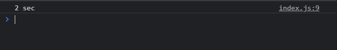
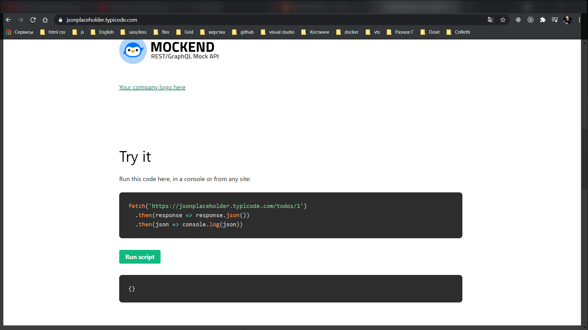
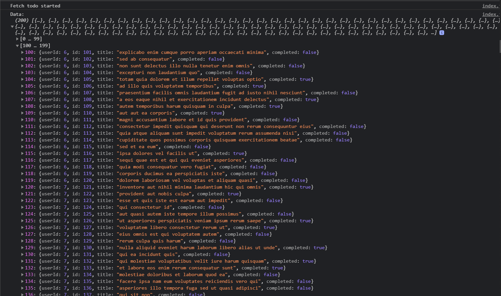
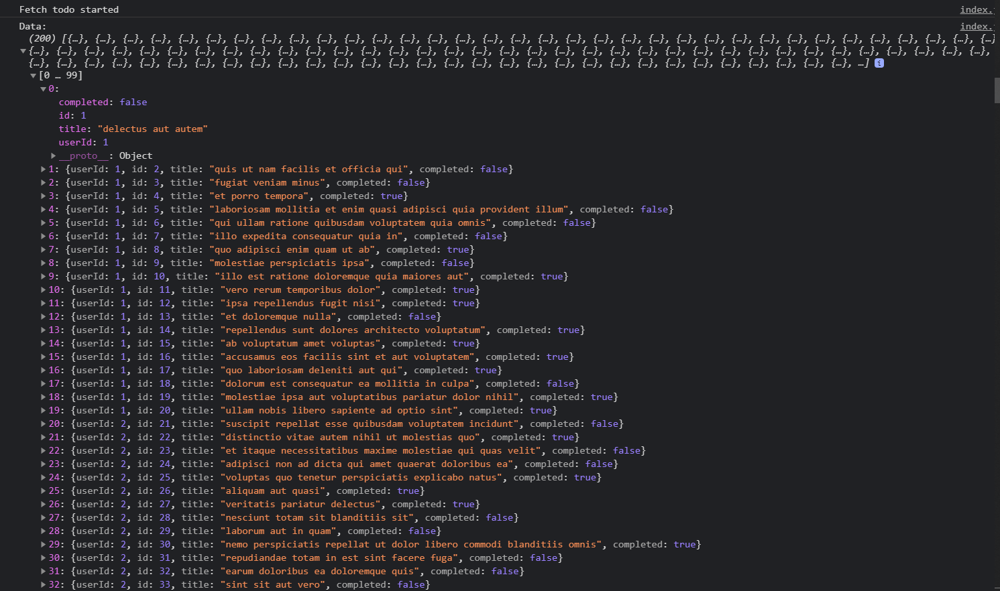

# async await fetch

Реализуем следующую задачу. Она может будет не слишком приближена к жизни, но зато будет более наглядный пример.

Мы изначально создадим функцию которая будет нам возвращать промис который будет делать некоторую искуственную задержку.

```js
const delay = (ms) => {
  return new Promise((resolve) =>
    setTimeout(() => {
      resolve;
    }, ms)
  );
};
```

И теперь мы можем протестировать данную функцию.

```js
const delay = (ms) => {
  return new Promise((resolve) =>
    setTimeout(() => {
      resolve();
    }, ms)
  );
};
delay(2000).then(() => {
  console.log('2 sec');
});
```



теперь разберем следующую задачу. Допустим мы хотим сделать асинхронный запрос на сервер и получить какие-то данные. Но так же к этому добавить искуственную задержку. Т.е. что бы построить некоторую цепочку из промисов.

Для того что бы продемонстрировать работу с сервером через [ajax](https://habr.com/ru/post/14246/) запросы через [XMLHttpRequest](https://learn.javascript.ru/xmlhttprequest) протокол. Мы можем зайти на сайт [JSONPlaceholder](https://jsonplaceholder.typicode.com/). Это сервис который предоставляет фейковый **Rest** **API** для того что бы что-то тестировать или прототипировать.

В поле **Exemple** копирую **url**. Но он копирует его не полностью. Теперь на главной странице это поле называется **try it**



```js
const delay = (ms) => {
  return new Promise((resolve) =>
    setTimeout(() => {
      resolve();
    }, ms)
  );
};
delay(2000).then(() => {
  console.log('2 sec');
});

const url = 'https://jsonplaceholder.typicode.com/todos';
```

Далее я создаю функцию **fetchTodos** в которой для начало буду добавлять искуствнную задержку.

```js
const delay = (ms) => {
  return new Promise((resolve) =>
    setTimeout(() => {
      resolve();
    }, ms)
  );
};

const url = 'https://jsonplaceholder.typicode.com/todos';

function fetchTodos() {
  delay(2000).then(() => {});
}
```

И далее с помощью метода **then** я коворю что когда задержка будет пройдена я буду выполнять следующий **callback** где я хочу сделать запрос на сервер. И для того что бы сделать запрос на сервер через промисы мы можем воспользоваться нативной функцией в браузере которая называется **fetch**. Т.е. **fetch** это некоторый такой аналог **ajax** который делает асинхронный запрос и возвращает нам промис. Т.е. с ним работать очень удобно.

И **fetch** мы будем делать по нашей константе **url**.

```js
const delay = (ms) => {
  return new Promise((resolve) =>
    setTimeout(() => {
      resolve();
    }, ms)
  );
};

const url = 'https://jsonplaceholder.typicode.com/todos';

function fetchTodos() {
  delay(2000).then(() => {
    fetch(url);
  });
}
```

Учитывая то что данный метод нам так же возвращает промис мы можем так же обратится к **then**. В нем мы будем получать некоторый response. И далее для того что бы получить тот **JSON** который прилетает с сервиса мы у объекта **response** должны вызвать метод который называется **json()** это некоторый **API** который присутствует в методе **fetch**.

```js
const delay = (ms) => {
  return new Promise((resolve) =>
    setTimeout(() => {
      resolve();
    }, ms)
  );
};

const url = 'https://jsonplaceholder.typicode.com/todos';

function fetchTodos() {
  delay(2000).then(() => {
    fetch(url).then((response) => response.json());
  });
}
```

Но здесь учитывая что мы работаем внутри промиса, мы можем не создавать такую вложенность, вместо того что бы прописывать последний **then**. Далее я могу вернуть новый промис

```js
const delay = (ms) => {
  return new Promise((resolve) =>
    setTimeout(() => {
      resolve();
    }, ms)
  );
};

const url = 'https://jsonplaceholder.typicode.com/todos';

function fetchTodos() {
  delay(2000).then(() => {
    return fetch(url);
  });
}
```

и далее уже у верхнего промиса вызывать **then** и парсить **json**. И вернуть весь этот промис из функции **fetchTodos**

```js
const delay = (ms) => {
  return new Promise((resolve) =>
    setTimeout(() => {
      resolve();
    }, ms)
  );
};

const url = 'https://jsonplaceholder.typicode.com/todos';

function fetchTodos() {
  return delay(2000)
    .then(() => {
      return fetch(url);
    })
    .then((response) => response.json());
}
```

Теперь я могу вызывать **fetchTodos()** он не принимает ни каких параметров, но теперь в нем доступен метод **then** куда будет прилетать некоторая **data**

```js
const delay = (ms) => {
  return new Promise((resolve) =>
    setTimeout(() => {
      resolve();
    }, ms)
  );
};

const url = 'https://jsonplaceholder.typicode.com/todos';

function fetchTodos() {
  return delay(2000)
    .then(() => {
      return fetch(url);
    })
    .then((response) => response.json());
}

fetchTodos().then((data) => console.log('Data: ', data));
```

Более того в промисах у нас доступен метод **catch** для того что бы обрабатывать потенциальные ошибки.

```js
const delay = (ms) => {
  return new Promise((resolve) =>
    setTimeout(() => {
      resolve();
    }, ms)
  );
};

const url = 'https://jsonplaceholder.typicode.com/todos';

function fetchTodos() {
  return delay(2000)
    .then(() => {
      return fetch(url);
    })
    .then((response) => response.json());
}

fetchTodos()
  .then((data) => console.log('Data: ', data))
  .catch((e) => console.error(e));
```

И давайте сделаем еще один момент. Когда я буду фетчить что-то в консоль я буду выводить

```js
const delay = (ms) => {
  return new Promise((resolve) =>
    setTimeout(() => {
      resolve();
    }, ms)
  );
};

const url = 'https://jsonplaceholder.typicode.com/todos';

function fetchTodos() {
  console.log('Fetch todo started');
  return delay(2000)
    .then(() => {
      return fetch(url);
    })
    .then((response) => response.json());
}

fetchTodos()
  .then((data) => console.log('Data: ', data))
  .catch((e) => console.error(e));
```



В принципе как видите мы с вами реализовали подобную логику и выглядит это все очень даже не плохо.

Учитывая что мы используем промисы мы избегаем лишних вложенностей. Мы кстати можем еще больше сократить код, где мы возвращаем **fetch**.

```js
const delay = (ms) => {
  return new Promise((resolve) =>
    setTimeout(() => {
      resolve();
    }, ms)
  );
};

const url = 'https://jsonplaceholder.typicode.com/todos';

function fetchTodos() {
  console.log('Fetch todo started');
  return delay(2000)
    .then(() => fetch(url))
    .then((response) => response.json());
}

fetchTodos()
  .then((data) => console.log('Data: ', data))
  .catch((e) => console.error(e));
```

Потому что мы используем **ES6** по умолчанию если мы не пришем **return**, то **JS** нам автоматически возвращает разультат.

И как видите с этим очень удобно работать. Но благодаря новым операторам **async await**. C помощью этих опрераторов данный подход мы можем сделать еще более комфортным.

Теперь я создам одну функцию которая будет делать тоже самое но с применением **async await**.

```js
const delay = (ms) => {
  return new Promise((resolve) =>
    setTimeout(() => {
      resolve();
    }, ms)
  );
};

const url = 'https://jsonplaceholder.typicode.com/todos';

function fetchAsyncTodos() {}
```

Первый момент который нам важно понять что те функции которые внутри применяют оператор **await** должны быть асинхронными. Т.е. если мы хотим работать с асинхронным кодом в новом формате, то нам обязательно сделать функцию в которой мы выполняем какую-то логику асинхронной.

```js
const delay = (ms) => {
  return new Promise((resolve) =>
    setTimeout(() => {
      resolve();
    }, ms)
  );
};

const url = 'https://jsonplaceholder.typicode.com/todos';

async function fetchAsyncTodos() {}
```

Далее в первую очередь нам необходимо подождать нашей искуственной задержки. вызываем **delay(2000)**. И мы знаем что данная функция нам возвращает промис. Но учитывая что наша функция асинхронная, вместо того что бы обрабатывать данный промис с помощью метода **then**, мы перед выполнением этого действия можем написать оператор **await**. На самом деле это будет равносильно тому что мы обрабатываем промис.

```js
const delay = (ms) => {
  return new Promise((resolve) =>
    setTimeout(() => {
      resolve();
    }, ms)
  );
};

const url = 'https://jsonplaceholder.typicode.com/todos';

async function fetchAsyncTodos() {
  await delay(2000);
}
```

Теперь следующей строчкой мы можем выполнять какую-то логику. И важный момент заключается в том что мы не перейдем к этой строчке пока данный промис **await delay(2000)** не зарезолвится т.е. пока данный промис не выполнится. Именно эту функцию выполняет оператор **await**.

Дальше нам нужно обратится к методу **fetch** и передать в него константу **url**.

```js
const delay = (ms) => {
  return new Promise((resolve) =>
    setTimeout(() => {
      resolve();
    }, ms)
  );
};

const url = 'https://jsonplaceholder.typicode.com/todos';

async function fetchAsyncTodos() {
  await delay(2000);
  fetch(url);
}
```

Но мы так же знаем что метод **fetch** нам возвращает промис. Оператор **await** позволяет нам автоматически обработать этот промис

```js
const delay = (ms) => {
  return new Promise((resolve) =>
    setTimeout(() => {
      resolve();
    }, ms)
  );
};

const url = 'https://jsonplaceholder.typicode.com/todos';

async function fetchAsyncTodos() {
  await delay(2000);
  await fetch(url);
}
```

Но метод **fetch** возвращает нам некоторый **response** который попадает в метод **then**. И здесь как раз таки есть отличия в записи. Если мы применяем оператор **await** то мы просто получаем этот объект **response** в обычную переменную как результат работы оператора **await** и промиса **fetch**.

```js
const delay = (ms) => {
  return new Promise((resolve) =>
    setTimeout(() => {
      resolve();
    }, ms)
  );
};

const url = 'https://jsonplaceholder.typicode.com/todos';

async function fetchAsyncTodos() {
  await delay(2000);
  const response = await fetch(url);
}
```

Далее нам необходимо выполнить еще один промис т.е. метод **responce.json** он нам так же возвращает промис. Поэтому нам его нужно дождаться. И здесь делаю ровно так же.

```js
const delay = (ms) => {
  return new Promise((resolve) =>
    setTimeout(() => {
      resolve();
    }, ms)
  );
};

const url = 'https://jsonplaceholder.typicode.com/todos';

async function fetchAsyncTodos() {
  await delay(2000);
  const response = await fetch(url);
  const data = await response.json();
}
```

И сейчас на самом деле мы полностью повторили всю предыдущую логику.

```js
const delay = (ms) => {
  return new Promise((resolve) =>
    setTimeout(() => {
      resolve();
    }, ms)
  );
};

const url = 'https://jsonplaceholder.typicode.com/todos';

async function fetchAsyncTodos() {
  console.log('Fetch todo started');
  await delay(2000);
  const response = await fetch(url);
  const data = await response.json();
  console.log('Data: ', data);
}
```

Однако сейчас нам не стоит забывать про тот факт что мы определили функцию **fetchAsyncTodos**, но нам необходимо ее вызвать для того что бы она работала.

```js
const delay = (ms) => {
  return new Promise((resolve) =>
    setTimeout(() => {
      resolve();
    }, ms)
  );
};

const url = 'https://jsonplaceholder.typicode.com/todos';

// function fetchTodos() {
//   console.log('Fetch todo started');
//   return delay(2000)
//     .then(() => fetch(url))
//     .then((response) => response.json());
// }

// fetchTodos()
//   .then((data) => console.log('Data: ', data))
//   .catch((e) => console.error(e));

async function fetchAsyncTodos() {
  console.log('Fetch todo started');
  await delay(2000);
  const response = await fetch(url);
  const data = await response.json();
  console.log('Data: ', data);
}

fetchAsyncTodos();
```



Здесь не присутствует ни каких **callback** которые мы передаем в метод **then**. Мы как будто бы сейчас программируем синхронный код. Но благодаря тому что присутствует оператор **await** он позволяет не переходить к следующей строчке пока промис не выполнится.

Так а что на счет метода **catch**? Так же **finally**? Что нам делать если мы используем асинхронные функции. На самом деле все очень просто. В **JS** присутствуют ключевые слова **try catch**. Поэтому для того что бы обработать потенциальные ошибки, блок где присутствует оператор **await** мы оборачиваем в **try catch**.

```js
const delay = (ms) => {
  return new Promise((resolve) =>
    setTimeout(() => {
      resolve();
    }, ms)
  );
};

const url = 'https://jsonplaceholder.typicode.com/todos';

// function fetchTodos() {
//   console.log('Fetch todo started');
//   return delay(2000)
//     .then(() => fetch(url))
//     .then((response) => response.json());
// }

// fetchTodos()
//   .then((data) => console.log('Data: ', data))
//   .catch((e) => console.error(e));

async function fetchAsyncTodos() {
  try {
    console.log('Fetch todo started');
    await delay(2000);
    const response = await fetch(url);
    const data = await response.json();
    console.log('Data: ', data);
  } catch (e) {
    console.error(e);
  }
}

fetchAsyncTodos();
```

Так а что же на счет метода **finilly**? У операторов **try catch** так же присутствует блок **finally**

Теперь давайте поговорим про как вообще это все работает? Потому что изначально в **JS** небыло подобных операторов **async await** и все было построено на **callback**. Подобный подход нам принес **bable**. На самом деле когда **babel** продвигается по подобному коду он видит оператор **async await**, то он все это оборачивает в промисы. Именно для этого мы дописываем оператор **async** у функции. Т.е. потом когда это все преобразуется в промисы здесь будет конечно написано на много больше кода. Оператор **async await** служит для того что бы нам было проще разрабатывать. И как сделствие того что это все будет перещено в промисы, во всяком случае до того как это все войдет в спецификацию **JS** и будет доступно на всех браузерах. Функция которая является **async** она нам всегда возвращает промис. Т.е. на самом деле мы можем вызвать метод **then** у функции **fetchAsyncTodos**.
