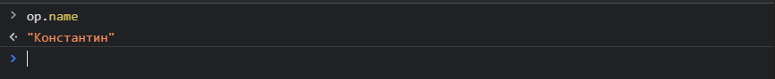
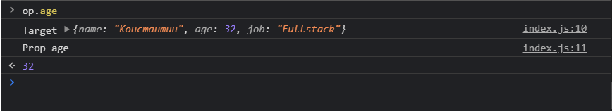
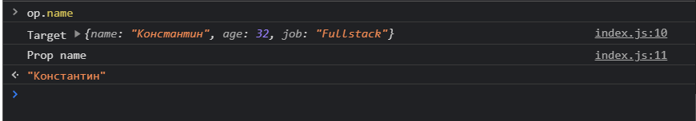
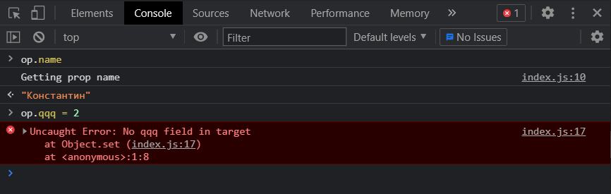
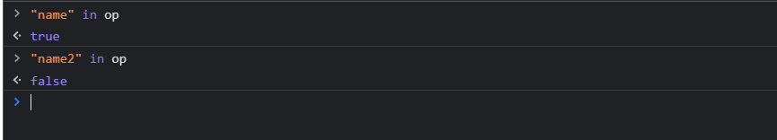
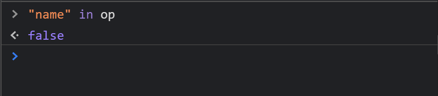
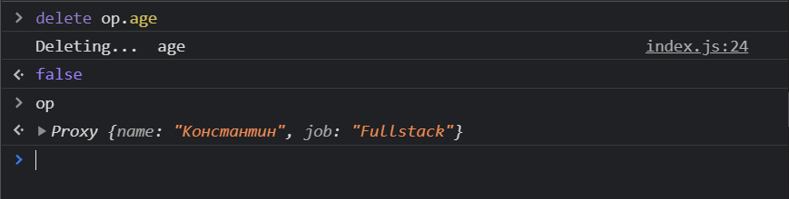
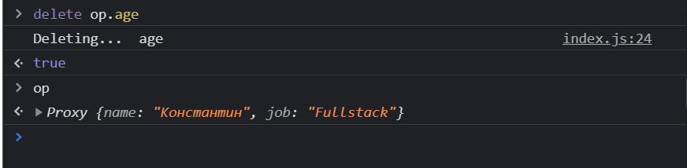

# JavaScript. Proxy. Объекты, функции, классы. Часть 1

В этом ролике поговорим про теорию связанную с **proxy**, а в следующем мы поговорим про некоторые практические применения данной технологии.

**Proxy** по сути это некоторый класс в **JS** который позволяет создавать различные ловушки для объектов, функций, классов и т.д.

```js
const person = {
  name: 'Константин',
  age: 32,
  job: 'Fullstack',
};
```

Теперь мы можем пользоваться данным объектом, но здесь нет ничего не обычного.

Что более интересно мы можем его запроксировать. Для того что бы запроксировать объект person мы можем создать какую-нибудь переменную и в нее я положу результат работы глобального класса **new Proxy()**. В конструктор данного класса мы должны передавать два параметра. Первый параметр это некоторый **target(цель)** т.е. та цель на которую мы хотим повесить **Proxy(переводится как полномочие)**. В нашем случае полномочиями является объект **person**.
Вторым параметром я передаю набор **handlers(обработчиков)** т.е. те методы которые позволяют сделать так называемые ловушки в данном случае для объекта.

Например мы можем реализовать метод get. Метод **get** принимает в себя так же два параметра это **target** и некоторый **prop**

```js
// Object
const person = {
  name: 'Константин',
  age: 32,
  job: 'Fullstack',
};

const op = new Proxy(person, {
  get(target, prop) {},
});
```

Метод **get** обычно что-то возвращает. Пока что напишу **return target[prop]** т.е. мы таким образом обращаемся к объекту **target** и к его ключу **prop**.

```js
// Object
const person = {
  name: 'Константин',
  age: 32,
  job: 'Fullstack',
};

const op = new Proxy(person, {
  get(target, prop) {
    return target[prop];
  },
});
```

Теперь если в консоли браузера я обращусь к объекту **op**, потому что мы сейчас работаем с **Proxy**, и вызову поле.



Данный **Proxy** по сути повторяет функционал оъекта.

Но в чем же его идея?

Идея здесь заключается в том что у нас теперь поставлена ловушка на матод **get**. Теперь я могу написать в консоли.

```js
// Object
const person = {
  name: 'Константин',
  age: 32,
  job: 'Fullstack',
};

const op = new Proxy(person, {
  get(target, prop) {
    console.log('Target', target);
    console.log('Prop', prop);
    return target[prop];
  },
});
```

Теперь когда я обращаюсь к полю объекта я получаю некоторе значение, мы так же молучаем те консоль логи которые мы описали.



В качестве значения **target** мы получаем сам объект над которым мы ставим **proxy**. В качестве значения **prop** мы получаем в строковом формате значение поля к которому мы обращаемся. Не правильно говорит не значение, а ключ поля объекта мы получаем в строковом формате.



По сути вся идея **proxy** и заключается в этом коцепте что мы реализуем некоторые ловушки и внутри них мы можем переписывать функционал базовый.

Разберем еще некоторые ловушки которые мы можем сделать с proxy. На самом деле в proxy существует большое количество различных методов ссылка на документацию <https://www.youtube.com/redirect?event=video_description&redir_token=QUFFLUhqa2hzS3hoWGRGUVFkMnI2LW52c2NPRXRaaFcyZ3xBQ3Jtc0tsckVqaWVHVjZRalo0MnVhLUtINGtOX0d1enlhbEd2T3VKSWdOeXVpTkxEUkZtYTlhZ2hJb1FleEhWckI5Z3RHVGc4NW9nZnJxQ3pQYW52S1FtNF9EdE5PdGNUWU9TLTVOalFoSHdLaW5nYW5DZ2ZHYw&q=https%3A%2F%2Fdeveloper.mozilla.org%2Fen-US%2Fdocs%2FWeb%2FJavaScript%2FReference%2FGlobal_Objects%2FProxy>.

Разберем самые основные методы.

Мы так же можем реализовывать метод **set**. Он принимает **target**, **prop** и некоторый **value** который мы хотим добавить.

```js
// Object
const person = {
  name: 'Константин',
  age: 32,
  job: 'Fullstack',
};

const op = new Proxy(person, {
  get(target, prop) {
    console.log(`Getting prop ${prop}`);
    return target[prop];
  },
  set(target, prop, value) {},
});
```

В теле я могу написать простую логику. В объекте **target** по ключу **prop** буду задавать значение **value**.

```js
// Object
const person = {
  name: 'Константин',
  age: 32,
  job: 'Fullstack',
};

const op = new Proxy(person, {
  get(target, prop) {
    console.log(`Getting prop ${prop}`);
    return target[prop];
  },
  set(target, prop, value) {
    target[prop] = value;
  },
});
```

Но допустим мы можем так же переписать эту логику. Я могу написать условие что если **prop** сейчас находится в объекте **target**, то тогда мы будем делать эту логику.
А если мы пытаемся задать какой-то не существующий **prop** мы можем выкинуть ошибку в которой напишу что **Нет реквизитов поля в цели**.

```js
// Object
const person = {
  name: 'Константин',
  age: 32,
  job: 'Fullstack',
};

const op = new Proxy(person, {
  get(target, prop) {
    console.log(`Getting prop ${prop}`);
    return target[prop];
  },
  set(target, prop, value) {
    if (prop in target) {
      target[prop] = value;
    } else {
      throw new Error(`No ${prop} field in target`);
    }
  },
});
```

> Теперь как это будет работать? Обращу внимание что с >объектом person мы не работаем. Мы в proxy передаем >объект person. Но дальше формируется новый объект с >которым мы и работаем



Если я задаю и переопределяю какое-нибудь не существующее поле, то я получаю кстомную ошибку. **Setter** нам грубо говоря валидирует что такого пол у нас в объекте нет и поэтому мы не можем его изменить. И как вы понимаете здесь можно написать абсолютно любую логику которая вам будет удобна именно для решения текущей задачи.

Еще один полезные метод которые есть в **proxy** называется **has** переводится как имеет. Он тоже принимает в себя некоторый **target**, **prop**. Метод has должне вернуть булево значение либо **true** или **false** который будет говорить есть ли такое поле в объекте.

И я могу написать такую логику. У нас скажем не обычный объект. У него может быть все го лишь 3-ри поля. Поэтому я могу поступить следующим образом. Я заведу массив который будет описывать поля которые у нас есть и далее с помощью метода **includes** спросить что если в данном массиве есть поле **prop** то тогда мы вернем значение **true**.

Но если мы будем передавать какой-то не правильный параметр, который не содержится в данном массиве, то тогда мы будем получать значение **false**.

```js
// Object
const person = {
  name: 'Константин',
  age: 32,
  job: 'Fullstack',
};

const op = new Proxy(person, {
  get(target, prop) {
    console.log(`Getting prop ${prop}`);
    return target[prop];
  },
  set(target, prop, value) {
    if (prop in target) {
      target[prop] = value;
    } else {
      throw new Error(`No ${prop} field in target`);
    }
  },
  has(target, prop) {
    return ['age', 'name', 'job'].includes(prop);
  },
});
```



А теперь если я в массиве удалю поле name. Смотрите в proxy поле **name** присутствует. Однако мы в блоке **has** переписываем логику.

```js
// Object
const person = {
  name: 'Константин',
  age: 32,
  job: 'Fullstack',
};

const op = new Proxy(person, {
  get(target, prop) {
    console.log(`Getting prop ${prop}`);
    return target[prop];
  },
  set(target, prop, value) {
    if (prop in target) {
      target[prop] = value;
    } else {
      throw new Error(`No ${prop} field in target`);
    }
  },
  has(target, prop) {
    return ['age', 'job'].includes(prop);
  },
});
```



Здесь мы можем так же придумывать какие-то свои кастомные валидации.

Следующий метод **deleteProperty**. Данный метод нам позволяет удалять какое-то свойство из объекта. В аргументы мы так же получаем некоторый **target**, **prop**.

```js
// Object
const person = {
  name: 'Константин',
  age: 32,
  job: 'Fullstack',
};

const op = new Proxy(person, {
  get(target, prop) {
    console.log(`Getting prop ${prop}`);
    return target[prop];
  },
  set(target, prop, value) {
    if (prop in target) {
      target[prop] = value;
    } else {
      throw new Error(`No ${prop} field in target`);
    }
  },
  has(target, prop) {
    return ['age', 'job'].includes(prop);
  },
  deleteProperty(target, prop) {
    console.log('Deleting... ', prop);
  },
});
```

И после этого мы можем так же добавлять любые условия, любые валидации для того что бы как-то усложнить работу удаления. Но самы простой пример повторить нативную функцию т.е. с помощью оператора **delete** указать что у **target** мы удаляем значение **prop**.

```js
// Object
const person = {
  name: 'Константин',
  age: 32,
  job: 'Fullstack',
};

const op = new Proxy(person, {
  get(target, prop) {
    console.log(`Getting prop ${prop}`);
    return target[prop];
  },
  set(target, prop, value) {
    if (prop in target) {
      target[prop] = value;
    } else {
      throw new Error(`No ${prop} field in target`);
    }
  },
  has(target, prop) {
    return ['age', 'job'].includes(prop);
  },
  deleteProperty(target, prop) {
    console.log('Deleting... ', prop);
    delete target[prop];
  },
});
```



Как видим поле **age** пропало.

Для того что бы **false** нам не выдавался мы просто после удаления возвращаю знае **true**.

```js
// Object
const person = {
  name: 'Константин',
  age: 32,
  job: 'Fullstack',
};

const op = new Proxy(person, {
  get(target, prop) {
    console.log(`Getting prop ${prop}`);
    return target[prop];
  },
  set(target, prop, value) {
    if (prop in target) {
      target[prop] = value;
    } else {
      throw new Error(`No ${prop} field in target`);
    }
  },
  has(target, prop) {
    return ['age', 'job'].includes(prop);
  },
  deleteProperty(target, prop) {
    console.log('Deleting... ', prop);
    delete target[prop];
    return true;
  },
});
```



Что касается объектов мы разобрали. Еще раз ссылка на более подробную документацию <https://www.youtube.com/redirect?event=video_description&redir_token=QUFFLUhqa2hzS3hoWGRGUVFkMnI2LW52c2NPRXRaaFcyZ3xBQ3Jtc0tsckVqaWVHVjZRalo0MnVhLUtINGtOX0d1enlhbEd2T3VKSWdOeXVpTkxEUkZtYTlhZ2hJb1FleEhWckI5Z3RHVGc4NW9nZnJxQ3pQYW52S1FtNF9EdE5PdGNUWU9TLTVOalFoSHdLaW5nYW5DZ2ZHYw&q=https%3A%2F%2Fdeveloper.mozilla.org%2Fen-US%2Fdocs%2FWeb%2FJavaScript%2FReference%2FGlobal_Objects%2FProxy>.
