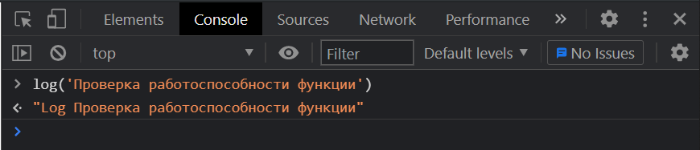
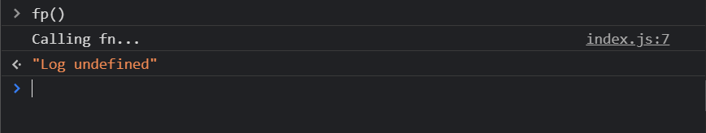
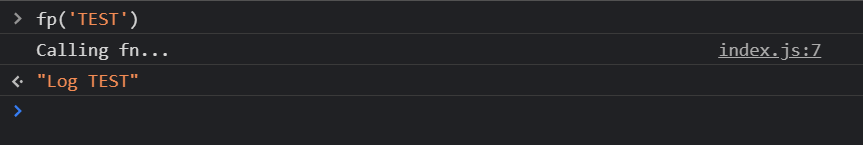
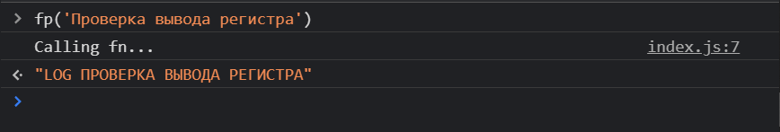

# Proxy Function

Поговорим про функции.

Рассмотрим бозовый пример проксирования над функциями. Поэтому мы заведем элементарную функцию.

```js
//function

const log = (text) => `Log ${text}`;
```

Иными словами в функцию мы будем передавать некоторый текст к которому будет добавляться некоторый префикс.



Теперь что мы можем сделать с этой функцией и с **proxy**? По сути мы можем создат переменную в котороую передаю результат работы глобального класса **Proxy**. Данный класс принимает аргумент **target** которая в данном случае будет функция **log**. Вторым параметром так же передаю объект **handlers** обработчиков.

```js
//function

const log = (text) => `Log ${text}`;

const fp = new Proxy(log, {});
```

Теперь мы можем оследить когда данная функция будет вызываться. И для этого мы здесь реализуем метод **apply** т.е. применять. Метод **apply** принимает в себя три параметра **target** т.е. та функция которую мы проксируем, далее мы принимаем некоторый параметр **thisArg**, и третий параметр **argArray** или можно просто назвать его **args**.

```js
//function

const log = (text) => `Log ${text}`;

const fp = new Proxy(log, {
  apply(target, thisArg, args) {},
});
```

Вы можете поставить на паузу и посмотреть каждый параметр в консоли, что он обозначает. Но если тезисно то **target** - это сама функция, **thisArg** - это контекст если мы его передавали допустим с помощью метода **call** или **bind**. И массив **args** - это все параметры кторые мы передаем в нашу функцию т.е. в случае с функцией **log** мы будем принимать массив состоящий из одного элемента т.е. **text**.

Для того что бы функция начала работать нам необходимо вернуть какое-то значение и выполнить саму функцию. Для этого я обращаюсь к переменной **target** т.е. это сама функция. И если вы помните то я выпускал урок про контекст где рассказывал как работают методы **call** **bind** и **apply**. Так вот здесь для того что бы вызвать эту функцию мы можем применить метод **apply** и именно метод **apply** потому что обычно у нас не известно количество аргументов, а метод **apply** удобен тем что он принимает массив аргументов. И тем самым мы можем работать с любым количеством параметров. Первым параметром в **apply** мы передаем контекст **thisArg**, а вторым параметром передаю массив **args**.

```js
//function

const log = (text) => `Log ${text}`;

const fp = new Proxy(log, {
  apply(target, thisArg, args) {
    console.log('Calling fn...');
    return target.apply(thisArg, args);
  },
});
```

На самом деле мы здесь получим вызов функции, она выполнится. Мы получим какой-то результат который былобы неплохо вернуть



Это говорит о том что мы попали в функцию **apply** и теперь мы можем выполнять любую логику которую захотим.

Если я передам параметр, то все отработает корректно



Что классно мы теперь в методе **apply** можем делать что угодно с данным результатом т.е. например мы можем преобразовывать в какой угодно нам формат.

Например приведу все к верхнему регистру.

```js
//function

const log = (text) => `Log ${text}`;

const fp = new Proxy(log, {
  apply(target, thisArg, args) {
    console.log('Calling fn...');
    return target.apply(thisArg, args).toUpperCase();
  },
});
```


