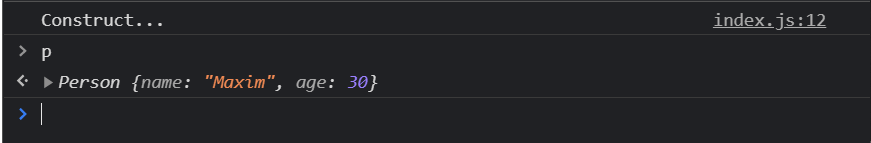
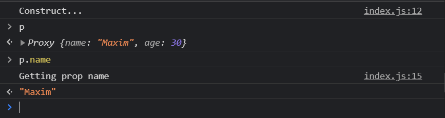

# Proxy работа с class

```js
// Classes

class Person {
  constructor(name, age) {
    this.name = name;
    this.age = age;
  }
}
```

И теперь я могу проксировать класс. Как обычно создаю переменную и так как я данную переменную буду использовать как класс я называю ее с большой буквы. И как обычно с помощью ключевого слова **new** я обращаюсь к классу **Proxy()**. Где в качестве **target** я передаю класс который я хочу проксировать. Вторым параметром я так же передаю объект в котором я должен указать список **handlers** т.е. обработчиков.

```js
// Classes

class Person {
  constructor(name, age) {
    this.name = name;
    this.age = age;
  }
}

const PersonProxy = new Proxy(Person, {});
```

Важно понимать что здесь я могу использовать любые **handlers** которые присутствуют. Но для того что бы отследить инициализацию нового класса т.е. через ключевое слово new я могу использовать ловушку которая называется **construct**.

```js
// Classes

class Person {
  constructor(name, age) {
    this.name = name;
    this.age = age;
  }
}

const PersonProxy = new Proxy(Person, {
  construct(target, args) {},
});
```

В **construct** я как обычно первым параметром принимаю **target** и вторым параметром я как обычно принимаю массив **args**. И в теле функции **construct** я могу делать все тоже самое что делал до этого т.е. выполнять любую логику которая мне потребуется.

```js
// Classes

class Person {
  constructor(name, age) {
    this.name = name;
    this.age = age;
  }
}

const PersonProxy = new Proxy(Person, {
  construct(target, args) {
    console.log('Construct...');
  },
});
```

Базовое использование ловушки над конструктором выглядит следующим образом. Мы возвращаем новый объект новый **new** объект **target** где в аргумент которого с помощью **spreed** оператора распарсиваем массив аргументов.

```js
// Classes

class Person {
  constructor(name, age) {
    this.name = name;
    this.age = age;
  }
}

const PersonProxy = new Proxy(Person, {
  construct(target, args) {
    console.log('Construct...');
    return new target(...args);
  },
});
```

Идея в том что мы перехватываем метод **constructor** и дальше выполняем какую-то логику. Т.е. мы должны вернуть что-то как результат потому что если мы делаем новый результат от класса **Person** то мы получаем новый объект. Здесь я пишу **return new target()**. **target** является классом **Person**. По факту new **target** это тоже самое что я напишу new **Person**. И дальше с помощью оператора **spreed** я передаю все необходимые аргументы для работы с данным классом т.е. в нашем случае это поле **name** и **age**.

И теперь я могу создать переменную результатом которой будет работа **new PersonProxy()**. В конструктор я передаю

```js
// Classes

class Person {
  constructor(name, age) {
    this.name = name;
    this.age = age;
  }
}

const PersonProxy = new Proxy(Person, {
  construct(target, args) {
    console.log('Construct...');
    return new target(...args);
  },
});

const p = new PersonProxy('Maxim', 30);
```



Чем это может быть хорошо?

Да тем что мы теперь можем что угодно творить с данным классом. Мы можем инициализацию данного объекта обернуть в новый **proxy**. И реализую **getter** в параметры которого передаю не **target**, а к примеру переменну **t** это делается для того что бы не было конфликтов, и второй аргумент **prop**.

```js
// Classes

class Person {
  constructor(name, age) {
    this.name = name;
    this.age = age;
  }
}

const PersonProxy = new Proxy(Person, {
  construct(target, args) {
    console.log('Construct...');
    return new Proxy(new target(...args), {
      get(t, prop) {
        console.log(`Getting prop ${prop}`);
        return t[prop];
      },
    });
  },
});

const p = new PersonProxy('Maxim', 30);
```



Мы получаем **console.log(`Getting prop ${prop}`);** который представляет собой любую логику по валидации, любую логику по трансформации которую мы описали в **getter** т.е. на самом деле это очень удобно.
