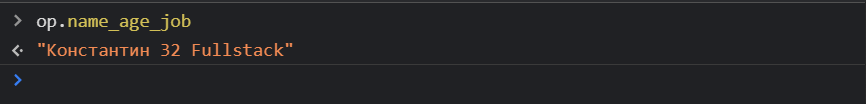
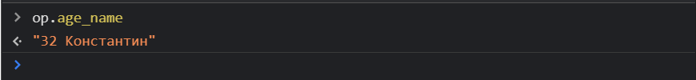

# Это спойлер так сказать к следующему видео

Рассмотрим его на объектах.

```js
// Object
const person = {
  name: 'Константин',
  age: 32,
  job: 'Fullstack',
};

const op = new Proxy(person, {
  get(target, prop) {
    console.log(`Getting prop ${prop}`);
    return target[prop];
  },
  set(target, prop, value) {
    if (prop in target) {
      target[prop] = value;
    } else {
      throw new Error(`No ${prop} field in target`);
    }
  },
  has(target, prop) {
    return ['age', 'job'].includes(prop);
  },
  deleteProperty(target, prop) {
    console.log('Deleting... ', prop);
    delete target[prop];
    return true;
  },
});
```

Представте что у нас есть метод **get** который делает достаточно сложную работу. Он возвращает нам **target[prop]** и просто выводит в консоль какое-то значение. Да это прикольно, но не впечетляет.

Представте что мы с вами реализуем следующую логику. Она будет достаточно странной. Но как результат вы поймете о чем идет речь.

Если я в условии прошу что если **!(prop in target)** т.е. если такого поля которое мы хотим получить нет в самом объекте, то тогда я буду делать что-то не обычное.

```js
// Object
const person = {
  name: 'Константин',
  age: 32,
  job: 'Fullstack',
};

const op = new Proxy(person, {
  get(target, prop) {
    console.log(`Getting prop ${prop}`);

    if (!(prop in target)) {
    }

    return target[prop];
  },
  set(target, prop, value) {
    if (prop in target) {
      target[prop] = value;
    } else {
      throw new Error(`No ${prop} field in target`);
    }
  },
  has(target, prop) {
    return ['age', 'job'].includes(prop);
  },
  deleteProperty(target, prop) {
    console.log('Deleting... ', prop);
    delete target[prop];
    return true;
  },
});
```

Например я обращусь к тому **prop** который я передаю сюда и вызываю метод **split**. В аргументы передаю символ нижнего подчеркивания. Метод **split** у строки нам возвращает массив. Поэтому с помощью **map** я на каждой итерации получаю **p** и далее возвращаю **target[p]** т.е. получать некоторое значение из исходного объекта. И дальше с помощью метода **join** все это соеденю через пробел.

```js
// Object
const person = {
  name: 'Константин',
  age: 32,
  job: 'Fullstack',
};

const op = new Proxy(person, {
  get(target, prop) {
    console.log(`Getting prop ${prop}`);

    if (!(prop in target)) {
      return prop
        .split('_')
        .map((p) => target[p])
        .join(' ');
    }

    return target[prop];
  },
  set(target, prop, value) {
    if (prop in target) {
      target[prop] = value;
    } else {
      throw new Error(`No ${prop} field in target`);
    }
  },
  has(target, prop) {
    return ['age', 'job'].includes(prop);
  },
  deleteProperty(target, prop) {
    console.log('Deleting... ', prop);
    delete target[prop];
    return true;
  },
});
```



Такого ключа у нас точно нет. Но все же я получаю достаточно не обычный результат. Я получил значения всех трех полей.

Допустим я хочу изменить порядок.



Данная кастомная логика позволяет выполнять довольно гибкие вещи.
