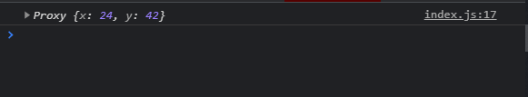
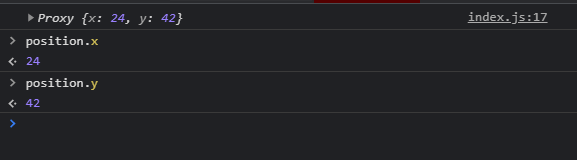
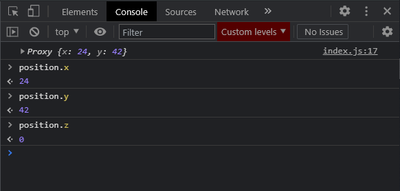
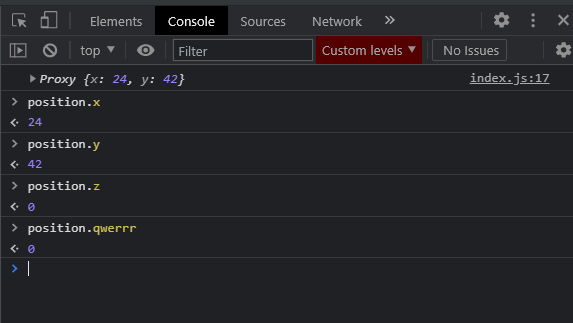

# Proxy Практика

## Wrapper

**Proxy** можно применять в очень большом количестве случаев. Все их мы не сможем разобрать так как их безграничное множество.

Мы разберем три разных составляющих **Proxy** и посмотрим как его можно применять.

В первую очередь я создам некоторую функцию, которая будет оборачивать входящий объект в наш **Proxy**, для того что бы добавлять ему новый функционал.

```js
// Wrapper

const withDefaultValue = (target, defaultValue) => {};
```

Судя по названию данная функция будет добавлять какое-то значение по умолчанию тем ключам, в случае если они не определены.
Это стрелочная функция которая принимает **target** и **defaultValue**.

Данная функция будет возвращать **new Proxy** и раз я ставлю фигурные скобки то я использую ключевое слово **return**

```js
// Wrapper

const withDefaultValue = (target, defaultValue) => {
  return new Proxy();
};
```

В **Proxy** мы оборачиваем **target**, и вторым параметром указываю объект в котором буду реализовывать **handlers** которые послужат нам для проксирования. Где по сути нам потребуется только метод **get**. И в принципе его можно задать как стрелочной функцией что бы записать в одну строчку. Он будет принимать в себя некоторый объект и параметр **prop**. И дальше я могу спросить если **prop** находится в **obj** то тогда это означает что это значение определено и мы просто можем вернуть **obj** по ключу **prop** а иначе если оно не определено, то тогда мы будем возвращать **defaultValue**.

```js
// Wrapper

const withDefaultValue = (target, defaultValue) => {
  return new Proxy(target, {
    get: (obj, prop) => (prop in obj ? obj[prop] : defaultValue),
  });
};
```

Предположим что мы можем завести объект **position**. И позиция обычно определяется в том примере который я хочу привести в координатах. Это **x**, **y** и **z**.

```js
// Wrapper

const withDefaultValue = (target, defaultValue) => {
  return new Proxy(target, {
    get: (obj, prop) => (prop in obj ? obj[prop] : defaultValue),
  });
};


const position =
```

И я получаю данный объект из функции **withDefaultValue({})** куда как начальное значение передаю поля **x**, **y**, **z**.

```js
// Wrapper

const withDefaultValue = (target, defaultValue) => {
  return new Proxy(target, {
    get: (obj, prop) => (prop in obj ? obj[prop] : defaultValue),
  });
};

const position = withDefaultValue(
  {
    x: 24,
    y: 42,
  },
  0 // Значение по умолчанию
);

console.log(position);
```



По сути я могу к ним обращаться и получать интересующие значения.



Но вот что класно. Мы здесь определили всего два ключа. Но в системе коорданит присутствуют и другие оси. Например ось **z**. Мы ее не определяли, но если мы к ней обратимся, то мы молучаем не ошибку а **0**.



Происходит это потому что мы задаем **default** параметр, которой мы указываем втрорым параметром после объекта c **handlers**, т.е. **0**. И задаем мы это значение для ключей которые не определены.

С таким же успехом мы можем указать любой ключ и получить **default** значение.



Т.е. в некоторых аспектах практики это может быть очень даже полезно.
