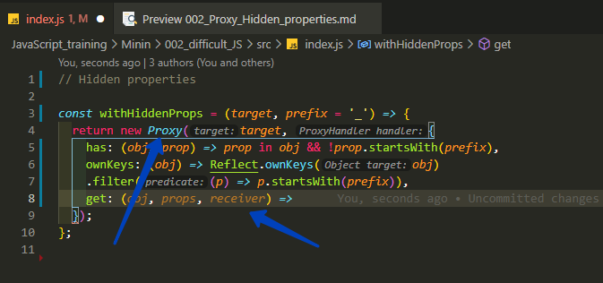
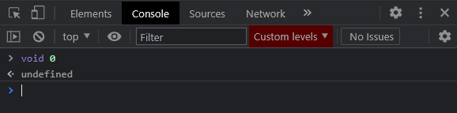
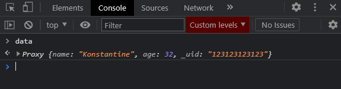
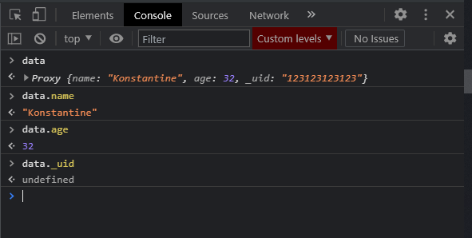
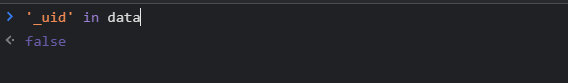
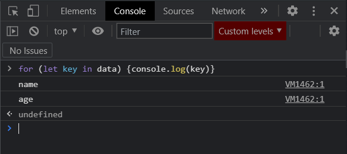
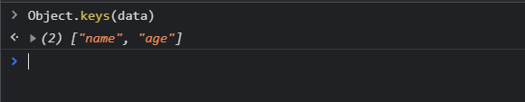

# Hidden properties

Здесь будет не самый простой код.

В данном случае я хочу завести функцию которая будет являтся оберткой для какого-то объекта который будет прятать нам определенные свойства которые мы укажем.

Предположим я заведу функцию **withHiddenProps** и данная функция будет в себя принимать некоторый **target** т.е. тот объект над которым мы ведем работу. И например некоторый **prefix** и по умолчанию о будет равняться нижнему подчеркиванию.

```js
// Hidden properties

const withHiddenProps = (target, prefix = '_') => {
  return new Proxy();
};
```

В **Proxy** я буду проксировать объект **target**, вторым параметром указываю объект с **handlers**. И здесь нам уже понадобится реализовать несколько методов.

```js
// Hidden properties

const withHiddenProps = (target, prefix = '_') => {
  return new Proxy(target, {});
};
```

Во-первых, мы хотим что бы те свойства которые начинаются с нижнего подчеркивания, они были в объекте но мы ни как не могли получить до них доступ. Т.е. мы не могли их проитерировать. Мы не могли их на прямую получить, но при этом они будут там присуствовать. Некоторая такая **security**.

По-этому я в первую очередь хочу релизовать метод **has**. Который будет принимать в себя непосредственно сам **obj**, и название свойства **props**. И дальше я хочу спросить если свойство **props** находится в **obj** (это базовая проверка для метода **has**), то тогда все хорошо. Но нам так же важно добавить условие что данное свойство не должно начинатся с **prefix**. Т.е. если оно начинается с **prefix**, то это означает что мы его хотим скрыть.

```js
// Hidden properties

const withHiddenProps = (target, prefix = '_') => {
  return new Proxy(target, {
    has: (obj, prop) => prop in obj && !prop.startsWith(prefix),
  });
};
```

Во второй части условия ставлю инверсию обращаюсь к свойству которое лежит в **prop** далее обращаюсь к функции **withHiddenProps** и при вызовее ее указываю к какому свойству обратиться т.е. **prefix**. Таким образом я проверяю что если не начинается с нижнего подчеркивания, то тогда я возвращаю **true**.

<br>
<br>
<br>

Далее нам необходимо реализовать то свойство в **Proxy** которое мы не рассматривали, но которое бузусловно присуствует. Называется оно [ownKeys](https://developer.mozilla.org/ru/docs/Web/JavaScript/Reference/Global_Objects/Proxy). Т.е. это свойство которое говорит какие ключи действительно находятся внутри объекта. И нам его тоже нужно переписать.

На вход я получаю **obj** и дальше я могу обратится к объекту [Reflect](https://developer.mozilla.org/ru/docs/Web/JavaScript/Reference/Global_Objects/Reflect) и у него вызываем метод который называется **ownKeys**

```js
// Hidden properties

const withHiddenProps = (target, prefix = '_') => {
  return new Proxy(target, {
    has: (obj, prop) => prop in obj && !prop.startsWith(prefix),
    ownKeys: (obj) => Reflect.ownKeys,
  });
};
```

Если вы не знаете что это такое.... короче ищи его видео об этом.
Но в принципе это некоторый объект который позволяет более детально работать именно с объектами. например получите его собственные ключи. И в **ownKeys** я передаю **obj**

```js
// Hidden properties

const withHiddenProps = (target, prefix = '_') => {
  return new Proxy(target, {
    has: (obj, prop) => prop in obj && !prop.startsWith(prefix),
    ownKeys: (obj) => Reflect.ownKeys(obj),
  });
};
```

Далее нам необходимо отфильтровать массив для того что бы убрать те свойства которые начинаются с **prefix**. Для того что бы **ownKeys** на не возвращал те ключи которые мы хотим сокрыть. Т.е. я могу вызывать метод **filter** где на каждой итерации я буду получать некоторое свойство к примеру **р** и в возвращаемом значении говорю данное свойство **p** не должно, для этого ставлю инверсию, обращаюсь к функции **startsWith**, и в нее передаю параметр с которого не должно начинаться т.е. с **prefix**.

```js
// Hidden properties

const withHiddenProps = (target, prefix = '_') => {
  return new Proxy(target, {
    has: (obj, prop) => prop in obj && !prop.startsWith(prefix),
    ownKeys: (obj) => Reflect.ownKeys(obj).filter((p) => p.startsWith(prefix)),
  });
};
```

**prefix** по замыканию нам доступен из верхней функции.

Теперь благодаря тому что мы переписали **ownKeys** мы можем написать метод **get**.

На самом деле метод get принимает в себя не два параметра а три:

- Первый параметр это сам объект **obj**.
- Второй параметр это свойство **prop**.
- И третий параметр это некоторый **receiver**, но на самом деле **receiver** и есть тот смый **Proxy** который мы возвращаем. т.е. тот самый объект с который мы ведем работу.



```js
// Hidden properties

const withHiddenProps = (target, prefix = '_') => {
  return new Proxy(target, {
    has: (obj, prop) => prop in obj && !prop.startsWith(prefix),
    ownKeys: (obj) => Reflect.ownKeys(obj)
    .filter((p) => p.startsWith(prefix)),
    get: (obj, prop, receiver) =>
  });
};

```

Метод get нам отдает какое-то свойство объекта, и как раз таки нам нужно сокрыть те элементы которые начинаются с **prefix**. Т.е. в первую очередь мы спрашиваем что если **prop** находится в **receiver**. Данная проверка нам вернет **true** если не начинается с **prefix**. Если **true**, то тогда мы возвращаем **object** по ключу **[prop]**.

```js
// Hidden properties

const withHiddenProps = (target, prefix = '_') => {
  return new Proxy(target, {
    has: (obj, prop) => prop in obj && !prop.startsWith(prefix),
    ownKeys: (obj) => Reflect.ownKeys(obj)
    .filter((p) => p.startsWith(prefix)),
    get: (obj, prop, receiver) => (prop in receiver) ? obj[prop]
  });
};
```

А иначе нам нужно скрыть поле. Я могу написать **undefined**, но я напишу что **void 0**.

```js
// Hidden properties

const withHiddenProps = (target, prefix = '_') => {
  return new Proxy(target, {
    has: (obj, prop) => prop in obj && !prop.startsWith(prefix),
    ownKeys: (obj) => Reflect.ownKeys(obj).filter((p) => p.startsWith(prefix)),
    get: (obj, prop, receiver) => (prop in receiver ? obj[prop] : void 0),
  });
};
```

**void 0** это просто альтернативная запись **undefined**.



**Proxy** готов. Но как его использовать?

Мы можем создать какой-нибудь объект и определить его через функцию **withHiddenProps**. Куда первым параметром я передаю какой-либо объект который является **target**.

```js
// Hidden properties

const withHiddenProps = (target, prefix = '_') => {
  return new Proxy(target, {
    has: (obj, prop) => prop in obj && !prop.startsWith(prefix),
    ownKeys: (obj) => Reflect.ownKeys(obj).filter((p) => p.startsWith(prefix)),
    get: (obj, prop, receiver) => (prop in receiver ? obj[prop] : void 0),
  });
};

const data = withHiddenProps({
  name: 'Konstantine',
  age: 32,
  _uid: '123123123123', // Уникальный индентификатор с нижним подчеркиванием
});
```



И вот я вижу данное поле.



Если я пытаюсь обратиться к полю с нижним подчеркиванием, то я получаю **undefined**.

Если я попробую спросить есть ли данное поле в объекте?



Его как будто бы нет.

> Кароче я так и не понял в чем проблема. А проблема в этой строчке кода. Сколько пялился так и не нашел. Правильная строчка кода

```js
ownKeys: (obj) => Reflect.ownKeys(obj).filter((p) => !p.startsWith(prefix)),
```

> Весь рабочий код. Сравнивай с предыдущим.

```js
// Hidden properties

const withHiddenProps = (target, prefix = '_') => {
  return new Proxy(target, {
    has: (obj, prop) => prop in obj && !prop.startsWith(prefix),
    ownKeys: (obj) => Reflect.ownKeys(obj).filter((p) => !p.startsWith(prefix)),
    get: (obj, prop, receiver) => (prop in receiver ? obj[prop] : void 0),
  });
};

const data = withHiddenProps({
  name: 'Konstantine',
  age: 32,
  _uid: '123123123123',
});
```




