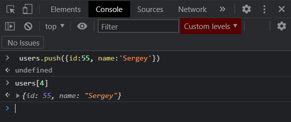

# Optimization

Создаю массив.

```js
// Optimization

const userData = [];
```

Это будет массив состоящий из объектов.

```js
// Optimization

const userData = [
  { id: 1, name: 'Konstantine', job: 'Fullstack', age: 25 },
  { id: 2, name: 'Elena', job: 'Student', age: 22 },
  { id: 3, name: 'Victor', job: 'Backend', age: 23 },
  { id: 4, name: 'Vasilisa', job: 'Teacher', age: 24 },
];
```

Теперь давайте реализуем следующую задачу. Предположим что нам нужно найти какой-нибудь элемент по его **id**.

В обычном **JS** мы делаем примерно так.


По сути данный метод является циклом по всему массиву. И в действительности если у нас будет массив состоять из **10 000** элементов, то безусловно итерировать **10 000** это некоторая затратная операция. Особенно если это мы будем делать часто.

С помощью Proxy мы можем создать такую обертку которая будет существенно оптимизировать данный процесс.

Мы можем завести такой концепт который называется **index**. Т.е. мы заведем некоторый объект который будет сохранять **index** какого либо ключа и выдавать нам определенный объект.

Т.е. если говорить проще. Рассмотрим пока без **Proxy**. Я могу создать пустой объект. И далее перебрать массив и выбрать из него индексы которые я занесу в массив **index**.

```js
// Optimization

const userData = [
  { id: 1, name: 'Konstantine', job: 'Fullstack', age: 25 },
  { id: 2, name: 'Elena', job: 'Student', age: 22 },
  { id: 3, name: 'Victor', job: 'Backend', age: 23 },
  { id: 4, name: 'Vasilisa', job: 'Teacher', age: 24 },
];

const index = {};
userData.forEach((i) => (index[i.id] = i));
```


т.е. **index** это объект у которого ключ соответствует **id** который соответствует какому либо пользователю.

Теперь я могу обращаться по **id**, **именно по id!!!** И получить пользователя.


Соответственно такому принципу мы и будем следовать когда будем реализовывать тот класс через **Proxy**.

Допустим я назову его **IndexedArray**

```js
// Optimization

const userData = [
  { id: 1, name: 'Konstantine', job: 'Fullstack', age: 25 },
  { id: 2, name: 'Elena', job: 'Student', age: 22 },
  { id: 3, name: 'Victor', job: 'Backend', age: 23 },
  { id: 4, name: 'Vasilisa', job: 'Teacher', age: 24 },
];

const IndexedArray = new Proxy();
```

И какой же класс мы будем проксировать? В действительности в **JS** мы можем создавать массивы не просто как **[]**. Мы можем создавать массивы через **new Array**, куда в конструктор мы передаем какие-то данные.

Поэтому мы можем проксировать целый класс **Array**

```js
// Optimization

const userData = [
  { id: 1, name: 'Konstantine', job: 'Fullstack', age: 25 },
  { id: 2, name: 'Elena', job: 'Student', age: 22 },
  { id: 3, name: 'Victor', job: 'Backend', age: 23 },
  { id: 4, name: 'Vasilisa', job: 'Teacher', age: 24 },
];

const IndexedArray = new Proxy(Array, {});
```

Как выпомните в **Proxy** если мы проксируем какие-то классы, то мы можем реализовать метод который называется **construct**

```js
// Optimization

const userData = [
  { id: 1, name: 'Konstantine', job: 'Fullstack', age: 25 },
  { id: 2, name: 'Elena', job: 'Student', age: 22 },
  { id: 3, name: 'Victor', job: 'Backend', age: 23 },
  { id: 4, name: 'Vasilisa', job: 'Teacher', age: 24 },
];

const IndexedArray = new Proxy(Array, {
  construct() {},
});
```

**construct** будет ставить ловушку на момент когда мы обращаемся через ключевое слово **New**. В его параметрах я получаю объект **target**. Дальше я делаю деструктуризацию и получаю массив **args**. Массив **args** и будет являтся тем массивом который мы будем передавать в ключевое слово **new**

```js
// Optimization

const userData = [
  { id: 1, name: 'Konstantine', job: 'Fullstack', age: 25 },
  { id: 2, name: 'Elena', job: 'Student', age: 22 },
  { id: 3, name: 'Victor', job: 'Backend', age: 23 },
  { id: 4, name: 'Vasilisa', job: 'Teacher', age: 24 },
];

const IndexedArray = new Proxy(Array, {
  construct(target, [args]) {},
});
```

В первую очередь я сразу возвращаю **new target(...args)**

```js
// Optimization

const userData = [
  { id: 1, name: 'Konstantine', job: 'Fullstack', age: 25 },
  { id: 2, name: 'Elena', job: 'Student', age: 22 },
  { id: 3, name: 'Victor', job: 'Backend', age: 23 },
  { id: 4, name: 'Vasilisa', job: 'Teacher', age: 24 },
];

const IndexedArray = new Proxy(Array, {
  construct(target, [args]) {
    return new target(...args);
  },
});
```

Теперь мы возвращаем какой-то **target**. И по сути таким образом мы можем создавать новый массив.

```js
// Optimization

const IndexedArray = new Proxy(Array, {
  construct(target, [args]) {
    return new target(...args);
  },
});

const users = new IndexedArray([
  { id: 1, name: 'Konstantine', job: 'Fullstack', age: 25 },
  { id: 2, name: 'Elena', job: 'Student', age: 22 },
  { id: 3, name: 'Victor', job: 'Backend', age: 23 },
  { id: 4, name: 'Vasilisa', job: 'Teacher', age: 24 },
]);
```


Мы сейчас просто повторили логику базового определения массива.

Но теперь мы работаем в **Proxy** и это означает что мы можем дописывать свой функционал.

Поэтому в методе **construct** я завожу переменную которая будет являться пустым объектом.

```js
// Optimization

const IndexedArray = new Proxy(Array, {
  construct(target, [args]) {
    const index = {};

    return new target(...args);
  },
});

const users = new IndexedArray([
  { id: 1, name: 'Konstantine', job: 'Fullstack', age: 25 },
  { id: 2, name: 'Elena', job: 'Student', age: 22 },
  { id: 3, name: 'Victor', job: 'Backend', age: 23 },
  { id: 4, name: 'Vasilisa', job: 'Teacher', age: 24 },
]);
```

И когда мы вызываем метод **construct** мы создаем какой-то новый массив. Я сразу же могу сделать эту карту по индексам. Пробегаюсь по массиву с **args** с помощью **forEach**.

```js
// Optimization

const IndexedArray = new Proxy(Array, {
  construct(target, [args]) {
    const index = {};
    args.forEach();

    return new target(...args);
  },
});

const users = new IndexedArray([
  { id: 1, name: 'Konstantine', job: 'Fullstack', age: 25 },
  { id: 2, name: 'Elena', job: 'Student', age: 22 },
  { id: 3, name: 'Victor', job: 'Backend', age: 23 },
  { id: 4, name: 'Vasilisa', job: 'Teacher', age: 24 },
]);
```

Безусловно мы делаем полную итерацию по массиву, но мы это делаем всего лишь один раз. В отличие от предыдущего подхода где мы это будем делать постоянно.

На каждой итерации я буду получать какое-то значение **item** и буду заносить в объект **index[iten.id] = item**. Т.е. теперь в **Proxy** у нас доступен и **index** кторый содержит карту всего массива.

```js
// Optimization

const IndexedArray = new Proxy(Array, {
  construct(target, [args]) {
    const index = {};

    args.forEach((item) => (index[item.id] = item));

    return new target(...args);
  },
});

const users = new IndexedArray([
  { id: 1, name: 'Konstantine', job: 'Fullstack', age: 25 },
  { id: 2, name: 'Elena', job: 'Student', age: 22 },
  { id: 3, name: 'Victor', job: 'Backend', age: 23 },
  { id: 4, name: 'Vasilisa', job: 'Teacher', age: 24 },
]);
```

Далее результирующий массив мы можем обернуть в **Proxy**.

```js
// Optimization

const IndexedArray = new Proxy(Array, {
  construct(target, [args]) {
    const index = {};

    args.forEach((item) => (index[item.id] = item));

    return new Proxy(new target(...args), {});
  },
});

const users = new IndexedArray([
  { id: 1, name: 'Konstantine', job: 'Fullstack', age: 25 },
  { id: 2, name: 'Elena', job: 'Student', age: 22 },
  { id: 3, name: 'Victor', job: 'Backend', age: 23 },
  { id: 4, name: 'Vasilisa', job: 'Teacher', age: 24 },
]);
```

И дальше мы передаем объект **handlers**. Где по сути я хочу реализовать метод **get**. Но его можно назвать **arr** так как мы работаем с массивом, и второй параметр **prop**.

```js
// Optimization

const IndexedArray = new Proxy(Array, {
  construct(target, [args]) {
    const index = {};

    args.forEach((item) => (index[item.id] = item));

    return new Proxy(new target(...args), {
      get(arr, prop) {},
    });
  },
});

const users = new IndexedArray([
  { id: 1, name: 'Konstantine', job: 'Fullstack', age: 25 },
  { id: 2, name: 'Elena', job: 'Student', age: 22 },
  { id: 3, name: 'Victor', job: 'Backend', age: 23 },
  { id: 4, name: 'Vasilisa', job: 'Teacher', age: 24 },
]);
```

Мы поставили ловушку на метод **get** т.е. когда мы обращается к каким-то свойсвам массива **users**.

И вот что теперь здорово!! Мы теперь можем реализовывать новые какие-то методы которые были ранее не доступны у массивов.

Здесь я могу сразу же завести конструкцию **switch** **case**. Где если ни какой **case** не сработает я буду просто возвращать свойство к которому мы обращались т.е. это **array** по ключу **prop**.

```js
// Optimization

const IndexedArray = new Proxy(Array, {
  construct(target, [args]) {
    const index = {};

    args.forEach((item) => (index[item.id] = item));

    return new Proxy(new target(...args), {
      get(arr, prop) {
        switch (prop) {
          default:
            return arr[prop];
        }
      },
    });
  },
});

const users = new IndexedArray([
  { id: 1, name: 'Konstantine', job: 'Fullstack', age: 25 },
  { id: 2, name: 'Elena', job: 'Student', age: 22 },
  { id: 3, name: 'Victor', job: 'Backend', age: 23 },
  { id: 4, name: 'Vasilisa', job: 'Teacher', age: 24 },
]);
```

**Switch** я буду делать именно по свойству **prop** т.е. это базовое применение.

Далее в **case** я могу добавлять некоторые элементы в массив с помощью **push(добавляет в конец)** или **unshift(добавляет в начало)**.

```js
// Optimization

const IndexedArray = new Proxy(Array, {
  construct(target, [args]) {
    const index = {};

    args.forEach((item) => (index[item.id] = item));

    return new Proxy(new target(...args), {
      get(arr, prop) {
        switch (prop) {
          case 'push':
            return (item) => {};
          default:
            return arr[prop];
        }
      },
    });
  },
});

const users = new IndexedArray([
  { id: 1, name: 'Konstantine', job: 'Fullstack', age: 25 },
  { id: 2, name: 'Elena', job: 'Student', age: 22 },
  { id: 3, name: 'Victor', job: 'Backend', age: 23 },
  { id: 4, name: 'Vasilisa', job: 'Teacher', age: 24 },
]);
```

По сути мне необходимо повторить функционал метода **push** для того что бы все это добавилось в конец массива.

```js
// Optimization

const IndexedArray = new Proxy(Array, {
  construct(target, [args]) {
    const index = {};

    args.forEach((item) => (index[item.id] = item));

    return new Proxy(new target(...args), {
      get(arr, prop) {
        switch (prop) {
          case 'push':
            return (item) => {
              arr[prop].call(arr, item);
            };
          default:
            return arr[prop];
        }
      },
    });
  },
});

const users = new IndexedArray([
  { id: 1, name: 'Konstantine', job: 'Fullstack', age: 25 },
  { id: 2, name: 'Elena', job: 'Student', age: 22 },
  { id: 3, name: 'Victor', job: 'Backend', age: 23 },
  { id: 4, name: 'Vasilisa', job: 'Teacher', age: 24 },
]);
```

Разберем эту строку

```js
arr[prop].call(arr, item);
```

В начале у массива аrr по методу **prop**, **prop** и **push** в данном случае одно и тоже, поэтому мы можем указать таким образом. Далее я вызываю метод **call** с контекстом текущего массива **arr**, и с параметром **item**. Здесь я пользуюсь методом **call** потому что я точно знаю сколько параметров я в эту функцию передаю (Один параметр). Если бы было **n-ное** количество параметров, то я бы воспользовался методом **apply**.

Помимо этого мы можем так же обратится к нашей карте и сказать что в **index** по ключу **idem.id** добавляес новое свойство которое называется **item**.

```js
// Optimization

const IndexedArray = new Proxy(Array, {
  construct(target, [args]) {
    const index = {};

    args.forEach((item) => (index[item.id] = item));

    return new Proxy(new target(...args), {
      get(arr, prop) {
        switch (prop) {
          case 'push':
            return (item) => {
              index[item.id] = item;
              arr[prop].call(arr, item);
            };
          default:
            return arr[prop];
        }
      },
    });
  },
});

const users = new IndexedArray([
  { id: 1, name: 'Konstantine', job: 'Fullstack', age: 25 },
  { id: 2, name: 'Elena', job: 'Student', age: 22 },
  { id: 3, name: 'Victor', job: 'Backend', age: 23 },
  { id: 4, name: 'Vasilisa', job: 'Teacher', age: 24 },
]);
```

Т.е. мы так же пополняем нашу карту для того что бы она была коректной.


Теперь мы модем написать еще один **case**. И теперь я могу реализовать метод какой мне угодно. К примеру **findById**. По сути данного метода у нас не присутствует в обычных массивах, но мы можем его реализовать и написать свою логику. Элемент который я буду возвращать я буду брать не из нашего массива, а уже из самой карты.

```js
// Optimization

const IndexedArray = new Proxy(Array, {
  construct(target, [args]) {
    const index = {};

    args.forEach((item) => (index[item.id] = item));

    return new Proxy(new target(...args), {
      get(arr, prop) {
        switch (prop) {
          case 'push':
            return (item) => {
              index[item.id] = item;
              arr[prop].call(arr, item);
            };
          case 'findById':
            return (id) => index[id];
          default:
            return arr[prop];
        }
      },
    });
  },
});

const users = new IndexedArray([
  { id: 1, name: 'Konstantine', job: 'Fullstack', age: 25 },
  { id: 2, name: 'Elena', job: 'Student', age: 22 },
  { id: 3, name: 'Victor', job: 'Backend', age: 23 },
  { id: 4, name: 'Vasilisa', job: 'Teacher', age: 24 },
]);
```

И так у нас присутствует массив **users** и как видите он является **proxy**


Теперь я могу по ключу **push** добавлять в объект.



Но теперь помимо стандартных методов присутствует


Происходит поиск по **id**.
