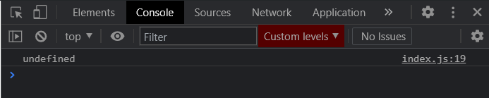
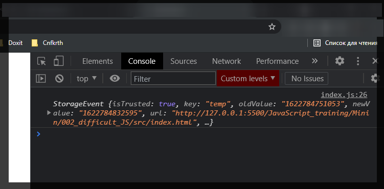

# localStorage

Это не сложно. Однако с ним есть определенные моменты которые начинающим достаточно сложно понять.

Для начало необходимо понять что такое **localStorage**? Это локальное хранилище. Прелесть этого хранилища заключается в том что там вы можете хранить любые данные и они будут доступны у вас после перезагрузки страницы. Т.е. это такая локальная и очень ипровизированна БД.

Теперь что касается **API** и как он работает.

```js
const myNumber = 42;
```

Для работы в **localStorage** мы просто обращаемся к глобальной переменной. В том случае если мы работаем в браузере.

> **Прошу обратить ваше внимание на то что если вы работаете в NodeJS то там localStorage нет.**

Только браузерный **API**.

Прописываем глобальный объект **localStorage**. Он кстати так же доступен в глобальном объекте **window**. Для того что бы что то получить из **localStorage** мы вызываем метод **getItem**

```js
const myNumber = 42;
console.log(localStorage.getItem('number'));
```


**null** потому что я пытаюсь что-то получить. Но там же ничего нет.

Для того что бы что-то записать в **localStorage** я вызываю метод **setItem**.

**setItem** принимает в себя два значения:

1. Это ключ по которому нужно сохранить что-то
2. Второй аргумент это само значение.

И **IDE** подсказывает что это должно быть строкой.

```js
const myNumber = 42;
console.log(localStorage.getItem('number'));
localStorage.setItem('number', myNumber);
console.log(localStorage.getItem('number'));
```


Это первый момент который важно понимать про **localStorage** это то что он умеет работать только со строками. Т.е. даже когда мы делаем **getItem** то мы все равно получаем строку.

Два раза получаю 42 потому что сначало я записываю, после получаю. Однако после перезагрузки страницы я два раза получаю.

И так смотрим в **devTools**.


Вижу на каком порту работаю.

Здесь важно понимать что **localStorage** работает для текущего домена. Т.е. в данном случае доменом у меня является данный **localhost**


Если я буду работать на другом сайте, то все что я записываю в **localStorage** у меня будет все асоциируется с текущим доменом. Если я работаю на другом домене то прошлые данные они будут недоступны.

Если мы посмотрим на поле то увидим **Key** **number**, **Value** **42**.

Так же у **localStorage** есть определенные методы такие как удаление определенного ключа.

```js
const myNumber = 42;
localStorage.removeItem('number');
console.log(localStorage.getItem('number'));
localStorage.setItem('number', myNumber);
console.log(localStorage.getItem('number'));
```


Так же есть метод **clear()** который полностью очищает хранилище.

```js
const myNumber = 42;
localStorage.removeItem('number');
console.log(localStorage.getItem('number'));
localStorage.setItem('number', myNumber);
console.log(localStorage.getItem('number'));
localStorage.clear();
```

В консоли я получаю данные, а вот в **localStorage** пусто.


В чем есть нюансы при работе с **localStorage**?

Создам объект с базовыми полями

```js
const object = {
  name: 'Max',
  age: 29,
};
```

И я хочу сохранить этот объект в **localStorage**. Допустимя я хочу все это сохранить в ключ **person**.

```js
const object = {
  name: 'Max',
  age: 29,
};

localStorage.setItem('person', object);
```


Как записать объект в **localStorage**? Для этого нужно использовать другой глобальный объкт который называется **JSON**. У него есть два метода это **parse** и **stringify**

```js
const object = {
  name: 'Max',
  age: 29,
};

localStorage.setItem('person', JSON.stringify(object));
```


На выходе мы получаем строку, но в этой строке в формате **json** содержатся данные нашего объекта.


Теперь я хочу получить то что лежит в **localStorage**

```js
// const myNumber = 42;
// localStorage.removeItem('number');
// console.log(localStorage.getItem('number'));
// localStorage.setItem('number', myNumber);
// console.log(localStorage.getItem('number'));
// localStorage.clear();

const object = {
  name: 'Max',
  age: 29,
};

localStorage.setItem('person', JSON.stringify(object));

const row = localStorage.getItem('person');
```

И допустим мы хотим изменить имя человека.

```js
const object = {
  name: 'Max',
  age: 29,
};

localStorage.setItem('person', JSON.stringify(object));

const raw = localStorage.getItem('person');

raw.name = 'Konstantine';

console.log(raw);
```


Как видим имя мы не поменяли. Если выведу **age**.

```js
const object = {
  name: 'Max',
  age: 29,
};

localStorage.setItem('person', JSON.stringify(object));

const raw = localStorage.getItem('person');

raw.name = 'Konstantine';

console.log(raw.age);
```



Как видим у меня нет доступа к прошлым ключам. И это логично потому что если мы проверим **type**, то мы увидим строку.

```js
const object = {
  name: 'Max',
  age: 29,
};

localStorage.setItem('person', JSON.stringify(object));

const raw = localStorage.getItem('person');

raw.name = 'Konstantine';

console.log(typeof raw);
```


Для того что бы нам получить объект вместо строки мы должны распарсить строку.

```js
const object = {
  name: 'Max',
  age: 29,
};

localStorage.setItem('person', JSON.stringify(object));

const raw = localStorage.getItem('person');

raw.name = 'Konstantine';

console.log(JSON.parse(raw));
```


```js
const object = {
  name: 'Max',
  age: 29,
};

// localStorage.setItem('person', JSON.stringify(object));

const raw = localStorage.getItem('person');
const person = JSON.parse(raw);
person.name = 'Konstantine';

console.log(person);
```


Это вся наука которая относится к **localStorage** при работе с объектами.

Какие еще есть особенности при работе с **localStorage**?

Допустим наше приложение открыто в разных вкладках. Мы можем все это дело синхронизировать с помощью специальных событий которые может прослушивать объект **window** для **localStorage**.

Т.е. мы добавляем событие либо таким образом.

```js
window.addEventListener('storage', (event) => {});
```

Альтернативный вариант это написать

```js
window.onstorage = () => {};
```

И посмотрим на эти события

```js
window.addEventListener('storage', (event) => {
  console.log(event);
});
```

Т.е. данное событие вызывается тогда когда что-то записывается в **localStorage**. И теперь я могу обратиться к **localStorage** и записать в его что-то.

```shell
localStorage.setItem('temp', Date.now().toString())
```

И так если мы посмотрим после ввода вконсоль то что нам вернулось, то мы увидим **undefined**


Мы видим что у нас нет ни какого **console.log event**. Хотя если посмотрим в **localStorage** то у нас есть temp с time штампом.


Почему так происходит? Да потому что здесь есть один нюанс. Это событие вызывается в том случае если во вкладке того же самого домена происходит запись в **localStorage**. Причем в другой вкладке. Т.е. если что-то происходит в этой вкладке то событие не вызывается.

Проверяю в двух вкладках.


Как видим в этой вкладке ничего нет.

А вот вторая вкладка



Если мы посмотрим на данное событие то мы увидим много полезных элементов. Прошлое значение которое было, текущее значение


**url** по которому мы сделали изменения. **key** т.е. над какими данными шла манипуляция.

Зачем это нужно? Представте что допустим вы работаете в какой-нибудь **SRM** системе где у вас много вкладок открыто и вам нужно менеджерить клиентов на разных страницах. Но в **SRM** обычно часто данные обновляются. И для того что бы синхронизировать все эти вкладки вы можете пользоваться подобной конструкцией.

На собеседовании вы можете встретить вопрос чем отличается **localStorage** от [Cookie](https://ru.wikipedia.org/wiki/Cookie).

Есть два основных отличия.

1. **localStorage** на много больше по объему чем **Cookie**. Обычно это примерно **5 MB**.
2. Основное отличие что **Cookie** улетают с запросами на сервер. И это не совсем безопасно потому что у вас все что храниться в **cookies** может распарсить и прочитать сервер. Ну и как-то использовать это в своих нуждах.
3. **localStorage** не улетает с **cookies** на сервак. Это только ваше локальное хранилище к которому вы имеете доступ.
